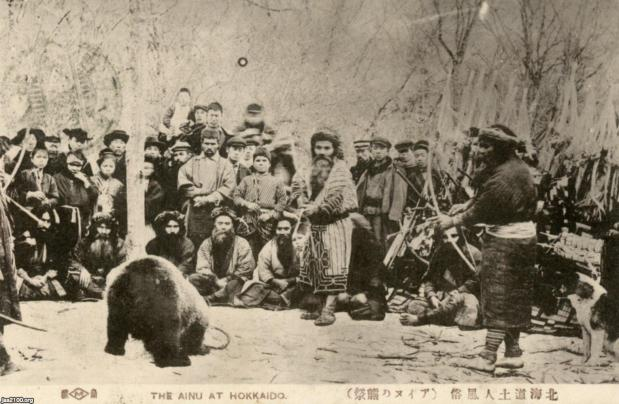
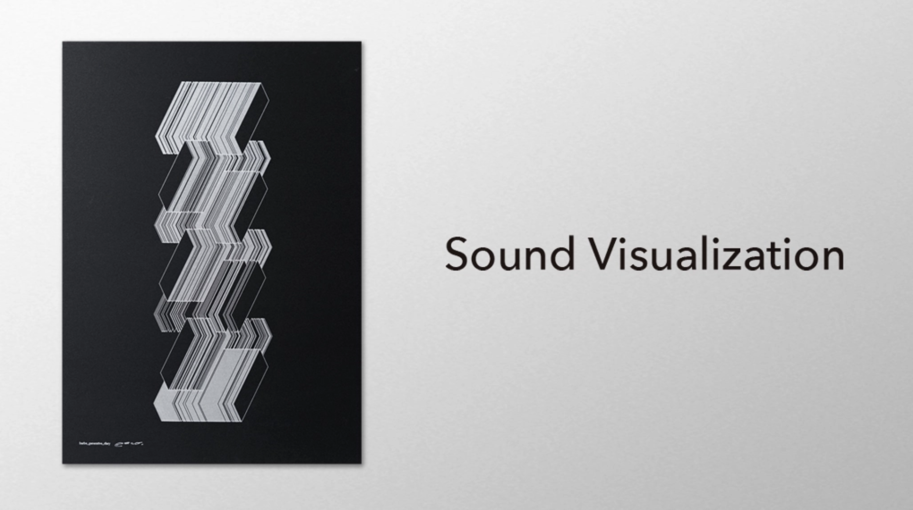
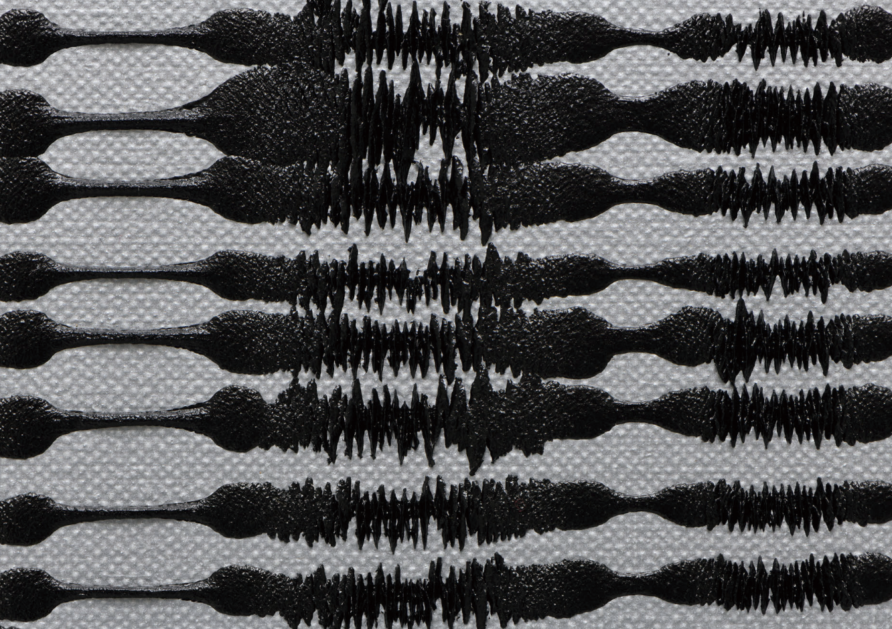

**Guidelines**

* Use what you have learned to create a project that explores programming as a creative medium.
* Your project could be a printed image, interactive installation, game, experimental instrument, generative artwork etc.
* Use whatever tools you like. p5.js or Processing are the suggested ones as we have been learning those, but you are also allowed to use some other programming languages/environments. I might just not be able to help you if you decide to use something more exotic. If you took the Audiovisual Studio workshop, you might also want to consider using TouchDesigner for your project.
* Remember “Poems, not demos”.

**Project Proposal (Friday, November 8)**

It should include the following:

* A short description of your idea. What do you want to do? Why?
* How are you going to do it? Do you think you need some special software libraries? Are there some things that you do not have any idea how to even get started with? Are you using p5.js or something else?
* Open questions that you have about the project or the implementation.
* 1-3 examples of works that other people have done that are similar.
* Are you combining this project with another course? (Physical Computing 21st Century Art & Science Lab, Storytelling etc.)

**Idea**

I am thinking about the idea of visualizing the voices of the Ainu people. They are a minority group that lived in Japan and Russia, and tens of thousands of them still survive today. The language they speak is a fully spoken language without a written language. As their population declines, fewer people are speaking the language, and it has been pointed out to be in danger of extinction.

Although I do not understand the language and may not be able to stop its extinction, I think it is meaningful to visualize it through this project.

**How to do**

I will continue by referring to the page about sound libraries mentioned in September 27, 2024 class, and then download sound sources and generate them using p5js. I am still thinking about how to visualize them (how to transform the sound into a visual, and how to output it).

**疑問**

Is there anything I should be careful about when downloading and using downloaded music? Do I need to get permission from the rights holder?

**Examples of works that other people have done that are similar/ I'm interest in.**

* barbe_generative_diary : <https://barbegenerativediary.com/en/sounds/how-to-get-started-with-field-recording/>
* barbe_generative_diary (instagram) : <https://www.instagram.com/barbe_generative_diary?utm_source=ig_web_button_share_sheet&igsh=ZDNlZDc0MzIxNw==>

* Bosques de mi Mentre - Ahora son solo fantasmas, parte 2, Karl Kleim : \[<iframe title="vimeo-player" src="https://player.vimeo.com/video/43974919?h=5bd7dfb2a1" width="640" height="360" frameborder="0"    allowfullscreen></iframe>](<<iframe title="vimeo-player" src="https://player.vimeo.com/video/43974919?h=5bd7dfb2a1" width="640" height="360" frameborder="0"    allowfullscreen></iframe>>)
* MARS, Yoriko Takabatake, 2020 : <https://shugoarts.com/en/news-en/23526/>

  
