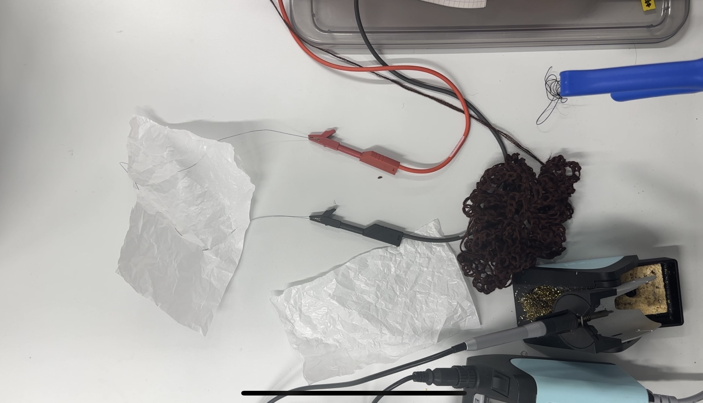

6/12/2024

Project Documentation

**Introduction**

This is an interactive artwork featuring wisteria flowers swaying in the wind. It physically expresses the motion of wisteria flowers swaying in the wind through simple human actions.

 When brainstorming ideas, I came across a piece of art where the surface of a fabric moved like waves. I found it both beautiful and fascinating that static objects like fabric or knitted materials, moved in unexpected ways. At the same time, I was inspired by the image of flowers swaying in the breeze in gardens or flower
fields. This led me to the concept of expressing the subtle motion of flowers swaying. Matti introduced me to Muscle Wire, and I made multiple prototypes to observe its movements. Eventually, by combining it with mohair yarn knitting, I was able to make the desired motion.

**The required components are:**

* Arduino Uno
* 4 Wires
* TIP120
* Resistance (1kΩ)
* Distance Sensor VL53L1X
* Electric Power Supply
* PC (should be connected to Arduino with a cable)
* Mohair yarn
* Muscle Wire
* Breadboard

 From a system perspective, it utilizes a common mechanism where the muscle wire makes micro-movements or exhibits shape memory behavior in response to an electric current. Similar works exist, where fabric with embedded circuits is controlled and adjusted based on digital data. However, I could not find existing electronic artworks that create organic, uncontrolled movements like those achieved with muscle wire. I also felt that muscle wire is the best material for expressing wisteria flowers swaying unpredictably in the wind.

**Prototype** 

**Explanation of the code:**

The VL53L1X measures the distance and converts the measurement into a range of 0–255 using the map() function. The Arduino’s PWM signal (0–255) is supplied to the TIP120's base. The TIP120 is a Darlington transistor that controls the current flowing between the collector and emitter based on the base current, allowing us to adjust the current and the temperature of the muscle wire. In this project, we used it because we needed to send 16V at 1.05A.

**How to work**

 When a hand is placed above the sensor, the current flows according to the distance between two points, causing the flowers to either move or remain still. The distance is read as a value between 0 and 255. When the distance is short, more current flows, and the flowers start to move. Since the movement is very slow, you can observe the flowers moving over a period of 10 seconds or more. Once the hand is removed and left for over 10 seconds, the flowers return to their original state.

**Reflection** 

Through this project, I encountered Physical Computing for the first time. Everything I learned and thought about in that classroom was a valuable experience. In the lectures, I was introduced to various sensors and was able to expand the possibilities of my work through hands-on learning while creating robots. Additionally, from the early stages of the course, activities such as short presentation and proposing Alt+Ctrl Game ideas allowed me to learn about other people’s ideas and program systems. This was a great experience for me and proved to be incredibly helpful when developing the concept for my final presentation. I feel that I wouldn’t have been able to reach the final form of this work on my own.

In individual works, I spent much time understanding wiring, coding, and the theoretical aspects of electricity, which deepened my comprehension.
