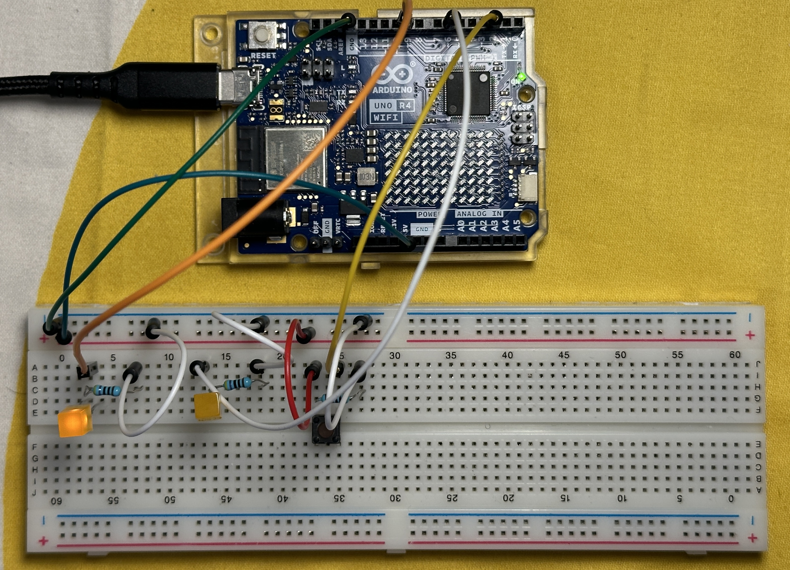
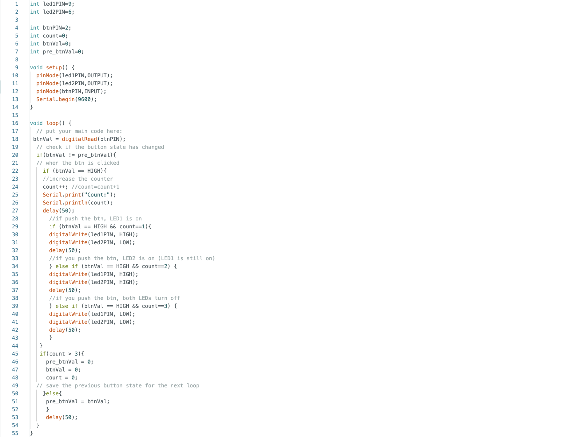

**The Assignment** 

**\- Instructions ------------------------------------------------------------------------**

**Circuit** 

Connect two LEDs to your Arduino using a breadboard

Connect one switch to your Arduino using a breadboard

**Code**

1 Read a momentary switch being pressed

2 When the program starts, both LEDs are off

3 When the switch is pressed once, the first LED turns on

4 When the switch is pressed the second time, the second LED turns on (the first one should also still be on)

5 When the switch is pressed the third time, both LEDs turn off

6 Repeat this same cycle of LEDs turning on and off in sequence (off, one LED, two LEDs, off…)

**\- Circuit ---------------------------------------------------------------------------------**

**\- Code -----------------------------------------------------------------------------------**

int led1PIN=9;

int led2PIN=6;

int btnPIN=2;

int count=0;

int btnVal=0;

int pre_btnVal=0;

void setup() {

  pinMode(led1PIN,OUTPUT);

  pinMode(led2PIN,OUTPUT);

  pinMode(btnPIN,INPUT);

  Serial.begin(9600);

}

void loop() {

  // put your main code here:

 btnVal = digitalRead(btnPIN);

  if(btnVal != pre_btnVal){ 

  // when the btn is clicked

\    if (btnVal == HIGH){

\    count++; //count=count+1

\    Serial.print("Count:");

\    Serial.println(count);

\    delay(50);

\    //if push the btn, LED1 is on

\    if (btnVal == HIGH && count==1){

\    digitalWrite(led1PIN, HIGH);

\    digitalWrite(led2PIN, LOW);

\    delay(50);

\    //if you push the btn, LED2 is on (LED1 is still on)

\    } else if (btnVal == HIGH && count==2) {

\    digitalWrite(led1PIN, HIGH);

\    digitalWrite(led2PIN, HIGH);

\    delay(50);

\    //if you push the btn, both LEDs turn off

\    } else if (btnVal == HIGH && count==3) {

\    digitalWrite(led1PIN, LOW);

\    digitalWrite(led2PIN, LOW);

\    delay(50);

\    } 

   }

   if(count > 3){

\    pre_btnVal = 0;

\    btnVal = 0;

\    count = 0;

  // save the previous button state for the next loop 

\    }else{ 

\    pre_btnVal = btnVal;

\    }

\    delay(50);

  }

}

**\- Thoughts/Reflections ------------------------------------------------------------------**

I struggled with how to light up the LED. There were two options: looping using "count" command, or coding in order based on the LED's HIGH/LOW information. In the end, I chose the former, referring to the link below. 

Digital Input: Falling or Rising Edge : <https://learn.newmedia.dog/tutorials/arduino-and-electronics/arduino/digital-io-rising-or-falling-edge/>

It is helpful for me and easy to understand how to code. When I was coding and the LED wasn't working properly (the code didn't seem to be wrong), that was because the LED wasn't physically inserted properly. It took me a while to realize that was a simple problem...
