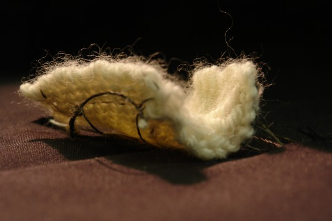

**Project Proposal**

**\- Concept**

I wanted to work with fabric or knitting and move it organically, like leaves on a tree. The knitted object remains unchanged in form, and sometimes we put it under something and end up forgetting the existence. 

**Some references** 

・Wakita Lab, Keio SFC

<https://wakita.sfc.keio.ac.jp/inner/livingtextile.html>

・New TEXTILES 2012, media, MIT (still checking )

<https://newtextiles.media.mit.edu/?p=3574>

・Closed-Loop Shape Control of a Haptic Jamming Deformable Surface, Stanford University 

<https://youtu.be/CVx0x7-0FzQ?si=zF2Ov7LPdftkcZb3>

・The Embroidered Computer, Irene Posch

<http://ireneposch.net/the-embroidered-computer/>

