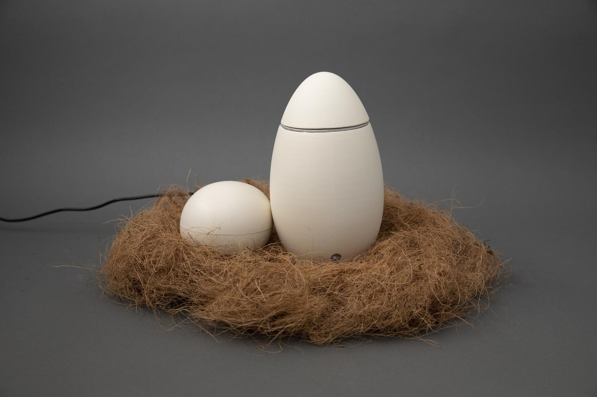

**Alt+Ctrl Interface**

**1. Find an interesting existing Alt+Ctrl Interface**

**Intro** : Hen is a remote controlled device created by Xiao Tan and Shuang Cai. Like a hen patiently warms her own eggs, this simple device is used to make boiled eggs by warming an egg-shaped controller device with two hands.

**Instruction** : To start cooking, you should gently put an egg into the boiler before adding a reasonable amount of water that submerges the egg. Then pick up the controller, hold it with two hands.

**Tec** : There is a [MKR WiFi 1010](https://store-usa.arduino.cc/products/arduino-mkr-wifi-1010) board in each egg. The one in the controller has an extra [temperture sensor](https://www.adafruit.com/product/1782?gclid=CjwKCAjwzuqgBhAcEiwAdj5dRiZcj34Zm1D_GKPbrYFcOSxY-yPCFkfS4TxkmqCTntFV-aUG5jGmVxoCpdYQAvD_BwE). When the shell temperture rises above a threshold, a message will be sent to the boiler to turn off the relay attached to the [heatpad](https://www.adafruit.com/product/1481?gclid=CjwKCAjwzuqgBhAcEiwAdj5dRvUOmZUNsUZAZis1JfSviLZrezdMDI1zol1qy0WIv5TJieCJM55DthoCVDsQAvD_BwE). The heatpad will then start generating heat.

My thoughts : It is interesting that you have to keep heating the eggs patiently to make them delicious as if you were a hen. The idea of using sensors and human body temperature to boil water is so exciting, and I also felt that it was an idea that could be applied to other works.

**2. Come up with a concept for your own Alt+Ctrl Interface**
