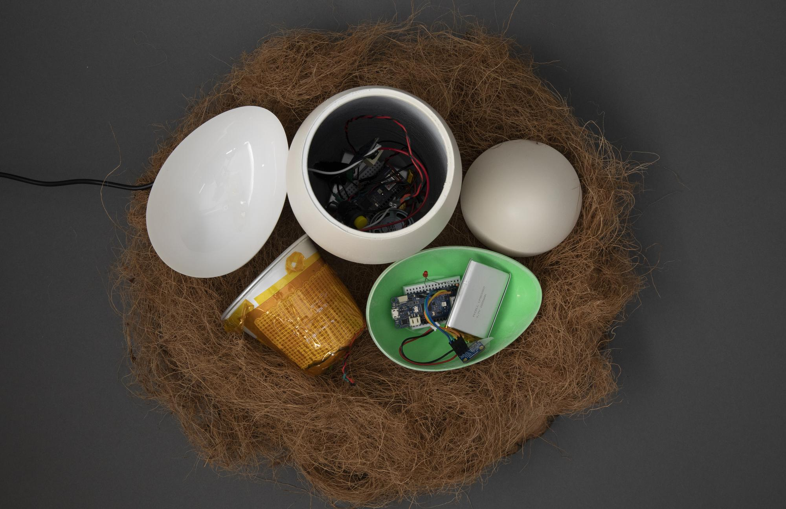
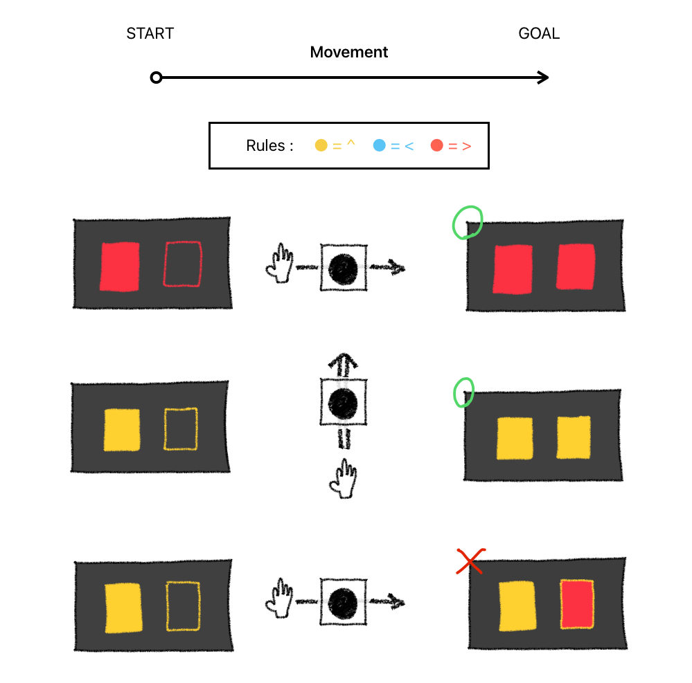
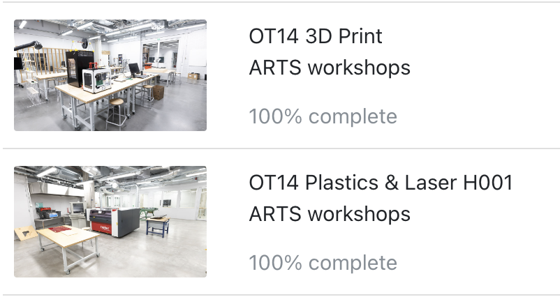

**Alt+Ctrl Interface**

**1. Find an interesting existing Alt+Ctrl Interface**

**Intro** : Hen is a remote controlled device created by Xiao Tan and Shuang Cai, inspired by [珍道具(ChinDougu)](https://chindogu.com/ics/?page_id=336). Like a hen patiently warms her own eggs, this simple device is used to make boiled eggs by warming an egg-shaped controller device with two hands. 

**Instruction** : To start cooking, you should gently put an egg into the boiler before adding a reasonable amount of water that submerges the egg. Then pick up the controller, hold it with two hands.

**Tec** : There is a [MKR WiFi 1010](https://store-usa.arduino.cc/products/arduino-mkr-wifi-1010) board in each egg. The one in the controller has an extra [temperture sensor](https://www.adafruit.com/product/1782?gclid=CjwKCAjwzuqgBhAcEiwAdj5dRiZcj34Zm1D_GKPbrYFcOSxY-yPCFkfS4TxkmqCTntFV-aUG5jGmVxoCpdYQAvD_BwE). When the shell temperture rises above a threshold, a message will be sent to the boiler to turn off the relay attached to the [heatpad](https://www.adafruit.com/product/1481?gclid=CjwKCAjwzuqgBhAcEiwAdj5dRvUOmZUNsUZAZis1JfSviLZrezdMDI1zol1qy0WIv5TJieCJM55DthoCVDsQAvD_BwE). The heatpad will then start generating heat.

**My thoughts** : It is interesting that you have to keep heating the eggs patiently to make them delicious as if you were a hen. The idea of using sensors and human body temperature to boil water is so exciting, and I also felt that it was an idea that could be applied to other works.

**2. Come up with a concept for your own Alt+Ctrl Interface**

* Explore at least one sensor in more detail. If you are not able to actually use it, find out what type of data you can get out of it. Is it on/off signal, continuous number, some more complex data?
* Think of different interactions and/or gestures that could be detected with the sensor you picked. What kind of objects could the sensor be attached to?
* Choose an existing video game that could be controlled using the interaction/interface enabled by this sensor OR come up with a completely new game or game mechanic.
* You don’t need to make it work yet. Just come up with the idea/concept for your alternative controller. Write about your idea on your site.
* You can draw sketches or other ways to illustrate your idea.

**Sensor :** Gesture Sensor APDS9960

It can detect simple gestures (left to right, right to left, up to down, down to up)

**Game :** 

By moving your hand in a certain direction over the sensor, a color is output. The color displayed on the screen is recognized, and you respond by outputting the same color using a gesture.

**3. Complete the MyCourses introductions for the 3D Printing and Laser Cutter workshops**

