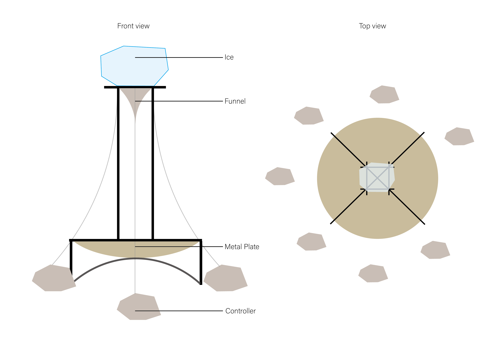
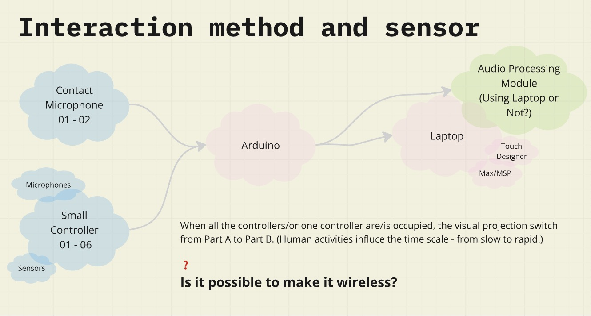

**Concept:**

In this project, we aim to use ice as a medium and collaborate with ice, focusing on the transformative qualities of its melting process to reveal the active roles that objects play in shaping our environment.

Historically, ice has embodied contrasting qualities—during the Anthropocene, it is often characterized as fragile and receding (Carey, 2007), yet in the age of glaciers, it was a formidable force capable of overwhelming human existence. Ice itself embodies tension: it is adhesive yet slick, seemingly clear yet opaque, solid yet delicate, enduring yet vulnerable to time’s pressures (Rider, 2019).

By observing and amplifying the visual and auditory changes as ice melts, we draw attention to the interaction between two contrasting temporal scales: the slow, expansive time of Earth’s geological history and the accelerated, urgent pace of glacial melt due to human activity. We aim to depict a de-anthropocentric future, shifting our perspective to understand how human intervention has expedited natural processes and altered environmental rhythms.

**More detailed process：**

<https://miro.com/app/board/uXjVLGnPCcA=/?share_link_id=430108964304>

**videolink：**

<https://youtu.be/lR1OMePhHwM?si=zCiQKR3UoqigsCEr>

**Reflection**

In this course, I collaborated with Annie to create a sound installation that combined digital technology and physical sculpture to explore the reflective theme of the dynamic relationship between humans and nature. This project was both challenging and rewarding, offering valuable learning opportunities and deepening my understanding of physical computing. 

Drawing from my previous experience with Arduino sensors for physical installations, I aimed to incorporate new elements, particularly sound design and visual interaction through Touch Designer. This intention led me to explore and master new tools, such as contact microphones and sound cards, which expanded my technical skills. 

However, the process was not without difficulties. Designing the iron frame structure highlighted the need to consider practical factors like material selection and stability, which we struggled with as the final structure lacked sufficient steadiness. Additionally, working with capacitive touch sensors introduced challenges, as the soft and fragile metal we chose was unsuitable for stable conductivity, and ensuring fully insulated wires proved essential for functionality. The complexity of managing long and numerous wires further underscored the importance of a clear and stable layout for both aesthetic and operational success. Despite these challenges, the project was a significant learning experience. I gained a deeper appreciation for the intricate balance between technical design and artistic expression and realized the critical role of material choices and organization in creating cohesive installations. 

There are also some details worth noting and improving. For instance, in sound and visual interaction, we often encountered the issue of the project scale being too large, which prevented us from achieving truly real-time interaction. This suggests that we might need to reconsider the way the system is constructed. Additionally, in setting the dimensions for the 3D-printed models, we failed to leave enough space for embedding physical components and wires, which created some challenges during assembly. At the same time, there were pleasant surprises in certain details, such as experimenting with new 3D printing materials and discovering that the soldering process left beautifully natural and unique metallic hues at the solder points.

During the exhibition, audience interaction often exceeded our expectations, revealing areas for improvement in the design and presentation. Some viewers treated the microphone as a button they could press, while others attempted to move the controller closer to their mouths, exceeding the height we had designed for optimal interaction. Moreover, many seemed hesitant to touch or approach the installation initially, suggesting that our exhibition setup lacked sufficient guidance to encourage engagement. Reflecting on this, I believe incorporating elements such as cushions or seating areas could invite audiences to sit down and immerse themselves more naturally in the interaction with the installation.

Despite these challenges, the project was a significant learning experience. I gained a deeper appreciation for the intricate balance between technical design, artistic expression, and audience engagement. It has inspired me to continue exploring innovative ways to merge technology and art while addressing complex and meaningful themes.
