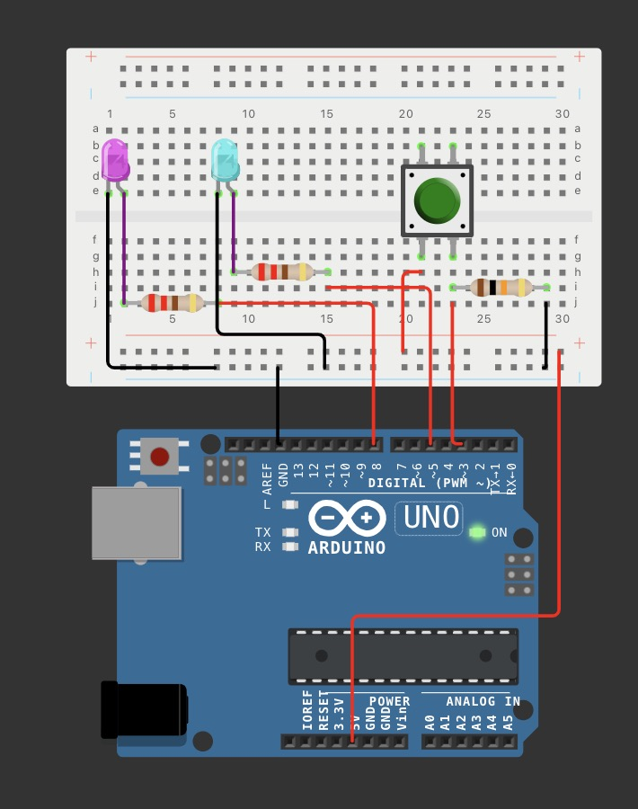

* P1:Here's a version that failed, feels like a connection problem（true）
* P2:Figured it out: the button press signal goes into the 3 interface（helped by Connor）

int led1 = 8;          

int led2 = 5;          

int button = 3;        

int pressCount = 0;     // googled

void setup() {

  pinMode(led1, OUTPUT);  

  pinMode(led2, OUTPUT);

  pinMode(button, INPUT);

  // led off

  digitalWrite(led1, LOW);  

  digitalWrite(led2, LOW);

}

void loop() {

  // read the button

  int buttonState = digitalRead(button);

  if (buttonState == HIGH) {

\    delay(200);          // don’t know if delay is necessary 

\    pressCount = pressCount + 1;

\    // googled how to read press twice

\    

\    if (pressCount == 1) {

\    digitalWrite(led1, HIGH);   

\    } 

\    else if (pressCount == 2) {

\    digitalWrite(led2, HIGH);   

\    } 

\    else if (pressCount == 3) {

\    digitalWrite(led1, LOW);     

\    digitalWrite(led2, LOW);

\    pressCount = 0;              

\    }

\    

  }

}
