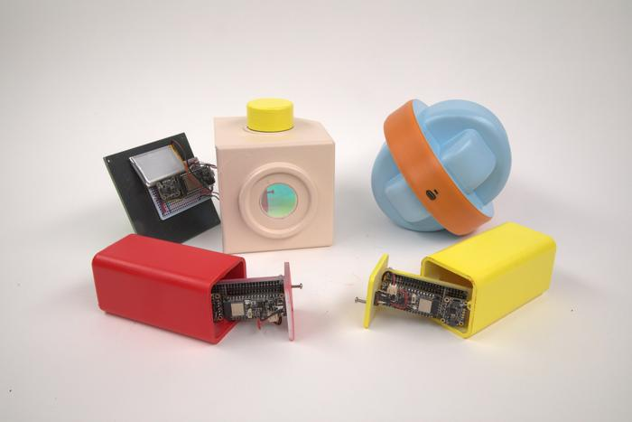
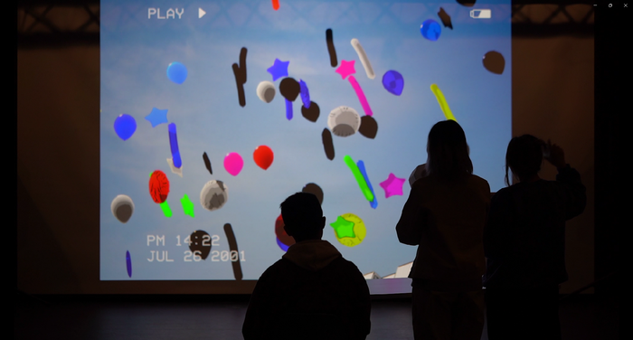
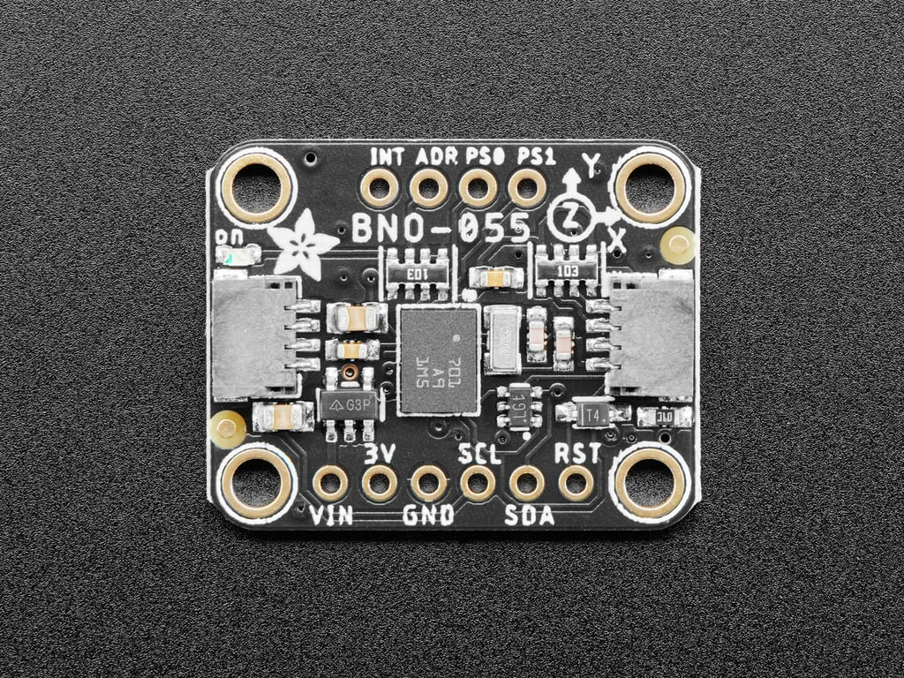
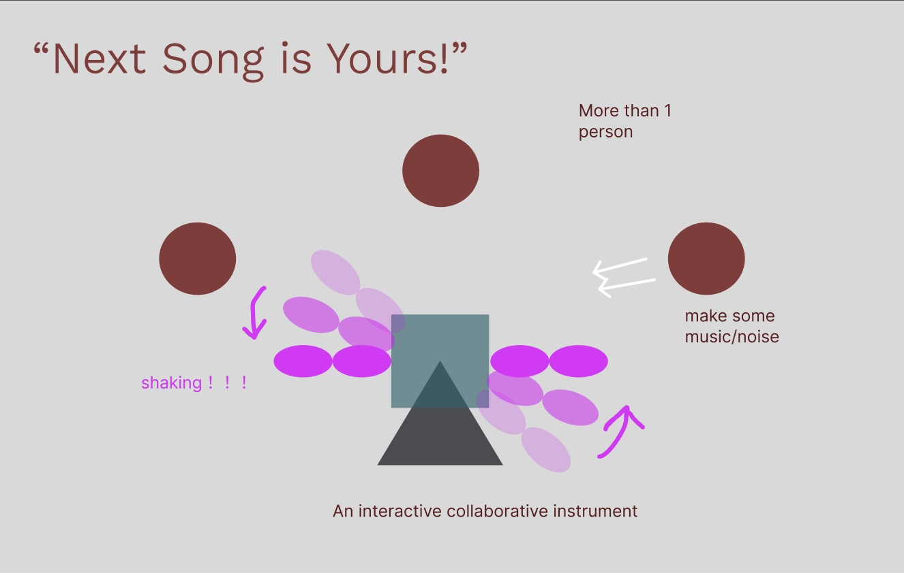
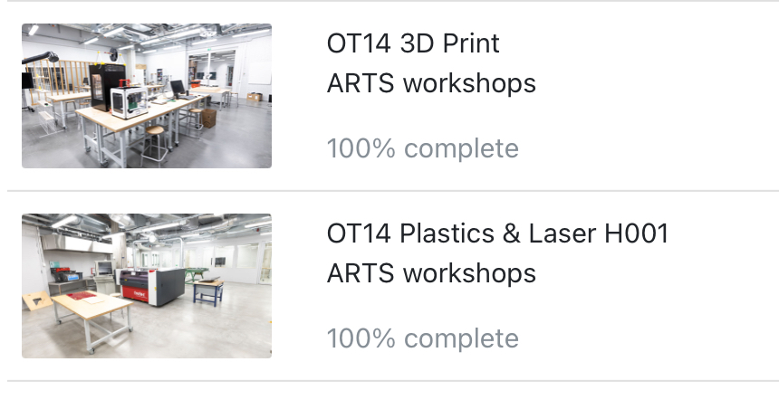

***1 Find one interesting project***

<https://shakethatbutton.com/i-will-wait-for-you-downstairs/>

<https://vimeo.com/826380331>

“I Will Wait for You Downstairs” is a thesis project by a student at NYU’s ITP. It’s an exploration game designed to rekindle the joy of make-believe and investigate the creative potential of blending tangible objects with virtual content.At the start of the game, players receive four controllers, each featuring ambiguous, toy-like shapes. Their functions are intentionally left unexplained, encouraging players to experiment and discover. The game is projected on a screen, with the controllers influencing various in-game variables like time, weather, and camera angles.

**The reason**

The first reason is that the design is very simple and cute, with clear functionality that offers variety and playability. The accompanying 3D visuals are also aesthetically pleasing. The second reason is my interest in the motion-sensing capabilities that allow for shaking interactions. This combination of appealing design and engaging interactivity creates an inviting experience for players.

**The sensor I interested** 

*BnoO55 Orientation Sensors*

<https://learn.adafruit.com/adafruit-bno055-absolute-orientation-sensor/overview>

***2. "Next Song is Yours!" - An Interactive Innovation in Karaoke***

***Game Concept:***

*An interactive karaoke game that uses BNO055 orientation sensors to track participants’ movements and a group-operated instrument that requires coordinated shaking to produce sound.*

Shake to Start: Players gather around a platform with sensors, shaking in sync to begin the musical accompaniment.

Rhythm Challenge: Players follow screen cues to shake in specific directions, enhancing music if correct, or adding “static” if incorrect.

Rhythm Relay: Players pass the rhythm to one another, creating a collaborative karaoke relay.

Multi-person Instrument: A “team drum” only sounds when shaken in unison, adding dynamics and rhythm.

***3. Complete the MyCourses introductions for the 3D Printing and Laser Cutter workshops*** 

