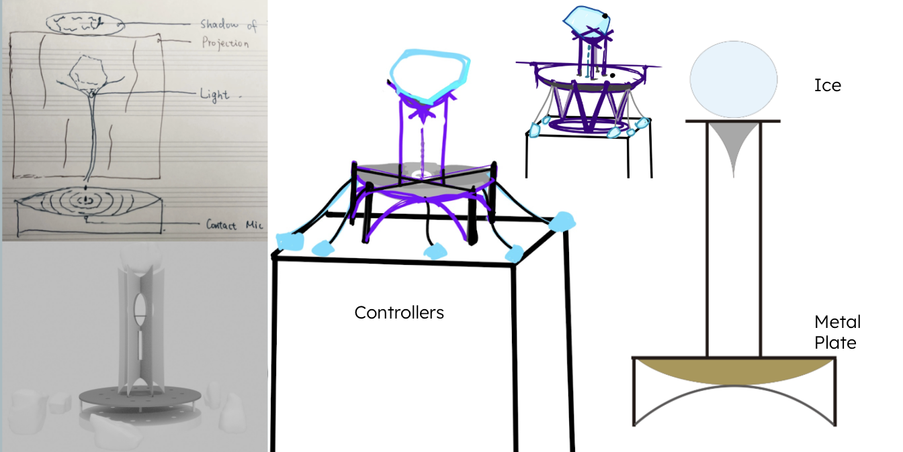
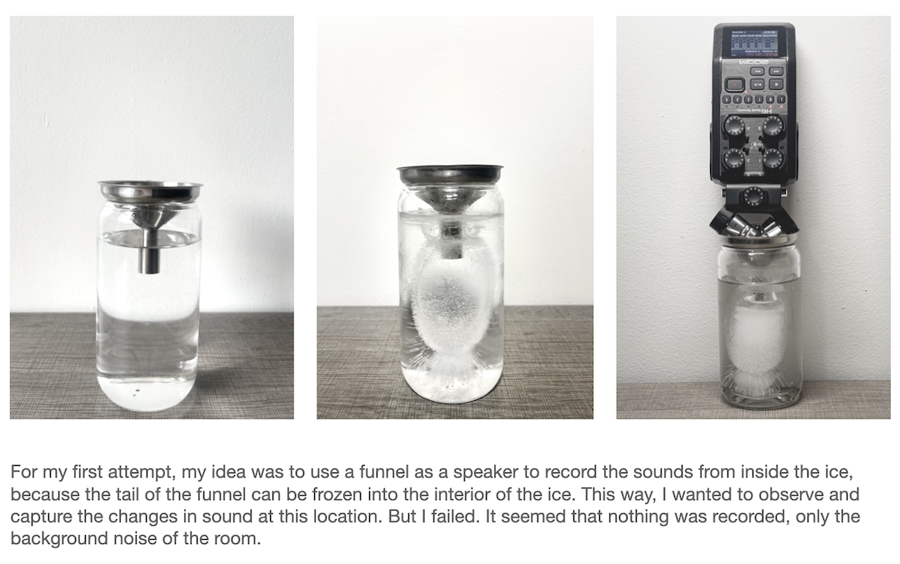
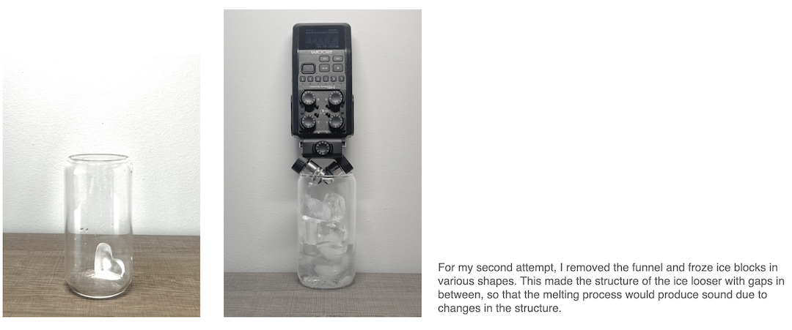
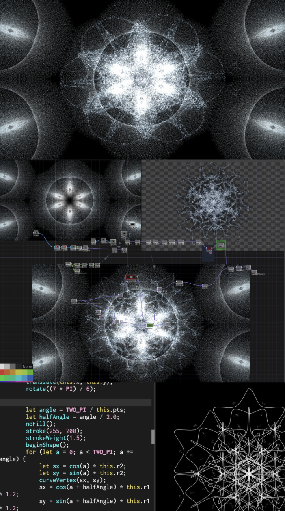
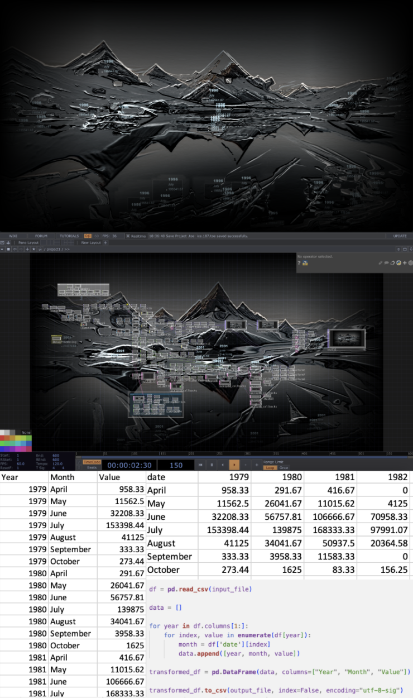

*Traceless* is an interactive sound sculpture with visual projections. It invites audiences to engage with its narrative through handheld controllers. The project centers on ice as both a medium and a collaborator, exploring its transformative qualities during the melting process to show the active role of nonhuman entities in shaping our environment.

Ice has historically embodied dualities: during the Anthropocene, it symbolized fragility and retreat, yet in the age of glaciers, it wielded immense power, dwarfing human existence. By amplifying the visual and auditory shifts as the ice melts, the project contrasts two temporal scales: the slow, expansive timeline of glacial formation and the rapid, human-accelerated pace of their current retreat. *Traceless* envisions a de-anthropocentric future, inviting audiences to reconsider how human intervention has reshaped natural processes.

<iframe width="560" height="315" src="https://www.youtube.com/embed/lR1OMePhHwM?si=I5HTA8Ut6HAwjqsF" title="YouTube video player" frameborder="0" allow="accelerometer; autoplay; clipboard-write; encrypted-media; gyroscope; picture-in-picture; web-share" referrerpolicy="strict-origin-when-cross-origin" allowfullscreen></iframe>

## Background

### Glacial Ice Formation

* Snow gradually compresses into ice as layers build up annually 
* Over time, it recrystallizes into firn, an intermediate state, and eventually becomes dense glacier ice. This process, which can take over a century, forms large ice crystals with minimal air pockets

  

### Glacier Melting

Glacier melting rapidly in the past two centuries is driven by:

* Fossil fuel combustion: CO2 and methane emissions causing global warming
* Deforestation: Reduced carbon absorption capacity
* Urbanization & agriculture
* Industrialization

  

## Installation

Our installation consists of a main body and 7 stone-shaped controllers. The main body is made of 0.5mm steel rods, with a block of ice on top. The ice melts into a 3D-printed funnel, and water drips onto a metal plate at the bottom. The controller is 3D printed using PLA with fiber material.

### Refining Ideas Through Iterative Processes

### Previous Experiments on Ice

<iframe width="560" height="315" src="https://www.youtube.com/embed/h2c7ZpcjlCg?si=tJH-G707IM8tvOnv" title="YouTube video player" frameborder="0" allow="accelerometer; autoplay; clipboard-write; encrypted-media; gyroscope; picture-in-picture; web-share" referrerpolicy="strict-origin-when-cross-origin" allowfullscreen></iframe>

## Interaction Design

* The behavior of humans does not control the process of ice;  
* The sounds people make can merge with the sounds of ice to form an echo;
* Humans cannot intervene, and any change will be embraced within the echo of the natural system.

### Content of Interaction

* The main body is natural ice melting and dripping to create an overall ambient sound;
* A human holds the controller distributed around the main body and gets visual (led) and audio (musical note) feedback;
* The human creates sound against the sensor (small microphone), and the sound blends and reverberates with the sound of falling water drops;
* When each sensor receives touch from a human, the visual projected behind it goes from snowflake to glacier.

  

## Visual Design

In terms of visual design, we used snowflakes to represent the process of glacier formation and a dataset of glacier monthly melting areas in Greenland in recent decades to represent the impact of human activities on natural rhythms.

### Snowflake

In p5.js, we create a basic linear model to visualize the evolving structure of a snowflake crystal, showcasing its transformation dynamically over time. Then, we integrate this with TouchDesigner by adding a particle effect background. We then overlay these particle effects onto the transforming snowflake structure. Finally, we implement audio-visual interaction to synchronize the visual transformations and particle effects with sound, creating an engaging and interactive experience.

### Glacier

We generated an AI-driven glacier video using the Deforum extension of Stable Diffusion, showcasing an animated representation of glacier dynamics. To enhance the visualization, we utilized TouchDesigner for advanced visual effects processing, using techniques such as blob tracking. We also implemented audio-responsive changes, allowing the visual elements to react dynamically to sound, and developed data-driven visualizations to integrate scientific information into the artistic narrative. For the dataset, we used the Greenland Surface Melt Extent from the NSIDC (National Snow and Ice Data Center), a reliable source of historical records. During the data processing stage, we converted the dataset into CSV format to facilitate analysis, focusing on extracting the monthly mean melting area of Greenland's surface from April to October over the period 1979 to 2024. This processed data was then integrated into the visuals, creating a data-informed depiction of environmental change.

## Sound Design

## System Overview

This installation system combines hardware and software modules to achieve artistic expression through multi-level interaction. The sculpture contains a water pump, four LED lights and two contact microphones, which are used to control water flow, light and sound capture respectively, and are centrally managed by Arduino. We used a potentiometer to control the flow rate of the water pump and a button to control the switch of the LEDs. The controller module includes a capacitive touch sensor, 7 LED lights and 7 microphones for touch sensing and sound recording. Arduino, as the core control unit, receives sensor data from the sculpture and controller modules, transmits information to Max/MSP through serial communication, and controls the physical output of the device. The audio interface collects the microphone signal and passes it to Max/MSP, which further processes the data from the hardware and performs audio processing, and transmits the results to TouchDesigner through the OSC protocol. TouchDesigner generates real-time visual effects based on the input and presents them through projection.

## Reflection

## Acknowledgments

Special thanks to Matti for all the help throughout the process, Xiaoqi Wang for help with video shooting and exhibition setup, and Ron from the metal workshop for the support during the installation construction.

## References

1. <https://nsidc.org/learn/parts-cryosphere/glaciers#:~:text=Glaciers%20begin%20to%20form%20when,and%20shape%20of%20sugar%20grains>.
2. <https://nsidc.org/data/g00472/versions/1> 
3. <https://nsidc.org/ice-sheets-today/melt-data-tools>
