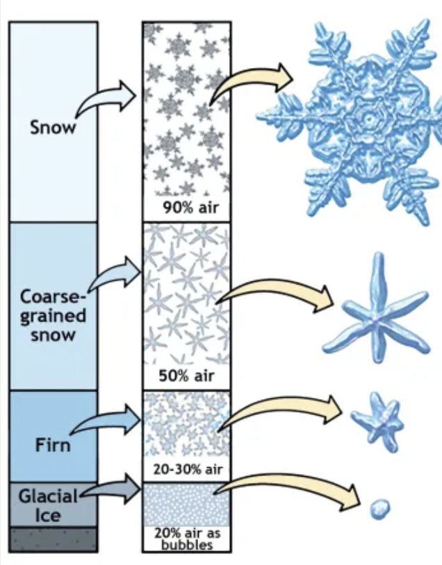
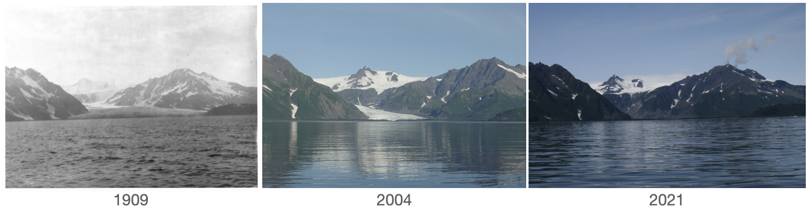
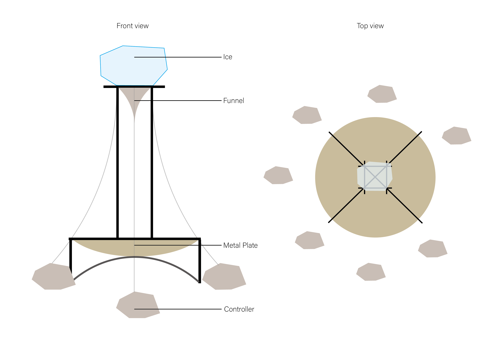
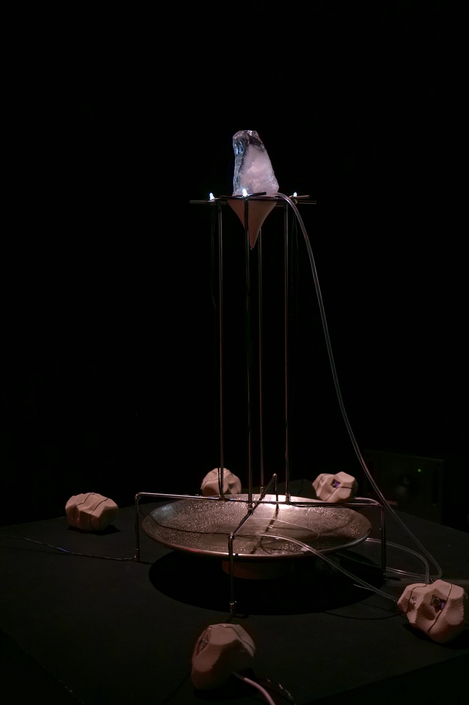
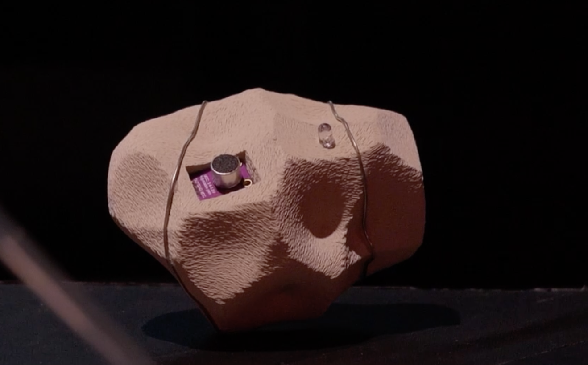
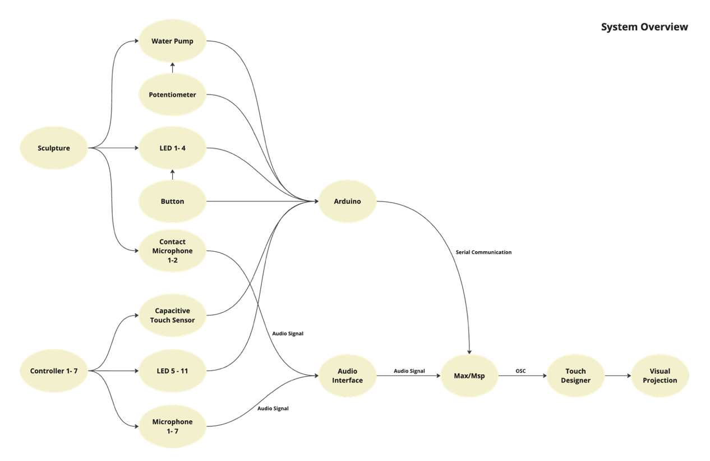

*Traceless* is an interactive sound sculpture with visual projections. It invites audiences to engage with its narrative through handheld controllers. The project centers on ice as both a medium and a collaborator, exploring its transformative qualities during the melting process to show the active role of nonhuman entities in shaping our environment.

Ice has historically embodied dualities: during the Anthropocene, it symbolized fragility and retreat, yet in the age of glaciers, it wielded immense power, dwarfing human existence. By amplifying the visual and auditory shifts as the ice melts, the project contrasts two temporal scales: the slow, expansive timeline of glacial formation and the rapid, human-accelerated pace of their current retreat. *Traceless* envisions a de-anthropocentric future, inviting audiences to reconsider how human intervention has reshaped natural processes.

<iframe width="560" height="315" src="https://www.youtube.com/embed/lR1OMePhHwM?si=I5HTA8Ut6HAwjqsF" title="YouTube video player" frameborder="0" allow="accelerometer; autoplay; clipboard-write; encrypted-media; gyroscope; picture-in-picture; web-share" referrerpolicy="strict-origin-when-cross-origin" allowfullscreen></iframe>

### Background

#### Glacial Ice Formation

* Snow gradually compresses into ice as layers build up annually. 
* Over time, it recrystallizes into firn, an intermediate state, and eventually becomes dense glacier ice. This process, which can take over a century, forms large ice crystals with minimal air pockets.

  

#### Glacier Melting

Glacier melting rapidly in the past two centuries is driven by:

* Fossil fuel combustion: CO2 and methane emissions causing global warming
* Deforestation: Reduced carbon absorption capacity
* Urbanization & agriculture
* Industrialization

  

### Installation

Our installation consists of a main body and 7 stone-shaped controllers. The main body is made of 0.5mm steel rods, with a block of ice on top. The ice melts into a 3D-printed funnel, and water drips onto a metal plate at the bottom. The controller is 3D printed using PLA with fiber material.

### Interaction Design

* The behavior of humans does not control the process of ice;  
* The sounds people make can merge with the sounds of ice to form an echo.
* Humans cannot intervene, and any change will be embraced within the echo of the natural system.

  

### Visual Design

### Sound Design

### System Overview

### Reflection

### References

1. <https://nsidc.org/learn/parts-cryosphere/glaciers#:~:text=Glaciers%20begin%20to%20form%20when,and%20shape%20of%20sugar%20grains>.
2. <https://nsidc.org/data/g00472/versions/1> 
3. <https://nsidc.org/ice-sheets-today/melt-data-tools>
