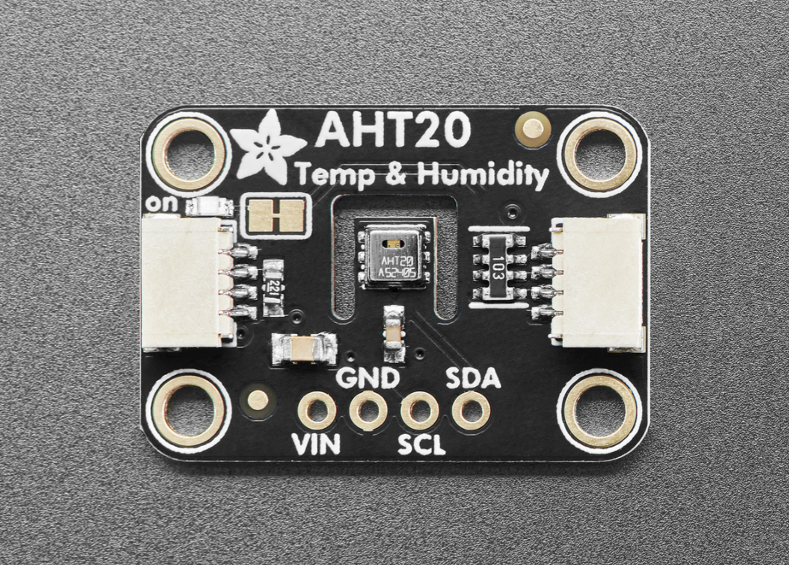
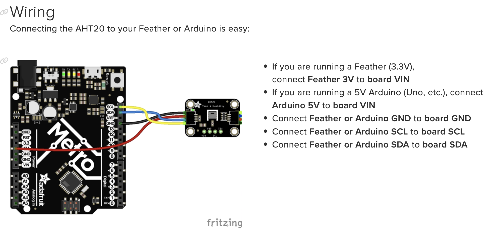
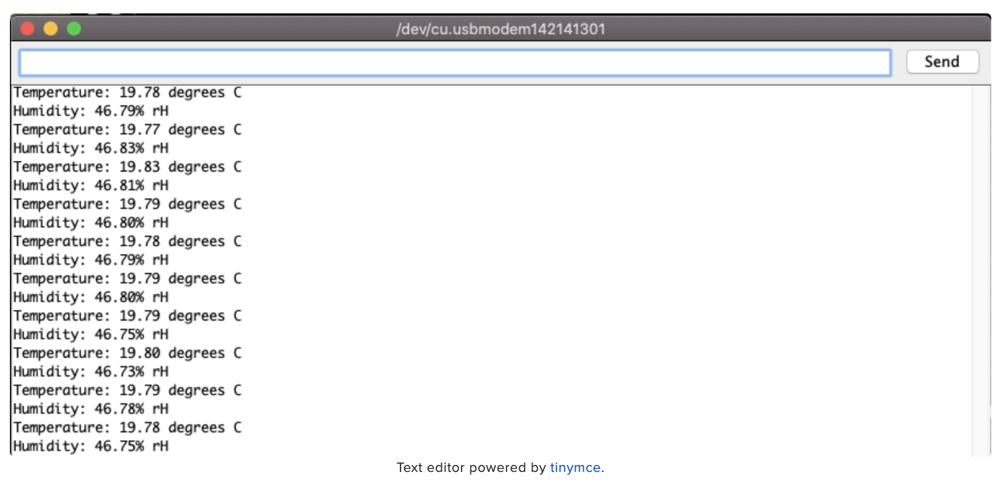
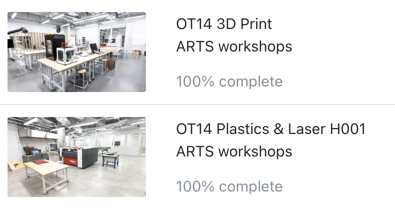

### 1. Find an interesting existing Alt+Ctrl Interface


Hen is a remote-controlled egg boiler designed for a patient cooking experience. To use it, gently place an egg inside, add enough water to cover it, and secure the cap. Hold the controller carefully and wait—like a hen hatching her eggs, it requires time. Expect soft-boiled perfection in over two hours.

**How it works?**

* 3D-printed boiler and remote control
* MKR WiFi 1010 board
* temperature sensor
* heat pad

**Video:** 

<iframe title="vimeo-player" src="https://player.vimeo.com/video/824921582?h=5324be062f" width="640" height="360" frameborder="0" allowfullscreen></iframe>

I chose this project because I love the concept of boiling an egg and the comparison between a hen hatching her egg and humans cooking one. It attempts to view things from the animal’s point of view. Additionally, I love the remote-control feature for its simplicity and aesthetic appeal. A wired, more complex setup often takes extra time and effort to figure out how to hide the cables.

- - -

### 2. Come up with a concept for your own Alt+Ctrl Interface

 **Sensor: AHT20 temperature and humidity sensor**



The AHT20 sensor has temperature and humidity measurement capabilities, providing a temperature range of -40°C to 85°C and a humidity range of 0% to 100% RH. It offers high accuracy, with a typical temperature accuracy of ±0.3°C within the range of 20-60°C and a typical humidity accuracy of ±2% within the range of 20-80% RH. It transmits data via an I2C interface (address 0x38), making it compatible with controllers such as Arduino and Raspberry Pi, and it can operate with either 3.3V or 5V power.

There are several considerations when using the AHT20. First, due to its single I2C address, it is not suitable for use with multiple AHT20 sensors in the same system. Additionally, the sensor supports STEMMA QT or Qwiic interfaces, enabling solder-free connections with adapter cables, which is convenient and quick. In terms of measurement environment, the sensor performs best in a specific temperature and humidity range, and accuracy may be affected outside of this range.

To achieve optimal performance, it is recommended to design the I2C bus connections properly to ensure stable data readings. Although the AHT20 supports frequent readings, excessive requests should be avoided to extend the sensor's lifespan and maintain data accuracy. Also, it should be prevented from being exposed to extreme temperature and humidity environments to ensure long-term, stable measurement performance.

**What kind of data can I get out of it?**

* **Temperature Data**

  * Range: -40 to 85 °C
  * Accuracy: ±0.3 °C typical accuracy at 20-60 °C; ±1 °C typical accuracy over the entire range
* **Humidity Data**

  * Range: 0% to 100% Relative Humidity (RH)
  * Accuracy: ±2% RH at 20-80% RH; ±3% typical accuracy over the full range

**Wiring**



**Example Code**

Open up File -> Examples -> Adafruit AHTx0 -> adafruit_aht_test and upload to your Arduino wired up to the sensor.

```c
#include <Adafruit_AHTX0.h>

Adafruit_AHTX0 aht;

void setup() {
  Serial.begin(115200);
  Serial.println("Adafruit AHT10/AHT20 demo!");

  if (! aht.begin()) {
    Serial.println("Could not find AHT? Check wiring");
    while (1) delay(10);
  }
  Serial.println("AHT10 or AHT20 found");
}

void loop() {
  sensors_event_t humidity, temp;
  aht.getEvent(&humidity, &temp);// populate temp and humidity objects with fresh data
  Serial.print("Temperature: "); Serial.print(temp.temperature); Serial.println(" degrees C");
  Serial.print("Humidity: "); Serial.print(humidity.relative_humidity); Serial.println("% rH");

  delay(500);
}
```

**What can I get from the serial monitor?**



- - -

**Alt+Ctrl Interface**

My idea is to create a "Virtual Plant Growing Simulator" where the player's goal is to cultivate healthy virtual plants. Using real-time temperature and humidity data from an AHT20 sensor, the game can simulate the plant's growing environment. Players need to adjust greenhouse conditions to meet the requirements for each stage of the plant's growth. For example, in the seed stage, the plant requires lower temperature and humidity; in the germination stage, it needs medium humidity and a warm environment; and in the flowering stage, higher temperature and moderate humidity are necessary. Players need to adjust the temperature and humidity range monitored by the sensor to maintain a suitable environment for the plant. If the temperature or humidity doesn't meet the requirements, the plant will gradually wither until the player readjusts the environment. After successfully growing each type of plant, players can unlock more plants.

I want to create a wireless controller that allows players to adjust the temperature and humidity by holding it with both hands. For example, gripping the controller tightly will increase the temperature, while relaxing it will decrease the temperature. Additionally, this controller will provide haptic feedback to the player, such as vibrations. 

- - -

### 3. Complete the MyCourses introductions for the 3D Printing and Laser Cutter workshops




