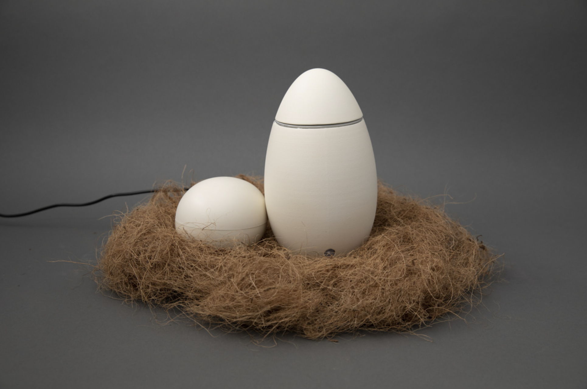

### Find an interesting existing Alt+Ctrl Interface

Hen is a remote-controlled egg boiler designed for a patient cooking experience. To use it, gently place an egg inside, add enough water to cover it, and secure the cap. Hold the controller carefully and wait—like a hen hatching her eggs, it requires time. Expect soft-boiled perfection in over two hours.

- 3D printed boiler and remote\
- MKR WiFi 1010 board\
– temperature sensor\
– heat pad

Video: 
<iframe title="vimeo-player" src="https://player.vimeo.com/video/824921582?h=5324be062f" width="640" height="360" frameborder="0" allowfullscreen></iframe>

I choose this game because
