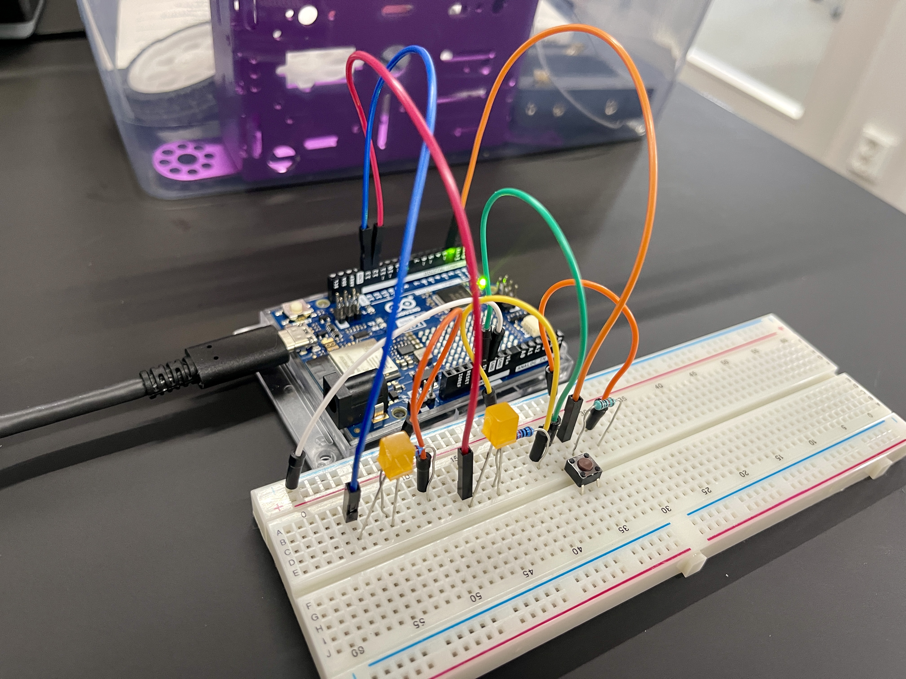

### First Attempt

In my first attempt, [watch here](https://youtube.com/shorts/2UfICF9XRc4?feature=share), I failed because I didn’t store the button state. This caused the counter to increment too quickly.

```cpp
if (btnState == HIGH) 
{
  counter++;
}
```

- - -

### Second Attempt (Success)

After storing the button state, I successfully solved the issue. You can watch it [here](https://youtube.com/shorts/ijCMIy3h8yU?feature=share).

```cpp
if(prevbtnState != btnState)
  {
    if (btnState == HIGH) 
    {
      counter++;
    }
  }
  prevbtnState = btnState;
```

- - -

### The code:

```cpp
int counter = 0; 
int prevbtnState = LOW;

void setup() {
  pinMode(2, INPUT);
  pinMode(13, OUTPUT);
  pinMode(12, OUTPUT);
  Serial.begin(9600);
}

void updateCounter() {
  int btnState = digitalRead(2);
  
  if(prevbtnState != btnState) {
    if (btnState == HIGH) {
      counter++;
    }
  }
  prevbtnState = btnState;
}

void controlLEDs() {
  if (counter % 3 == 0) {
    digitalWrite(13, LOW);
    digitalWrite(12, LOW);
  }
  
  if (counter % 3 == 1) {
    digitalWrite(13, HIGH);
    digitalWrite(12, LOW);
  }
  
  if (counter % 3 == 2) {
    digitalWrite(13, HIGH);
    digitalWrite(12, HIGH);
  }
}

void loop() {
  updateCounter();
  controlLEDs();
  delay(10);
}
```
