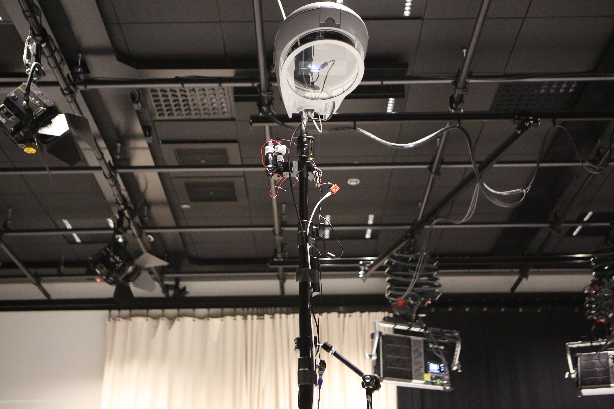
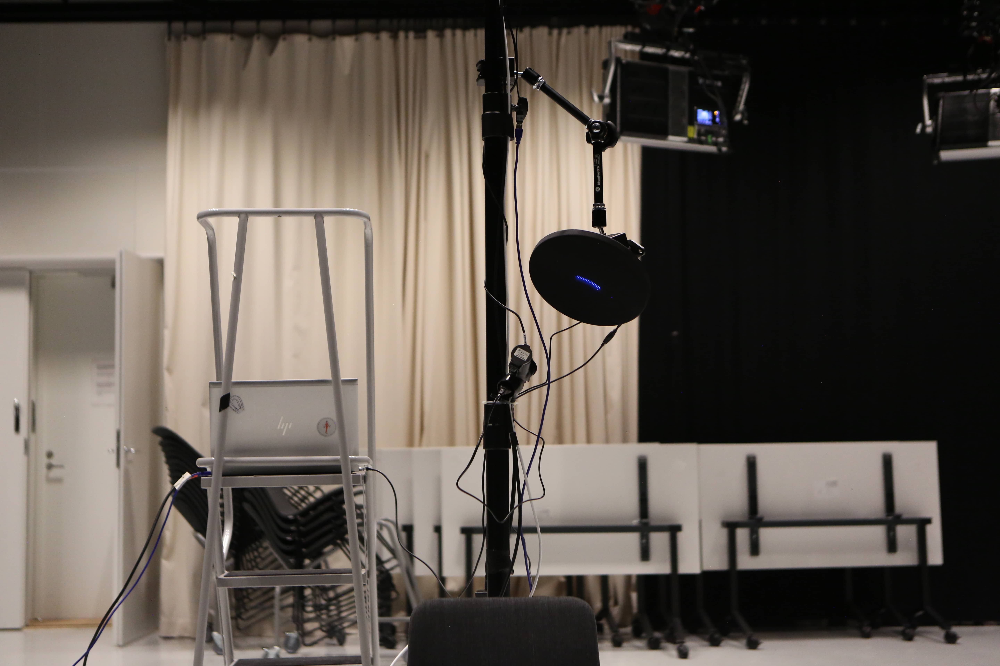
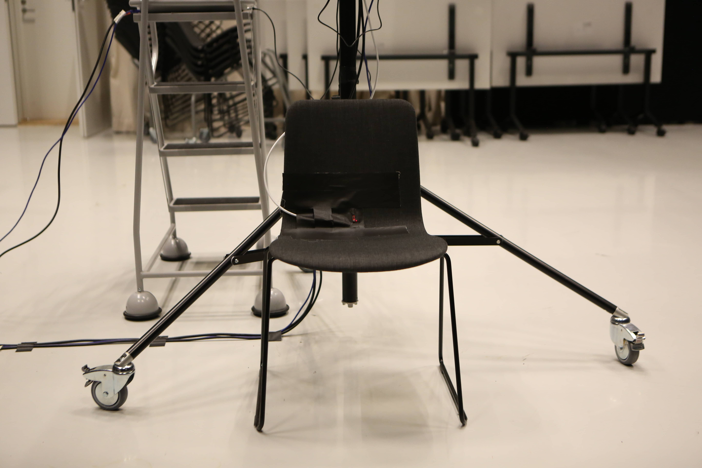
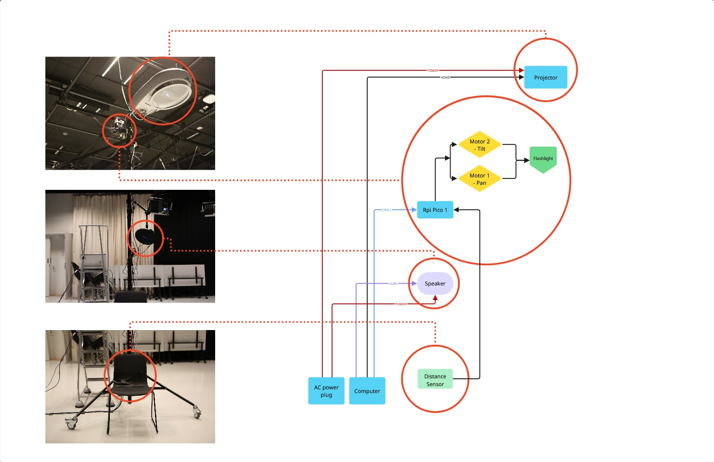
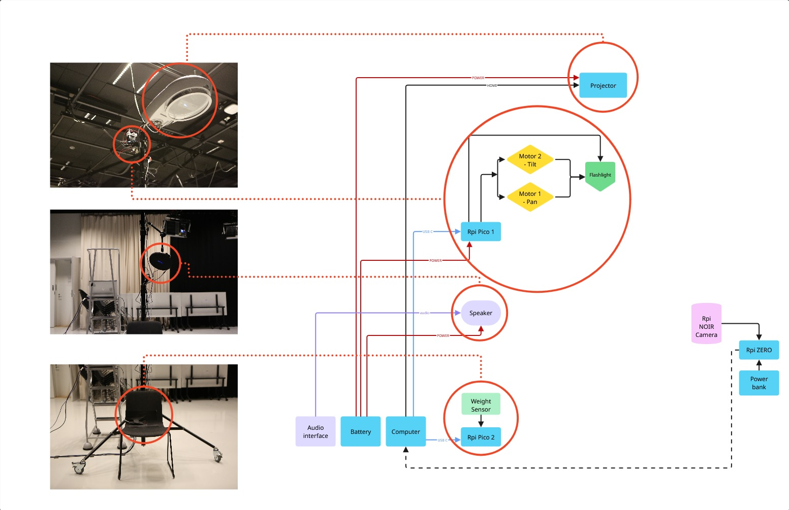

**The Cone of Light**

Julia Lohmann

Gloria Lauterbach

İdil Gaziulusoy

Matti Niinimäki

Ana Todosijević



The Cone of Light is an immersive installation created within NorDark, a multidisciplinary research project investigating how artificial light shapes Nordic after-dark environments and the lives of humans and non-humans. Developed by the Aalto University team working on more-than-human methodologies (İdil Gaziulusoy, Julia Lohmann, Gloria Lauterbach), and realized by Ana Todosijević in collaboration with Matti Niinimäki, this work serves as the project‘s final artistic reflection, gathering the learnings and translating them into a sensorial encounter.

The installation invites visitors to step out of the centre and see the night as a world shared with many others. It reveals how our lights shape the lives of animals, the forest, and the way we perceive ourselves. Instead of offering only data as numbers, The Cone of Light encourages embodied curiosity – a gentle re-learning of how to listen, observe, and belong beyond human scale.

The NorDark research consortium is funded by NordForsk.

nordark.org

