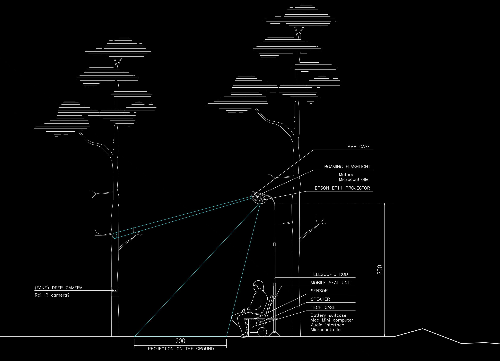
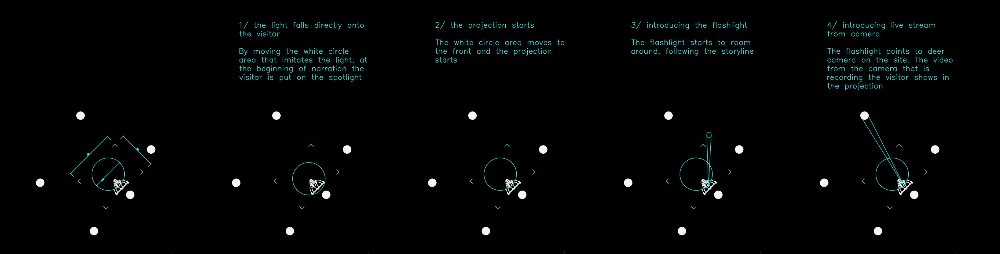

In this class I will make a mobile installation for the NorDark project. NorDark involved groups from six universities across the Nordic countries, working together to explore new methods for planning and developing policies around the use of electric artificial light in after-dark outdoor environment, and its impact on humans and nonhumans. Within Aalto's group, which focused on more-than-human methodologies, I will be working on the Forest Lights* installation. 

Forest Lights* is a mobile outdoor installation, designed to be set in a forest environment, inviting visitors to engage with findings and insights from the NorDark project. The installation will include a street light structure with a projector and rotating flashlight, mobile unit with necessary technology (computer, battery, microcontroller, sensor, speaker, etc.) and artifacts around the scene.

When a visitor sits on the seat, a sensor detects the presence and activates the projection.

1) First, a white light, similar to a street lamp spotlight, shines directly on the visitor, making them feel uncomfortable, like they're in the spotlight.

2) The projection then moves to the ground in front of the visitor and the content appears\*\*

3) The rotating light starts roaming around, illuminating artifacts in the scene, or possibly "following" (or being triggered by) sounds in the environment

4) One of the artifacts is an IR camera hidden inside a fake deer camera, which can stream the video of the visitor directly into the projection. This could be triggered when the spotlight illuminates the deer camera, or by other environmental impact.

