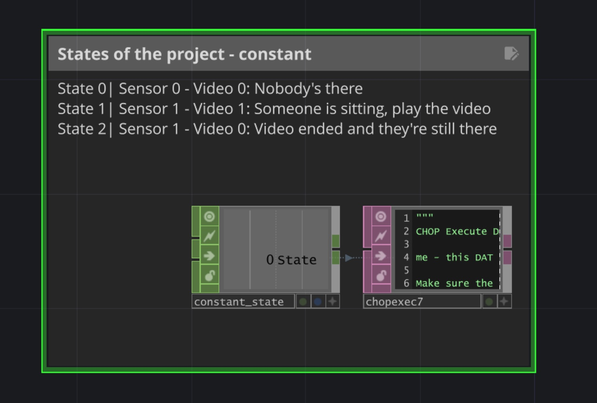
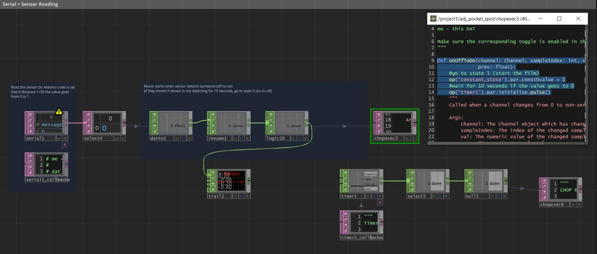
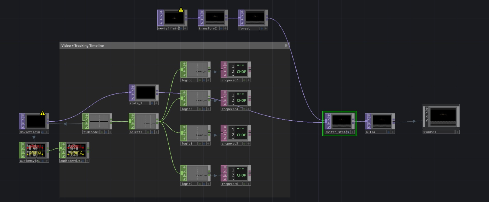
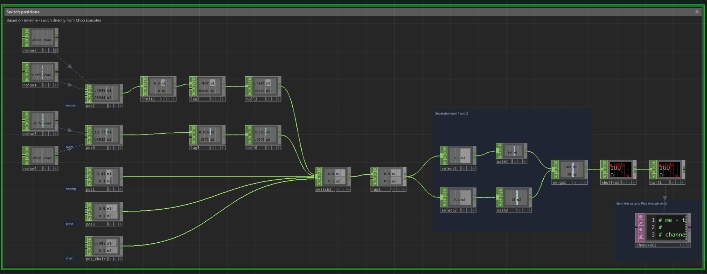
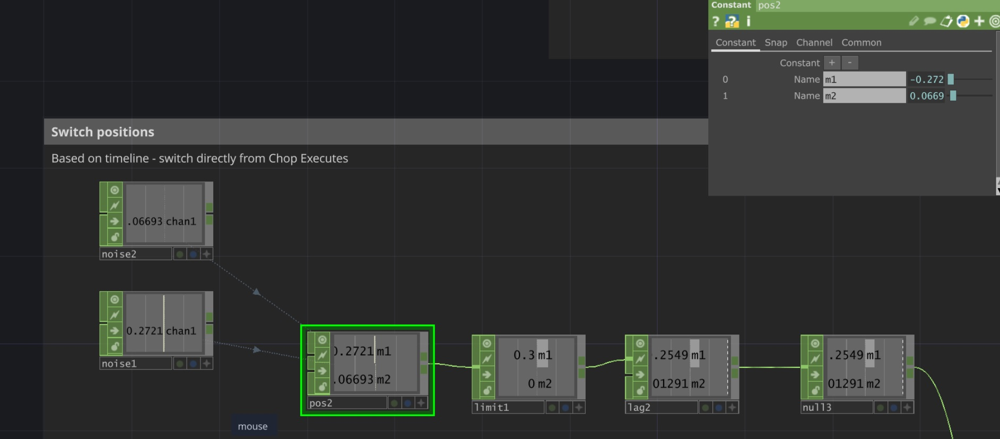

**The Cone of Light: Making of**

Julia Lohmann

Gloria Lauterbach

İdil Gaziulusoy

Matti Niinimäki

Ana Todosijević



Making The Cone of Light covered a wide range of operations, from developing the artistic content to working with electronics and motors, building the installation, programing, and sourcing and integrating the equipment. 

In general, I feel like I'm getting more confident in TD - even when I don't know the solution I know where to look. I learned to look at the documentation. My brain works more in the TD mode. 

Going through Arduino IDE, I feel confident to write a simple code and troubleshoot. I understand the circuit and have no trouble working with Pico, motors and sensors.

I spent half of the time on building things: adjusting projector to the street lamp, welding (for the first time in my life), making the pan tilt bracket and testing it, designing, 3D printing and trying 3D printed parts for the lamp.

I spent significant amount of time figuring out how we can make the effect of the street lamp from the projector, and how should the movement of the flashlight work, which was the central point of the installation. Here are some tests:



The project is run from TouchDesigner, and I spent a lot of time figuring out how to achieve what we were talking in the meetings with the rest of the team.

Documenting the TouchDesigner project (future Ana loves me now)




I learned how to structure and organize the project flow in a simple way. This was very helpful because I was able to return to the plan quickly at any moment and it prevented me to be lost.

Here are the 3 phases of the project that we said we will have:

State 0: Nobody's there - sensor state is 0 - play "screensaver mode"

State 1: Someone sits - sensor state is 1 - start the video

\*give 10 sec delay - in case someone moves accidentally to prevent stopping the video

State 2: Someone is still there but the video ended - sensor state 1 - play something

This is done by having the Constant CHOP for the project, with differen values for different states. In the Chop execute in Phyton code, in OnValueChange I can control what happens in each state:

```
def onValueChange(channel: Channel, sampleIndex: int, val: float, 
                  prev: float):
	#if state = 0
	#make light pulsing - switch_on_off index 0
	if val == 0:
		op('switch_states').par.index = 0
		op('timecode1').par.init.pulse()
		op('switch1').par.index = 4
		print('mode 0')
	elif val == 1:
		op('timecode1').par.start.pulse()
		op('switch_states').par.index = 1
		print('mode 1')
	return
```





I learned how to send and receive data from Rpi Pico to TD and vice versa - to use serial for sensor reading, but also how to think of real situation and include them in the code, such as preventing the video to restart if someone moves accidentally.

Here, I'm reading the sensor state via Serial (currently, I'm using Distance Sensor and in Arduino code the distance is threshold is set to 30cm). When the sensor value changes from 0 to 1, the project switches to the state 1, but it also starts the timer that counts 10 seconds, checks if the value is 0, and if it is, switches back to the project state 0.


In Chop Execute:


```
def onOffToOn(channel: Channel, sampleIndex: int, val: float, 
              prev: float):
	#go to state 1 (start the film)
	op('constant_state').par.const0value = 1
	#wait for 10 seconds if the value goes to 0
	op('timer1').par.initialize.pulse()
	return
```




I learned how to track the timeline of the video using Chop Timecode and how to access certain points in the video. The Logic Chop is still a bit confusing, particularly Bounce - at the moment of writing this, I believe here lies the problem of my flashlight moving even after I want it to move :)

Here, I have a video and Timecode Chop connected to it - I'm selecting the seconds and using the Logic Chop I'm accessing the exact second of the video and in the Chop Execute on OFF to ON I'm switching to the flashlight (motors) position (this will be explained in the next step).

I have also States Switch that switches in between project states - state 0 switches to "screensaver movie" and state 1 switches to the main movie.





I learned (sort of) how to control servo motors and change the rotation / position of them. I have 5 different positions in space (4 pointing to the props and 1 pointing to the chair when the state of the project is 0). Switching in between them is happening in the previous step, where in the certain moment in the video, I'm choosing different index of this switch here, the using Logic Chop.

After that, I'm sending the data via Serial using Chop Execute:

```
def onValueChange(channel, sampleIndex, val, prev):
	print(sampleIndex)
	if sampleIndex == 0:
		op('serial1').sendBytes('A'+ str(int(val)) + '\n')
	elif sampleIndex == 1:
		#print(val)
		op('serial1').sendBytes('B'+ str(int(val)) + '\n')
	return
```


This is how to access the value instead of just sending 0 or 1 - might not understand completely now, will definitely need it later.





This is where I am at now (Matti help!) - I want to make flashlight move in such a way that simulate the movement of a mouse. I kinda already have the movement that I want with noise, but I also want to limit it to be only on the floor space.

However, I have a problem somewhere in the program, that the movement of the mouse continues after it should switch to the next phase. For example, the movement continues what the index of the switch is 4 and the project state 0, which means its should be pointing to the chair. Anyhow, I didn't get the chance to properly troubleshoot this, so it might also be very easy to spot when I get back to it.
