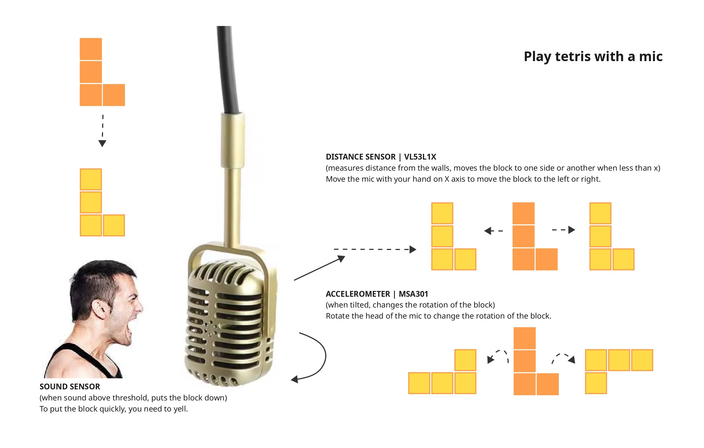

Play good old Tetris with a hanging mic!

To move left and right, you need to move the mic in the air on the x axis. The distance sensor in the mic measures the distance from the walls - when less than certain number, moves the block one step. 

To rotate the block, you need to rotate the head of the mic (see the picture of the mic). The accelerometer measures tilting of the mic and rotates the block for 90 degrees.

To put the block down quickly, you need to yell! The sound sensor detect when above certain level of noise, and puts the block down. 

You can play safe and never use your voice - but if you want to break some records, you better be loud!

