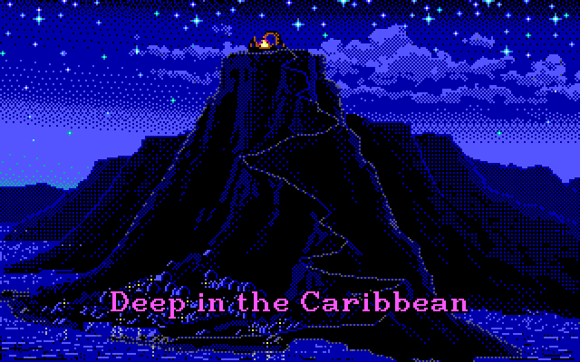
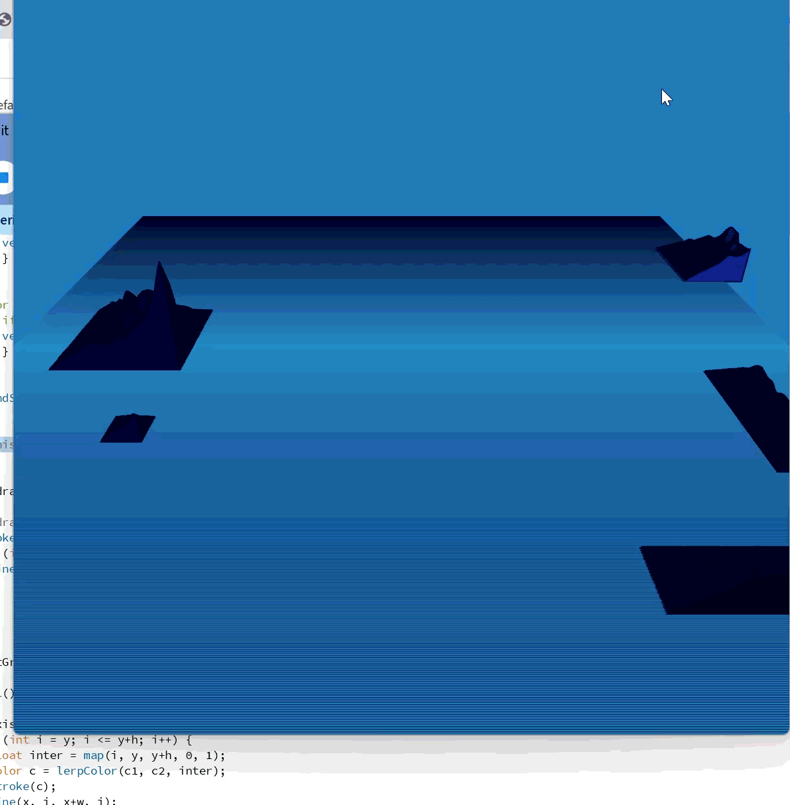

**Memory Scene Machine**

So recently I’ve been looking into pixel art and how I could procedurally generate some using techniques learned in the Computational art & design course. However, I know myself well enough to conclude that once the course is over I will probably drop this exploration. So I want to make something that will keep me on this path.

This combined with my recent binge watching of Star Trek: The Next Generation and my interest in the nature of visual memory has produced the following idea: The Memory Scene Machine (working title).

It’s a portable, foldable box with a screen, ADPS9960, LEDs, sensors and some dice (and perhaps a speaker for audio). The memories of a race of travellers (aliens, time travellers?) are “encoded” in the dice, which are placed in slots that then generate a memory (pixel art scene). The sides of the dice are different colors (with some neat patterns on them) which the sensor picks up. Each color represents a number (1-6). Slot 1 would be biome (water, forest, city, space, desert etc.), slot 2 time (day, night, dawn/dusk), slot 3 color palette etc. 

The dice are placed in the slots, there’s some led magic, a randomly generated text vignette appears and the scene plays. The idea is to make it a meditative exercise. Easter egg scenes would appear with certain combinations (666666 makes hellfire and pentagrams).

Now I am considering using a magnetometer to do more real-time manipulation but I wonder if that defeats the idea of putting in different combinations of dice to discover new places (the slot machine feeling).

Possible part list:

* A 800x480 screen (smaller resolution ones are too small, I’d like over 4 inches)
* A raspberry pi 4 that I have laying around (to make sure I can run the graphics)
* Arduino board to control and read sensors
* 6 x ADPS9960
* 6 x RGB led (to give light for color sensing and do flashy stuff)
* Power source
* Cheap speaker?
* Case

I also have an interest in making real-time visualizations to music, so the box could be used for that too later on, with the dice changing parameters. Removing one dice could allow for some realtime control via the distance sensor on the ADPS sensor.

**Visuals**

I really adore 80’s and 90’s pixel art adventure games, especially the Lucasarts ones. I’ve started trying to figure out how I could make the Monkey Island intro screen as a flyover animation.

Below are a few initial tests. My idea is to make a debug environment where I can easily change values to find sweet spots, show or hide elements and change camera angles. I´m hoping to have two ok-looking biomes with some changeable elements for the finished project.

**Other idea**

I did have an idea of an "annihilation mirror" where you have to stare at your eye as your body begins to disintegrate and makes weird sounds. If you move your eyes your body starts to come back. If you can stare without looking away for long enough past the peak some angelic music plays and there are nice light effects. But that mostly seems like coding and very little physical stuff unless I made a mechanical mirror from all kinds of parts, and that frankly seems a little outside my current skill range.
