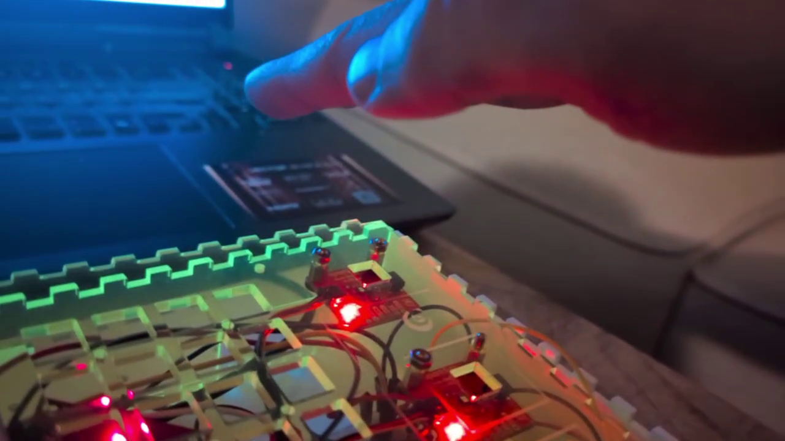

My original idea was to create a pixel art generator box. While this had its appeal, it felt a little static, with a lot of hardcoding of values. I wanted to play with more of the sensors so I repurposed the idea to make a simple VJ tool.

## VJseq

VJseq essentially takes the parameters of an audio synth and maps them to a visual scene and objects (or "actors") within it.

My idea was and is to make a VJ tool that is easy and intuitive to use, not too demanding on the hardware side and *DOES NOT REQUIRE A MOUSE*. I love playing with hardware synthesizers and they don't have mice (even a touchscreen kills the fun somewhat). So why should a visual synth be any different?

For controlling a visual scene we need some controllers, and we can leverage some ideas from a synth (a sequencer button matrix, touchstrip, encoders) and some not (keyboard).

A distance sensor seemed appropriate, as it makes intuitive sense to map some parameters of the scene to physical space. Two people who tried VJseq out commented "it's a visual Theremin!". It is, but it's better than that. With two distance sensors we can calculate the angle of the hand, and use that as an input to control e.g. the angle of an actor in the scene.

`____HAND____`

`^         ^`

`|         |`

`D1        D2`

For the distance sensor I made the cutoff points (minimum and maximum distances the sensor reads) modifiable in the code. I will put in a calibration function so users can find the distances they like (if some height is uncomfortable for the hand, or if there is visual noise in the environment that could interfere with the sensor).

``

`class DistanceSensor extends Sensor`

`{`

`  String name;`

`  private float v, avgV, rawV, minCutoff, maxCutoff;`

`  private int sampleRate;`

`  private IntList logV;`

`  private IntList logT;`

`  String[] debugValues;`

``

``

`  DistanceSensor(String name) {`

`    super(name);`

`    v = 0;`

`    avgV = 0;`

`    rawV = 0;`

`    minCutoff = 20; // 20 = 0`

`    maxCutoff = 300; // 350 = 300`

`    sampleRate = 3; // for calculating average`

`    debugValues = new String[5];`

``

`    logV = new IntList();`

`    logT = new IntList();`

`  }`

``

`  public void update(float v) {`

`    println("Updating " + this.name + " values...");`

``

`    this.v = filter(v);`

``

`    //Adding to log`

`    logV.append(int(this.v));`

`    logT.append(millis());`

``

`    if (logV.size() > 4)`

`      logV.remove(0);`

``

`    if (logT.size() > 4)`

`      logT.remove(0);`

``

`    println(logT);`

`    println(logV);`

``

`    avgV = approxRollingAverage(avgV, this.v);`

`    rawV = v;`

`    println("updating rawV");`

``

`    println(this.name + " values updated!");`

`  }`

``

`  public float filter(float v2) {`

`    println("filtering v");`

`    if (v2 < minCutoff)`

`      v2 = minCutoff;`

`    if (v2 > maxCutoff)`

`      v2 = maxCutoff;`

``

`    v2 = map(v2, minCutoff, maxCutoff, 0, 100); // map minCutoff-maxCutoff to 0-100`

``

`    if (abs(v-v2) < 1) {`

`      return v; // if difference is less than 1, do not read it, reduces noise`

`    } else {`

`      return v2;`

`    }`

`  }`

``

`  public float approxRollingAverage(float avg, float new_sample) {`

`    println("calculating avgV");`

``

`    avg -= avg / sampleRate;`

`    avg += new_sample / sampleRate;`

``

`    return avg;`

`  }`

``

`  public void setMinCutoff(float v) {`

`    minCutoff = v;`

`  }`

``

`  public void setMaxCutoff(float v) {`

`    maxCutoff = v;`

`  }`

``

`  public float getV() {`

`    return v;`

`  }`

``

`  public float getAvgV() {`

`    return avgV;`

`  }`

``

`  public IntList getLogV() {`

`    return logV;`

`  }`

``

`  public IntList getLogt() {`

`    return logT;`

`  }`

``

`  public String[] getDebugValues() {`

`    debugValues[0] = "v_" + v;`

`    debugValues[1] = "avgV_" + avgV;`

`    debugValues[2] = "rawV_" + rawV;`

`    debugValues[3] = "minCutoff_" + minCutoff;`

`    debugValues[4] = "maxCutoff_" + maxCutoff;`

``

`    return debugValues;`

`  }`

`}`

The rolling average of the two sensors is combined into one class (distanceController) and mapped to 0-100 value range. We can then multiply this value with height/100 to get our destination Y coordinate for our Actors to follow.

``

``

`class DistanceController extends Debuggable`

`{`

`  String name;`

`  private float v1, v2, combV, avgV1, avgV2, combAvgV, angle;`

`  String[] debugValues;`

``

`  DistanceController(String name) {`

`    name = this.name;`

`    v1 = 50; // distanceSensor gives normalized values between 0 - 100`

`    v2 = 50;`

`    avgV1 = 50;`

`    avgV2 = 50;`

`    combV = 50; // combined v1 and v2`

`    combAvgV = 50; // combined avgV1 and avgV2`

`    angle = 45;`

`    debugValues = new String[5];`

`  }`

``

``

`  public void update() {`

`    avgV1 = distanceSensor1.getAvgV();`

`    avgV2 = distanceSensor2.getAvgV();`

`    angle = map((avgV2-avgV1), -100, 100, 0, 30);`

``

`    combAvgV = (avgV1 + avgV2) / 2;`

`  }`

``

`  public float getCombAvgV() {`

`    return combAvgV;`

`  }`

``

`  public float getAngle() {`

`    return angle;`

`  }`

`}`

The linear softpot sensor makes for an intuitive x-axis coordinate controller and can be mapped to other values as well. I had a rotary softpot sensor, but found that controlling it was not easy. It requires the user to look at it while using it, because it is easy to fall off the circular track, thus I opted for a traditional encoder instead.

The next feature I will add is a mod-matrix, so that all controllers can be mapped to any parameters at the push of a button. The Trellis button matrix is perfect for this.\
\
\
Another abandoned sensor was the gesture sensor. The distance sensing function was not accurate enough, and the idea of "flinging" actors can probably be achieved with what I have already.

One problem I ran into was combining all the sensors on the Arduino Pico and outputting the data to the serial port. My encoder library, while fancy, was essentially taking up too much processing power, causing the serial messages to "splutter". Axing the library and opting for the simplest library solved the problem. Lesson learned: do it simple first, make it fancy later. Also, if you can make it fancy on the receiving end, do it there and not on the pico. The Pico is a sacred space for sensor processing, try not to contaminate it with anything else. Keep it simple, stupid.

The most challenging part was actually the end: putting it all in a box. This is still a work in progress. Measuring accurately is difficult. Making a good layout is difficult. Drilling holes in the right places is difficult. The compounding effect of all these tasks eats up a lot of time! This is another instance in which reality meets the abstract world of plans and reality wins every time. Lesson learned : putting things together can take more time than all the individual parts took on their own. Another: Lasers are cool as hell.

I am planning on rewriting the code with C++ and OpenGL I’m reaching some of the limits of Processing, and it is not well suited for 3d. Also my code is not optimized at all, I can run it buggily on a Raspberry Pi, but all the rendering is basically done on the cpu instead of the gpu so it’s not very efficient. The Pi 5 can run Half-Life 2, so I should be able to run this little program easily. But obviously this was a prototype, so no foul there – now I have to turn it into a real finished work.
