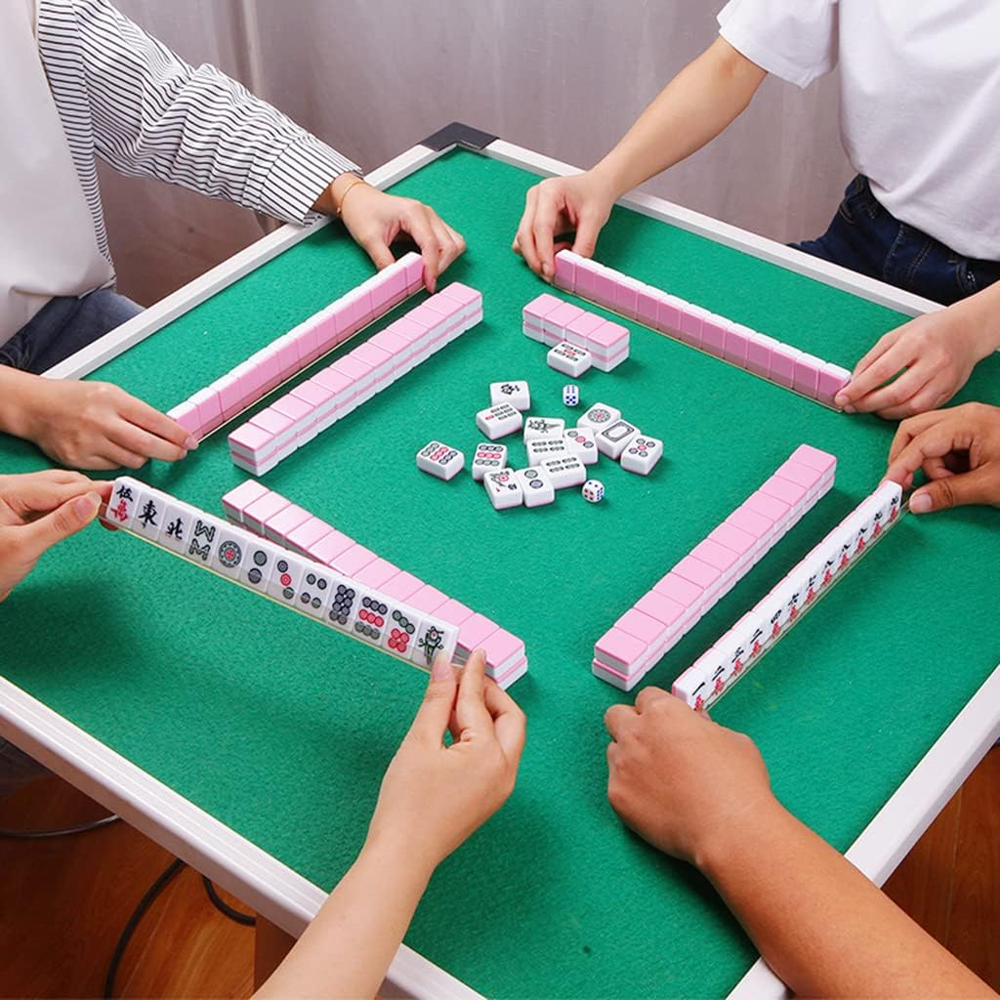
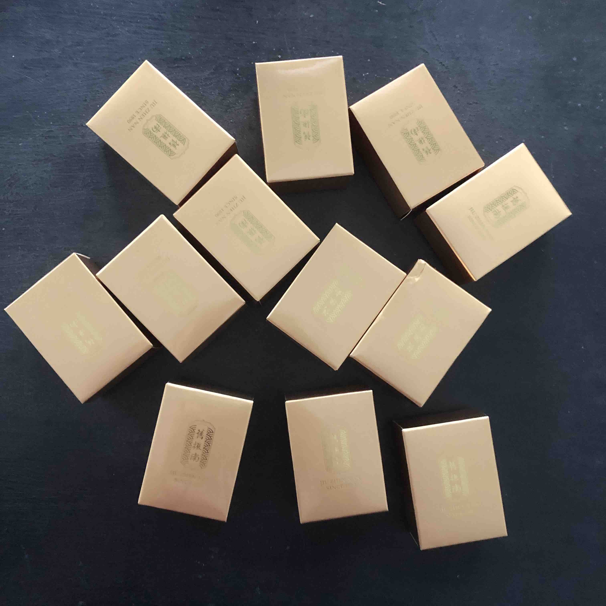
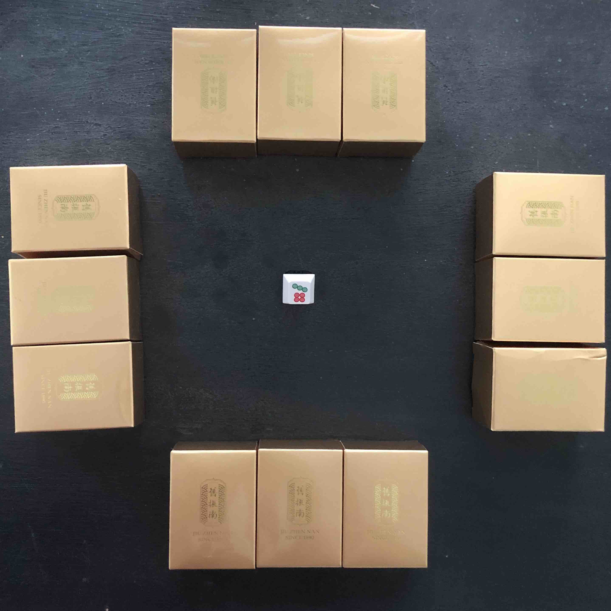

**Existing Alt+Ctrl Interface**

The Vending Door (2022) by Xiao Tan and Xiao Yu is an interactive game / installation, where people can put a coin into the right top corner of the door, and peak through the door for ten seconds until the coin travels down and block the peephole. 

I first discovered Xiao Tan’s work *Hen*, which also caught my attention for its simplicity and why egg? Both *Hen* and *The Vending Door* stand out from other games with the use of physical materials instead of screens and their minimal approach. I chose *The Vending Door* because it plays with human curiosity, the urge to glimpse into someone's life. I also like that part of the structure is transparent, allowing us to see the mechanism of how the coin travels down.  

<iframe width="560" height="315" src="https://www.youtube.com/embed/P3aEq0W_yz8?si=k35kOBSyiyK3ngUr" title="YouTube video player" frameborder="0" allow="accelerometer; autoplay; clipboard-write; encrypted-media; gyroscope; picture-in-picture; web-share" referrerpolicy="strict-origin-when-cross-origin" allowfullscreen></iframe>

**My Own Alt+Ctrl - Pinger Games 🍍**

How did the idea emerge?

I just received a box of pineapple cakes from Taiwan that I waited impatiently. The idea emerged when I was moving, splitting, counting the pineapple cake boxes. The gesture reminded me of mahjong, tilting, piling on top of each other, and the quick swift actions you can do with it. Also, I have mahjong keyboards!

What is the idea and mechanism?

Pinger Games (Pineapple + Hunger Games) is a friendship destroying game played with twelve pineapple cake boxes, with only one real pineapple cake left. Four hungry players compete to find the pineapple before the others, or bluff enough to make others believe they have it. 

In the beginning of the game, all players shuffle the 12 pineapple boxes. There are four players, and each player gets three boxes. Other than luck and bluff, the game involves three actions - tilt to pass, shake to guess, and reveal. 

The physical action becomes data, to award or subtract the points automatically, because the players are too hungry to count! 

Points System

Tilt: -2 point\
Reveal: wrong: -1 points / correct: pineapple cake! \
Shake: -1 point

Behind the scenes: 

Pinger Games uses fancy pineapple cake packaging as mahjong tiles, and putting accelerometer | MSA301 sensor inside. The sensor provides information about three values - x,y,z. 

Tilt - steady change in x and y value\
Reveal - the box is placed upside down, so the number is negative \
Shake - high variance and spikes 

The button could be used to reset the points. However, there is only one pineapple cake, so there’s no second chance. The button is, therefore, a triumph jingle for the winner.
