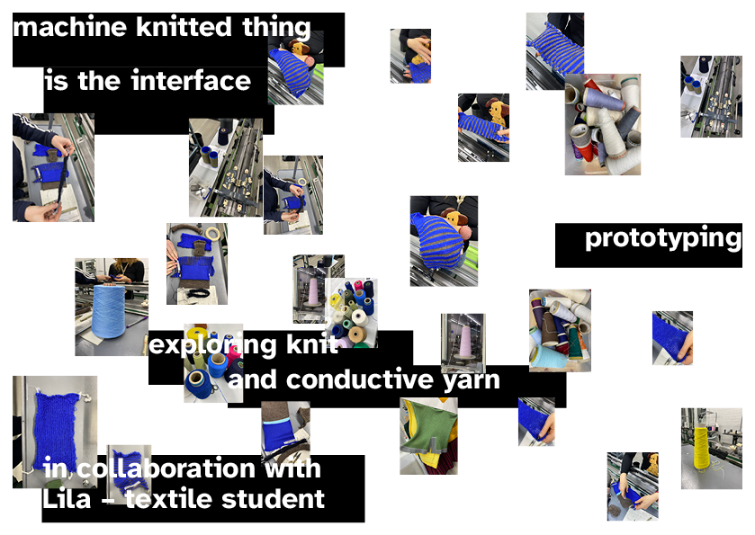
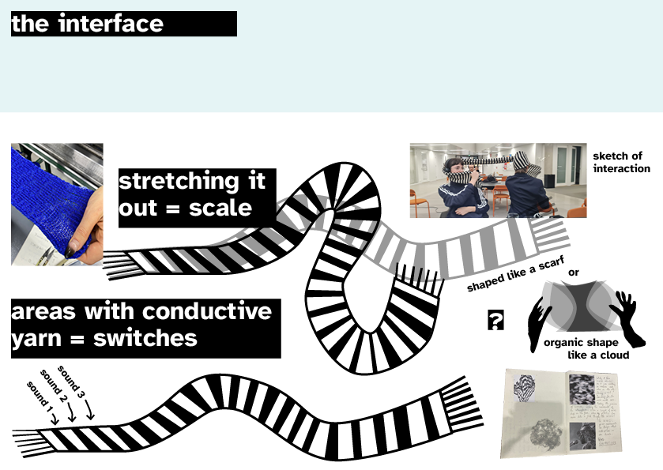
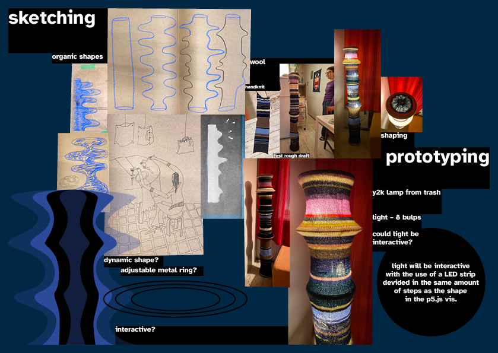
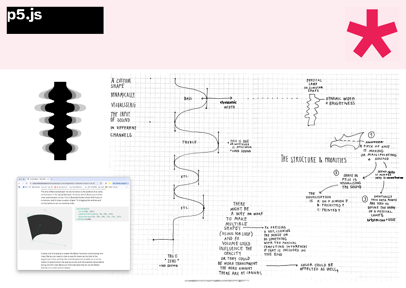
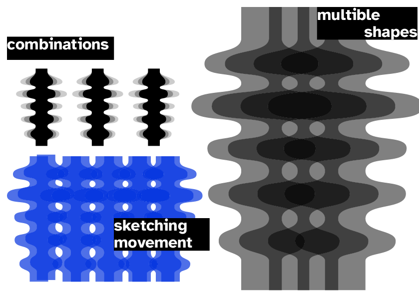
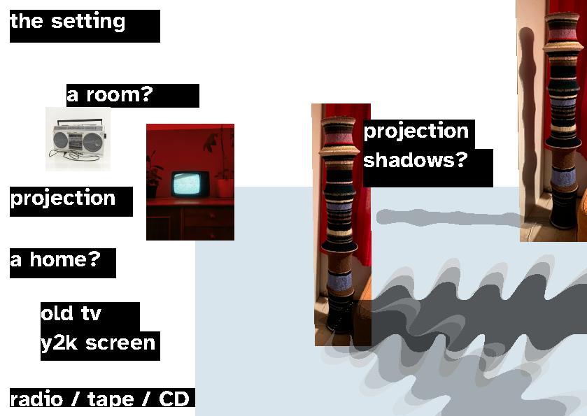
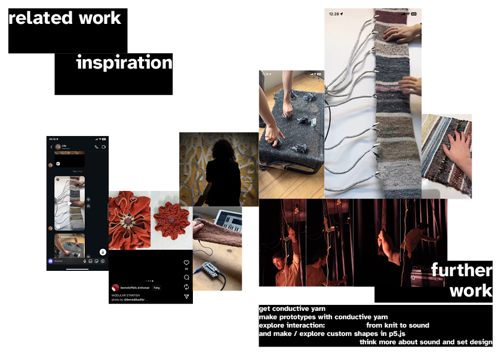
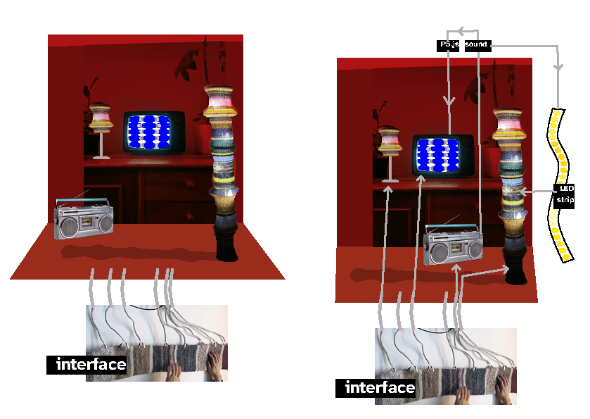

KNITTED SURFACES

in collaboration with textile designer, Lila , I will work with knitted fabrics as the interface

we are working with conductive yarn and wool as the main materials and we might combine machine knit with hand knit

CREATING SOUND

we are interested in sound as the feedback of the interaction with a knitted textile 

LIGHT COULD BE ADDED TOO

I am curious about implementing light as well

and I have made the prototype of a knitted lamp, that might be interesting to include in the setting – if it works out together with the knitted interface and in the physical setting of this project

open for inputs, ideas and collaborations, please send an email to klara.bloch-norup@aalto.fi and I'll get back to you within a few business days

