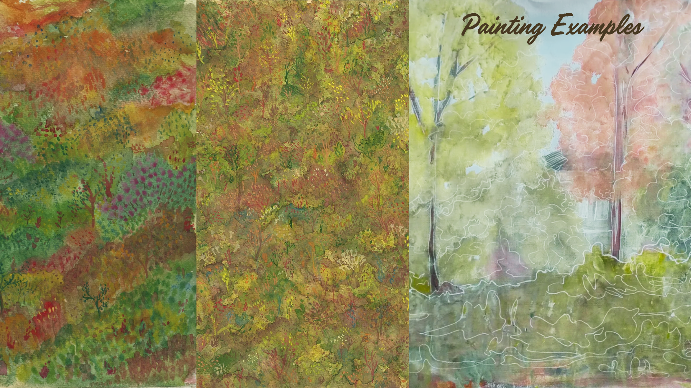
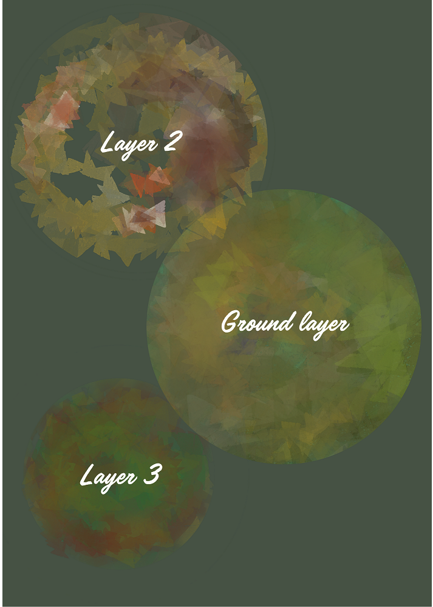
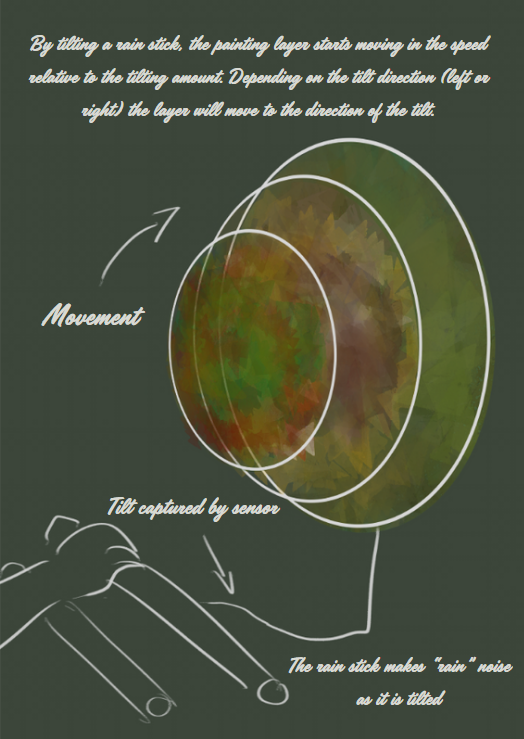

# "Hidden under"

"Hidden under" project idea is to create an interactive art piece, where the audience members can manipulate objects to make the painting move.

### Painting the nature

I have created paintings that explore the nature floor and its various color tones.

### Inspiration

Upon researching different "Layered Painting" examples, found the art from Peter Bynum. His work is similar to what I want to achieve from this project.

<https://www.peterbynum.com/museum-exhibitions/museum-of-art-and-design>

### Project idea

"Hidden under" project consists of layered paintings that can be made to rotate by interactive elements.

Underneath the layers, I am planning on adding some "hidden" elements. What might people find if they searched through the nature floor? Something that doesn't quite belong in nature, perhaps? If I have time, I want to include a LED to turn on when you rotate something to become visible.
