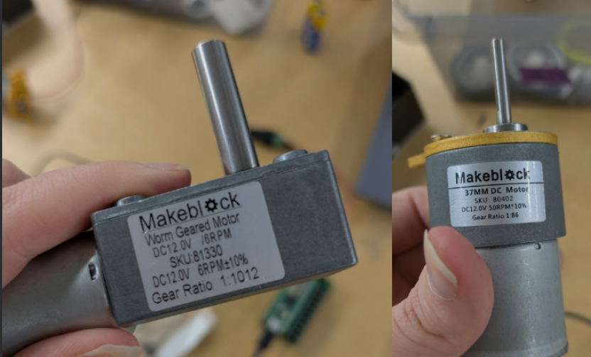
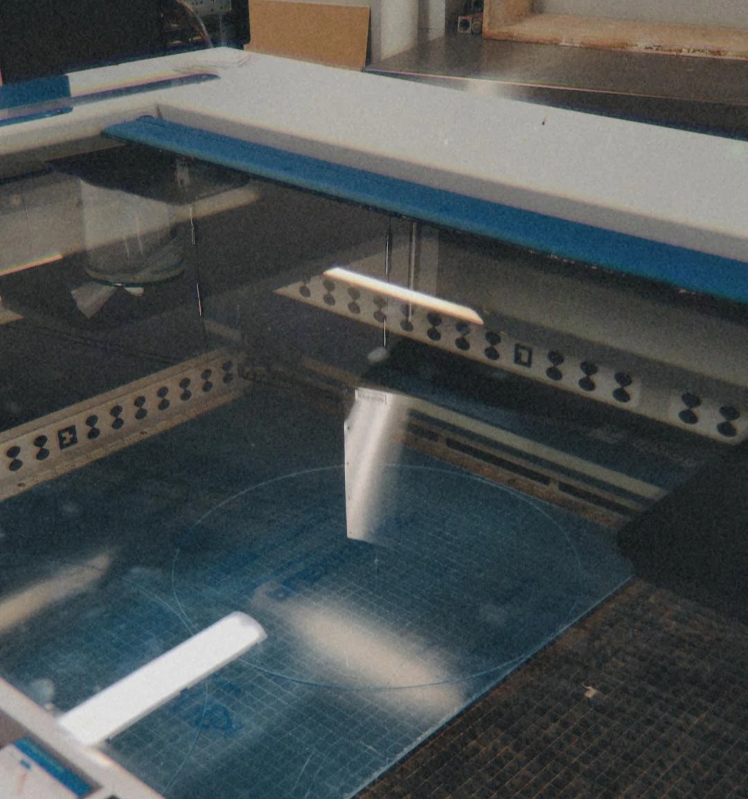
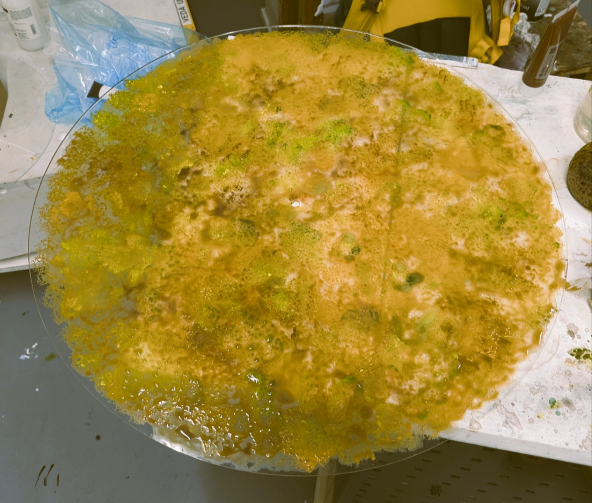
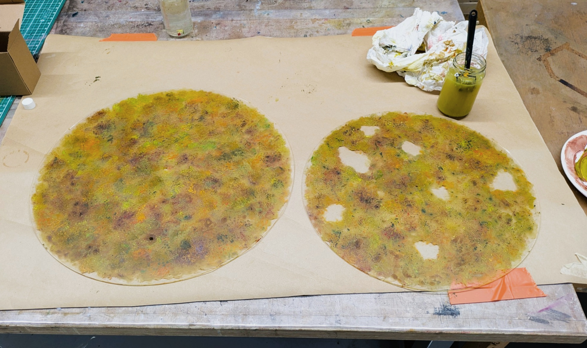
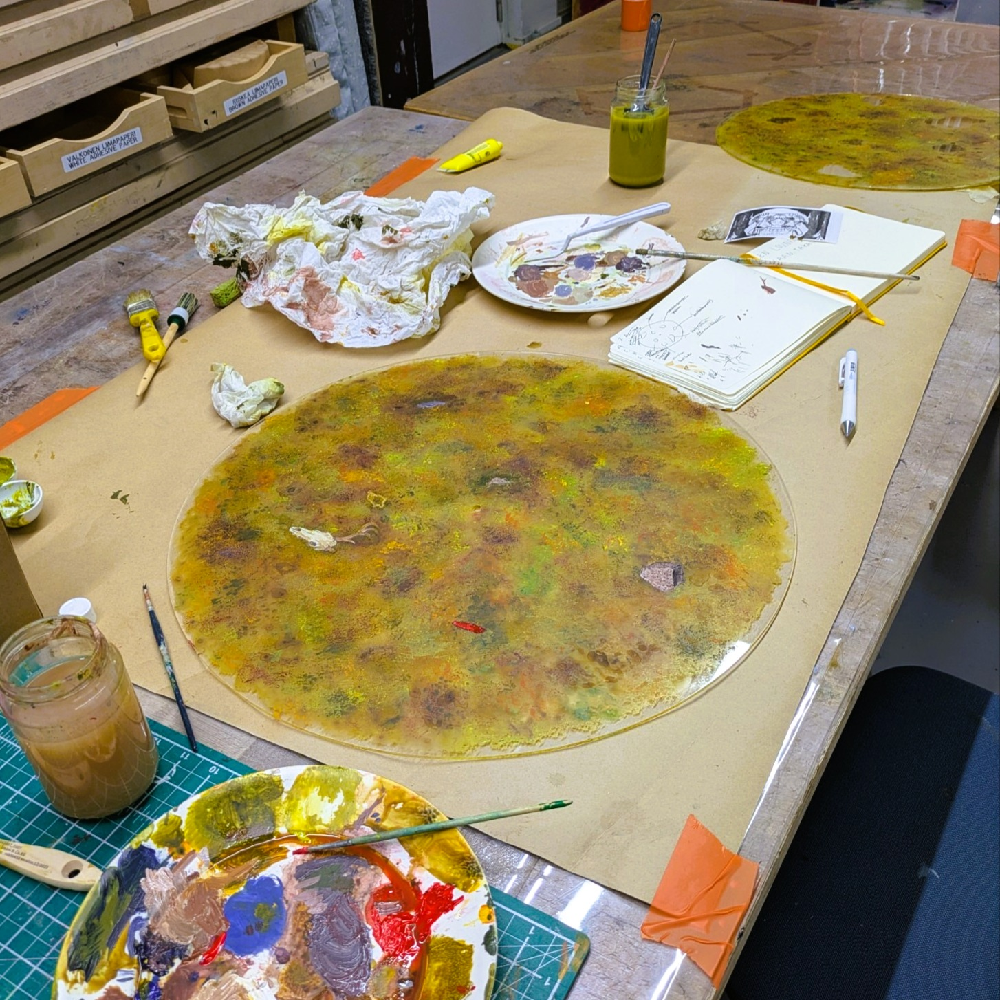
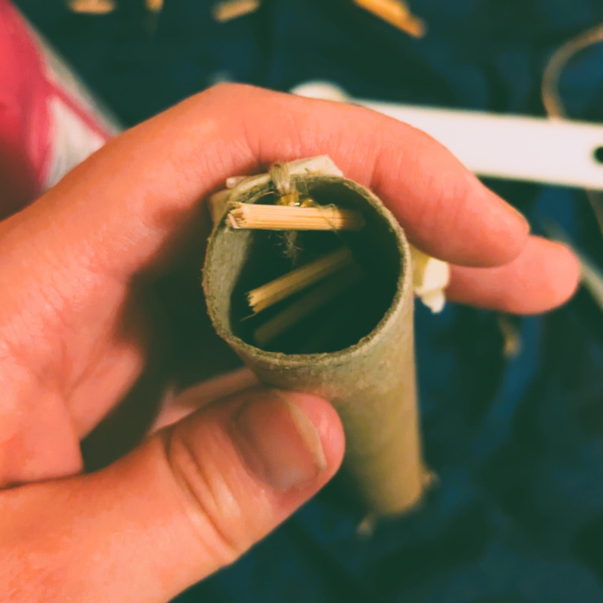
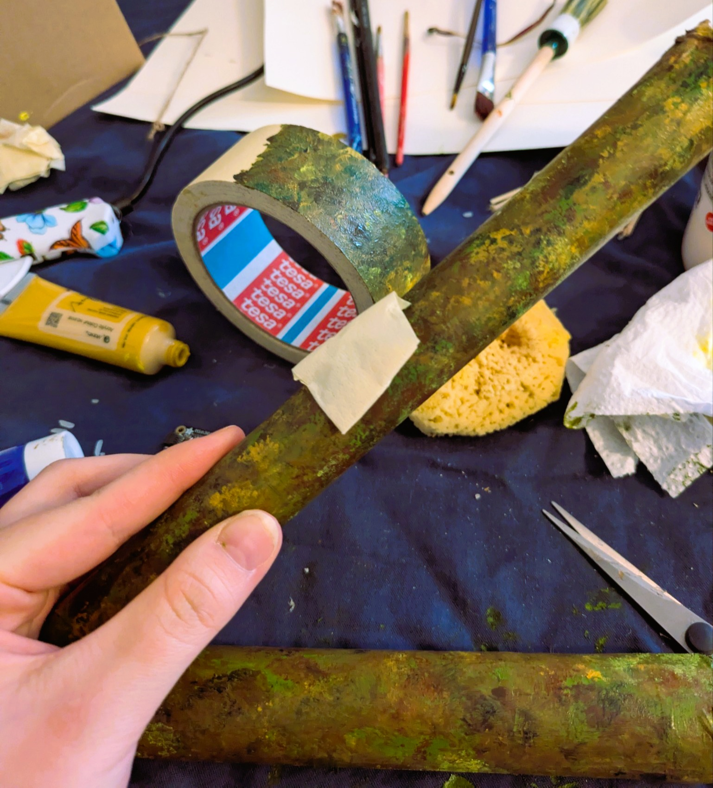
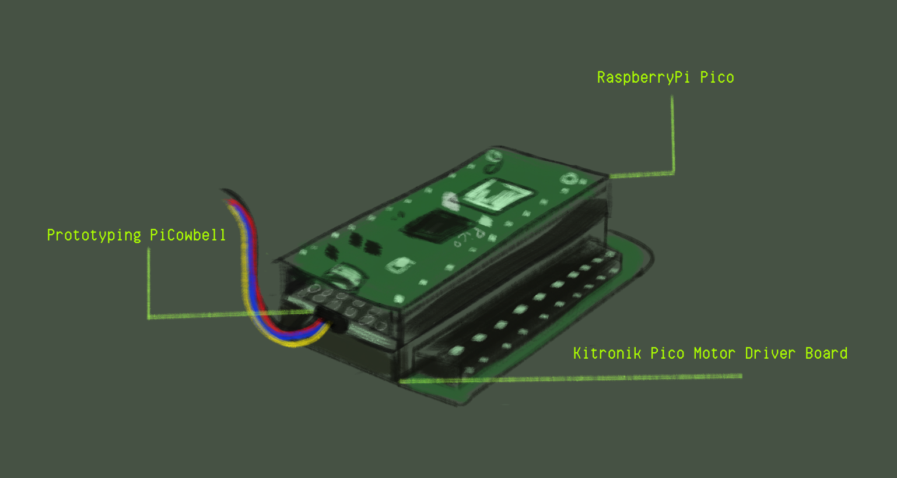
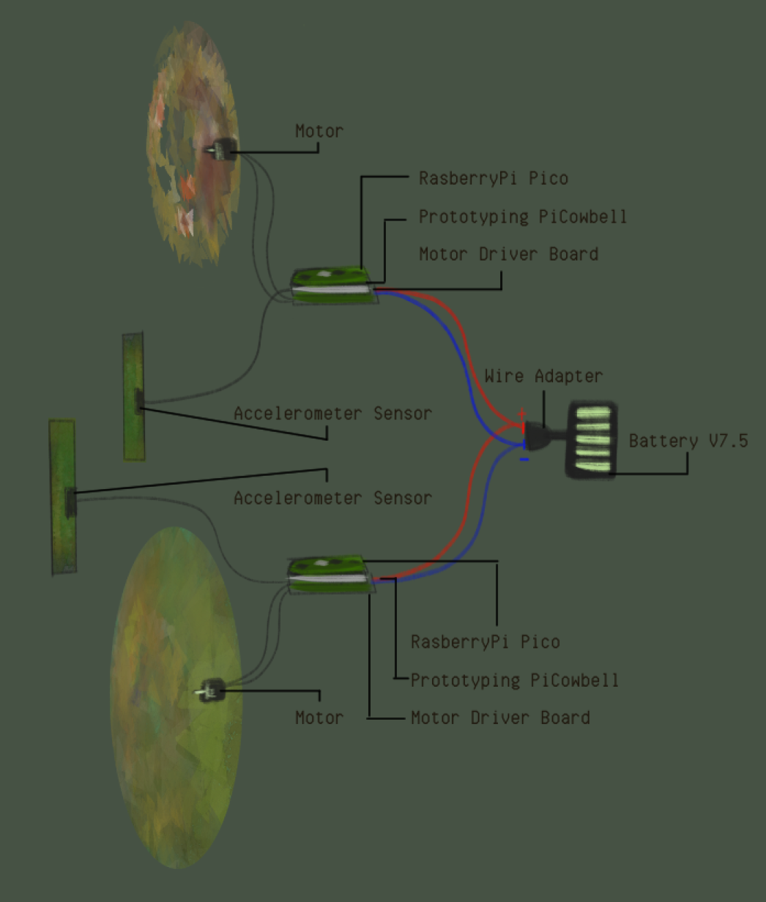

# **Hidden Under**

Hidden Under is an interactive art installation made for the project course called Physical Computing. This is the documentation of the project, which was proposed [earlier during the course](https://physcomp.newmedia.dog/2025/kuutamokuu/main-project-proposal-hidden-under/). This documentation is an overview of the project phases and a retrospective of why the design was executed this way and what would be done differently if there had been the needed resources to complete this work in its original design.

### Main aspects of the project

As illustrated in the [project proposal](https://physcomp.newmedia.dog/2025/kuutamokuu/main-project-proposal-hidden-under/), Hidden Under project aims to be an interactive art piece that rotates to reveal hidden illustrations from different layers of paintings. In essence, this project needs:

* Minimum of 2 rotating ‘canvases’ that have a transparent quality
* Rainstick interface(s) for the accelerometer(s)
* Motors to rotate the canvases
* A microcomputer controller(s) to rotate the motors
* A power source for the motors

#### **Canvases**

Acrylic sheets were chosen as a material for the paintings since they could be laser cut easily into shape and the sheet could have a transparent quality which was desired for the outcome. The idea was to create paintings that had holes that could be peeked through and paint that could be somewhat see-through. The project aims to examine and explore what kind of effects many somewhat transparent painting layers would look like when placed on top of each other and rotated.

This prototype project used only 2 layers of paintings. For a future version, the aim is to create bigger transparent paintings and more of them. To cut the desired size and shape of the sheets, some vector graphic work needed to be done for the laser cutting machine.

For the two different motors that I had, I made a vector graphic version of the rotating motor piece to cut a suitable hole to enter the acrylic sheet directly to the rotating part. Once these were done and tested, I cut two round sheets with the centered holes with a laser cutting machine. The shapes were cut to make one bigger circle as the ground layer and a second one as the layer with the peeking holes.

After this part was completed, I could proceed to the painting part.

#### **Painting**

I booked an atelier space to work with the acrylic sheets for some days. I had the impression that it was beneficial to coat the acrylic sheet with something like a pouring medium to make the acrylic paint stick better to the canvases. I tested the pouring medium on the transparent sheet, but noticed that it left a bit of a residue. I decided not to use it due to this. However, acrylic paint stuck to the acrylic sheets without an issue without any prework, so it was possible to proceed with the painting.

The paintings first got a background layer.

Then, additional details were added to the acrylic sheets. The aim was to use the bigger acrylic sheet as the background layer that would have the hidden objects painted on it. Hence, the bigger sheet was painted to be less transparent. The smaller sheet was left with the window holes to peek through. The smaller sheet also was purposefully painted to be more transparent so that the colors of the upper sheet(smaller) would blend more with the lower sheet(bigger).

The last part of the painting process was to paint the illustrative objects that would be revealed through the smaller sheet in right angles. The objects and holes were positioned so that only one of the hidden objects would be revealed at the time in the correct angle. There is a total of 7 holes and each hole reveals one hidden illustration.

The hidden illustrations are:

* A mouse
* Silver coins
* Gold necklace
* Prehistoric pot
* A boat-shaped hammer head
* Deer skull
* Plastic toy

As a finish, the paintings were sprayed with fixative to set the paint into the sheets and prevent it coming off from the sheets. Once this phase was done, it was time to fit these paintings together with the motors.

#### **Rainsticks**

Rainsticks were chosen as the controlled interface for the project to rotate the paintings since rainsticks as an instrument give audio feedback as tilted. The original idea is to create a soothing, sensory experience of gentle rainstick sounds and calm rotating earthy visuals. There were hopes to create the rainstick with more authentic wood material and sound, however, within the project timeframe the rainsticks were created with a more straightforward DIY way.

The rainsticks were made of two different sized cardboard cylinders. To create a more rainlike sound with the cylinder, an additional filling piece was added inside the cylinder. These were created with grillsticks and a piece of jute rope. The grill stick parts were hot glued to the jute rope and then pulled inside the cylinder, before adding the rainstick filling.

I used rice as the filling for these rainsticks to make the rain sound. In the bigger cylinder I additionally added some pistachio shells. The cylinder tubes were then sealed with paper and tape. These cylinders were painted to match the general earthy aesthetic as the paintings.

Since the sensor couldn’t fit inside the rainstick with the additional wooden pieces, the sensor needed a pocket to fit outside of the stick. A pouch was made outside the stick with tape and then painted.

#### **Electrical setup**

Before the painting process, different setups were tested and planned for the sensors. The first idea was to use one RaspberryPi minicomputer to control the two sensors that could read data from tilting. This idea was scrapped due to the need for additional parts. There were many RaspberryPi’s to use, so instead of one, two were used.

The RaspberryPi’s were setup as following:

The RaspberryPi's were attached to a Prototyping PiCowbell part. Prototyping PiCowbell is the part that can read the specific type of cable for the sensors used for the rainsticks. This part was attached to the Kitronik Pico Motor Driver Board part. This board receives the needed power voltage to use the motors. This part is connected to the motors directly.

Both of the RaspberryPi's used for this project were individually programmed to work with the different motors I had. These motors were introduced earlier in this documentation. Once the accelerometer sensor and motor were calibrated to move slowly and smoothly enough within the accelerometer data values, they were set up to use the same battery power source to move.

To summarize, this illustration shows how the electrical setup was managed:

To explain the illustration simply:

(7.5V) Power source has a part that distributes energy ( + & - ). To each Motor Driver board, a + and - wire is attached to give the RaspberryPi and the accelerometer power. The Motor is connected to the Motor Driver board directly. The Prototyping PiCowbell has an accelerometer attached which give out tilting data. The RaspberryPi controls the logic of the received accelerometer data and powers the motor speed according to the logic.

#### **Programming**

\-Explain code aspects that were needed-

Show code 1

Show code 2

The codes are generally different for each RaspberryPi due to the sensors being both different model. Accelerometers were used as the sensor to read tilting. The code only uses the (?) coordinate reading. This reading is mapped to the speed of the motor depending on how much the sensor is tilted.

\---Rest of this documentation is still in process---
