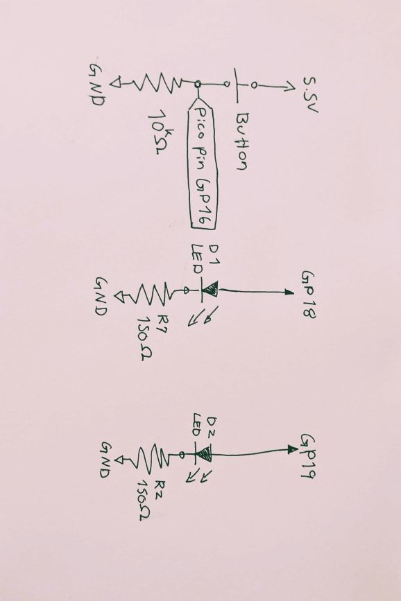
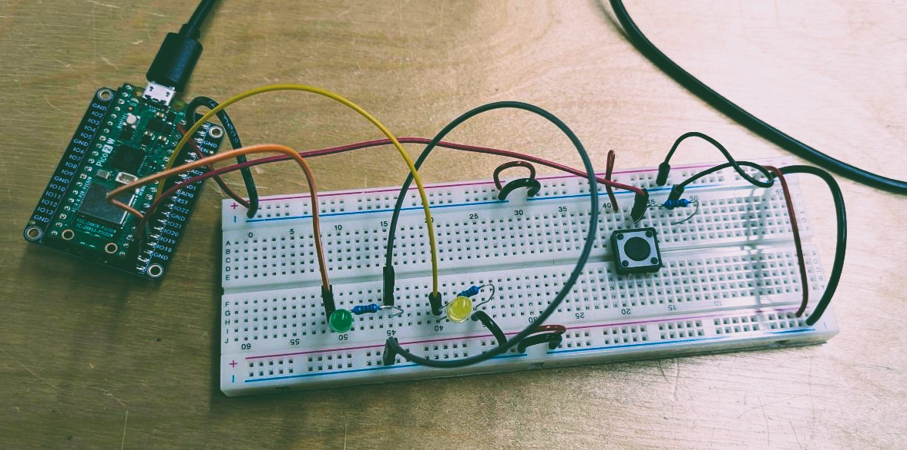

In my first week of learning to do physical computing with Arduino software and Raspberry Pico 2 W, I created a breadboard that had the following schematics:




And this is what it looked on the board:



The board needed the following functionality:

1. The lights should be off when the board is powered
2. Upon first click of the button, one of the LEDs should turn on
3. Upon the second click of the button, the first LED should turn off and the second turn on
4. Upon the third click, both of the LEDs should turn off

The functionality was accomplished with the following code:

```cpp
int button;

int buttonPress;

void setup() {
  // put your setup code here, to run once:

  pinMode(16, INPUT); // Button Pin

  pinMode(18, OUTPUT); // LED 1 pin
  pinMode(19, OUTPUT); // LED 2 pin

  digitalWrite(18, LOW); // Making sure the LEDS are off at the start of turning the device on
  digitalWrite(19, LOW);

  Serial.begin(9600);
}

void loop() {
  // put your main code here, to run repeatedly:

  button = digitalRead(16);
  Serial.println(button); // Checking if button is pressed or not

  // If button is pressed and the int index is 0 (not pressde before), turn on first LED and make int index 1
  if(button==HIGH && buttonPress == 0){
    digitalWrite(18, HIGH);
    digitalWrite(19, LOW);
    buttonPress = 1;
    delay(1000);
  }

  //Debugging if button index has changed
  button = digitalRead(16);
  Serial.println(button);
  Serial.println(buttonPress);

  // If button is pressed and the int index is 1 (pressed once before), turn the second LED on and the first one off and change the int index to 2
  if (button==HIGH && buttonPress == 1){
    digitalWrite(18, LOW);
    digitalWrite(19, HIGH);
    buttonPress = 2;
    delay(1000);
    Serial.println("Button Pressed, Int changed to 2");
  }

  //Debugging if button index has changed again
  button = digitalRead(16);
  Serial.println(button);
  Serial.println(buttonPress);

  //If button is pressed and the int index is 2(pressed twice before), turn the LEDS off and change the int index to 0 (start over again)
  if (button==HIGH && buttonPress == 2){
    digitalWrite(18, LOW);
    digitalWrite(19, LOW);
    buttonPress = 0;
    delay(1000);
  }
}
```

One improvement that can benefit this code is to tinker more with the delay.
