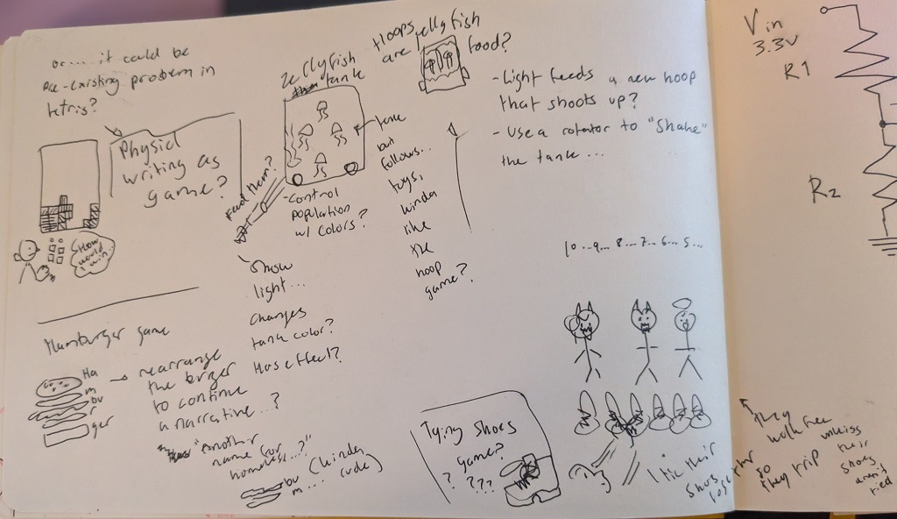
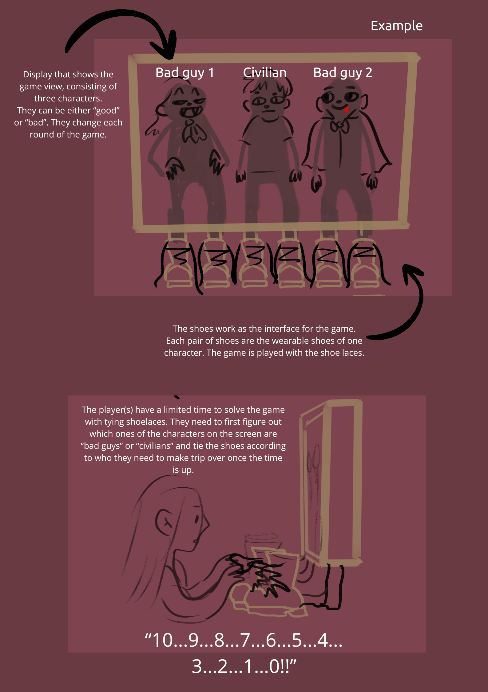
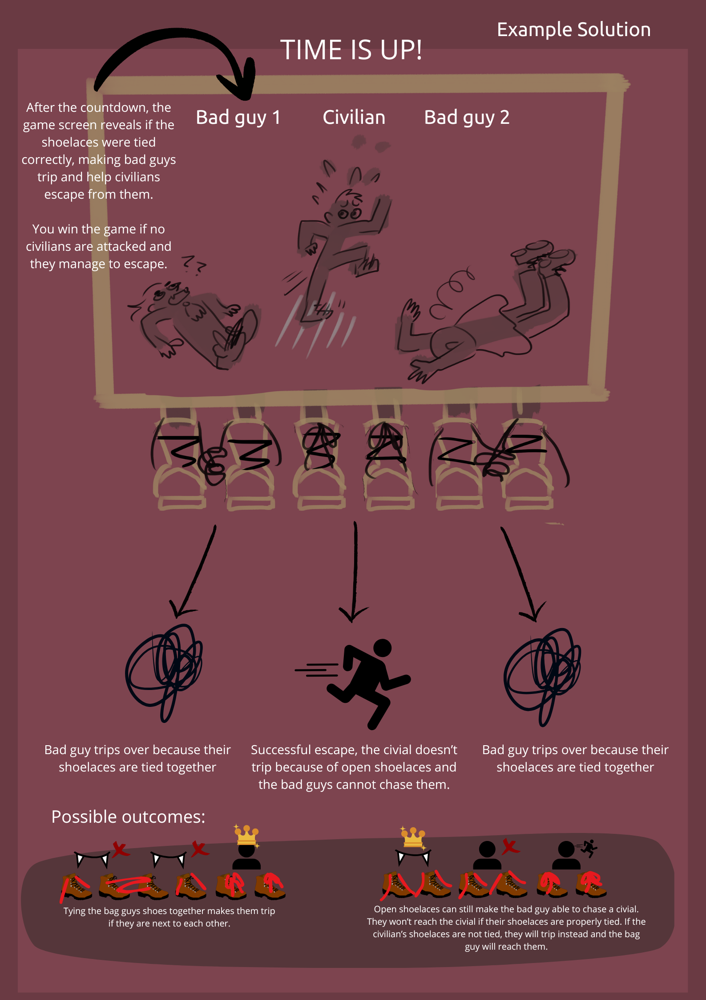

# Task

For this week we were tasked to:

1. Find an interesting existing Alt+Ctrl interface

2. Come up with a concept for your own Alt+Ctrl Interface

Once I heard and explored Alt+Ctrl games, my sketchbook started to fill with different ideas within a week. I figured out task 2 prior to looking more deep into task 1, so once I looked into various Alt+Ctrl games, I was already scanning through them, wanting to see if my top 1 idea was already explored in some capacity. To my surprise, I couldn't find an Alt+Ctrl game that used the idea I had. (Using shoes as an interface)

Since I came up with a concept for a Alt+Ctrl game prior to finding other Alt+Ctrl games that had used similar concepts, I will first showcase my concept and then introduce another Alt+Ctrl game that could provide insight into how to approach developing the game technically.

## Concept for Alt+Ctrl Game

I find that the game idea and mechanic is just as important to an interesting concept as the interface. I had various thoughts and ideas for different approaches for a game concept of my own, but I ultimate settled with the concept that was the most novel to myself. In my other concepts, I was able to figure out either the interface, but not the game, or I could figure out the game, but not the interface.

From these different and upcoming concepts I ultimately leaned towards the one that featured shoes, although I had interest in exploring the jellyfish idea as well. My scribbles are most likely not easy to decipher as concepts of themselves, because they are not fully developed.

### Ever played with shoes?

"Well, how about the game is just shoe laces?"\
Initially the idea made no sense to me, but after a moment of pondering, I figured that tying shoelaces together could become a game where you can make people trip by tying the shoelaces together. A picture tells more than a thousand words, so I continued my exploration of this idea with more sketches and drawings.

These concept photos illustrate the general idea of the game I am envisioning. Since the object we are playing are initially pieces of string, I searched through different Alt+Ctrl games to figure out if string had been used as an interaction device.

### Strings as interaction device

#### (un)done

The project (un)done is an non-linear story game where two players wear a poncho with strings attached. In this game, strings can be tied together and untied, which affects the environment. This game focuses on illustrating the relationship aspects. If strings are tied together, the installation becomes more vivid with visuals and there are narration of a story with love and connection. If the strings are untied, the narration reflects the severed bond of a relationship and the installation loses a part of its vivid visuals. Depending on which strings you tie together or untie, the story narration becomes different.

 

From the project website, it is not completely clear as to what kind of sensors were used to detect if the strings were together. This project interested me mainly because it explored an interface that seemed to be rarely utilized.

#### Sensor possibilities

The most sensible solution to getting data about if the shoelaces are close together is to use a magnetic sensor. A reed switch could be used. However, since reed switch appears to only read data about if a magnetic object has entered close enough to the sensor, it cannot tell if the shoelace has been tied, it only knows if something has reached its proximity. On top of that, the system could also have a flex sensor to indicate if the shoelace has also been properly tied. The flex sensor can give analog readings, which can be used to determine if the shoelace is flexed enough to be counted as "tied".

Further investigation needs to be done to figure out if this idea is feasible, but if the game shoelaces can be built similar to the (un)done project interface, it could be done.
