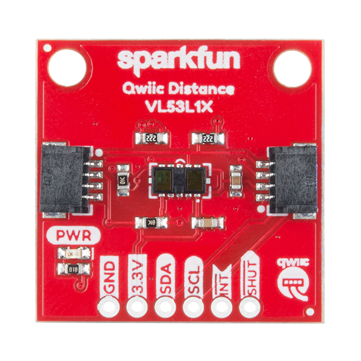
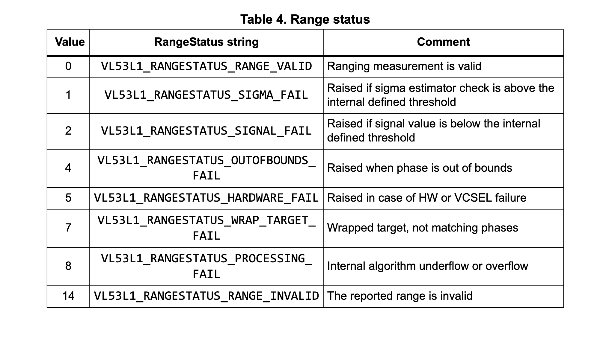
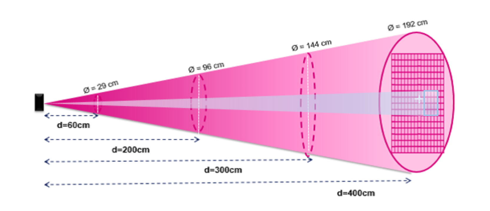
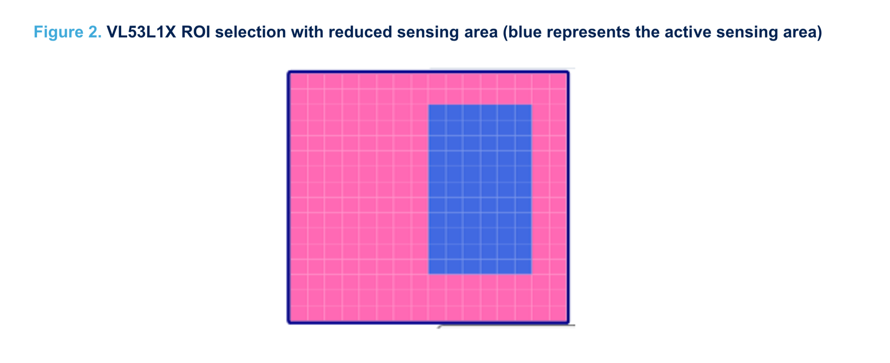
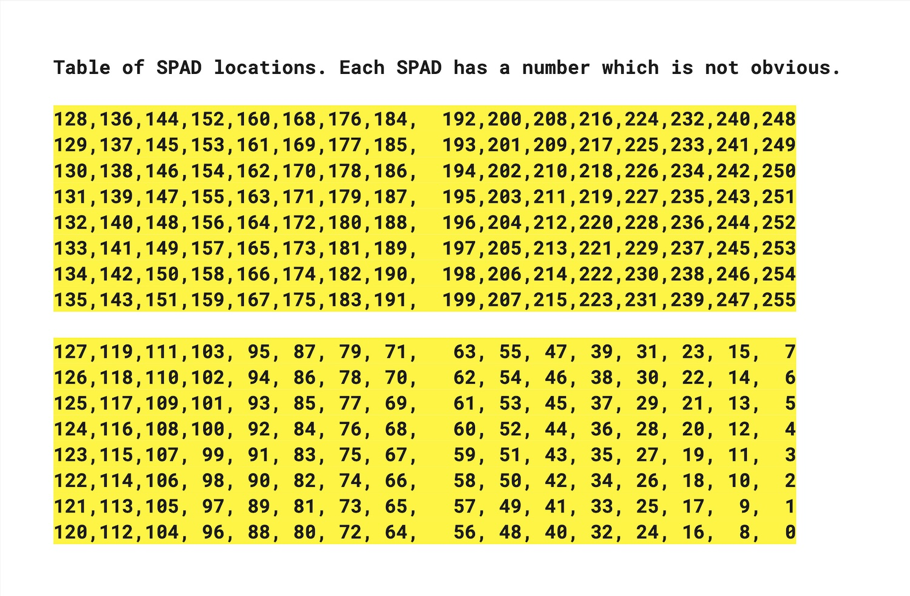
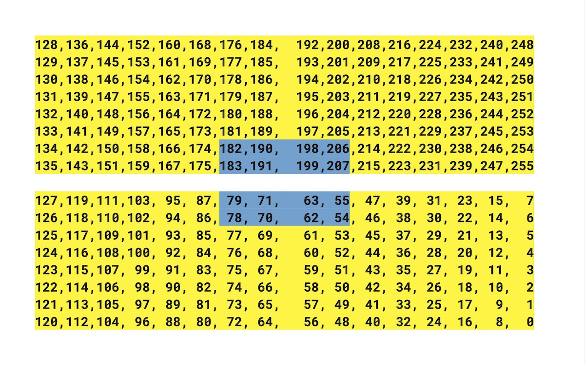

## Interesting ALT+CTRL Game

Line Wobbler by Robin Baumgarten



> ...game that is played on a one-dimensional LED strip with a new controller using the spring and knob from a shoe-tree. The first game for this setup is a dungeon crawler - you control the green dot and have to overcome obstacles such as lava pits, conveyor belts and enemies. You can attack using a unique 'wobble' attack.

This is such a simple but great idea! The game works really well and the controller is very responsive. The animations are smooth and there are some impressive visual effects for just a strip of LEDs. I love the sound design as well

### How to add video to this site?

Change the editing mode to **Markdown**

Add the following line for Vimeo:

```go

```

Or for YouTube:

```go

```

id is the ID of the video in the URL. For example, for [this video](https://www.youtube.com/watch?v=UZ_5ol_kyL4) the id is UZ_5ol_kyL4 so I would type:

```go

```

- - -

## Sensor: VL53L1X Distance Sensor



### What kind of data can I get out of it?

* Distance measurement (0–4000 mm)
* Status of the signal (is it a valid reading or not). Status of 0 means that it is a valid reading.



### Field of View (FoV) of the Sensor

The sensor sees the world basically as a cone shape.



### Region of Interest (ROI)

We can limit this cone to a smaller area by using the ROI setting of the sensor.



* Using the ROI seems to be a little complicated at first but it is actually quite simple. There are two steps to define the ROI
* Set the center of the Region of Interest
* Set the width and height of the ROI
* Minimum 4x4
* Maximum 16x16
* Note that you have to take into account where the center is, you cannot go beyond the edges of the grid.

The photon detector is made up of a 16 x 16 array of SPADs (single photon avalanche diode). Each SPAD is identified by a number as shown in the table below.



Let's say you want to set the ROI to be only the blue area. 



You would set the code like below (using the Pololu library)

```c
sensor.setROICenter(199);
sensor.setROISize(4, 4);
```

Why 199? We have an even value as width and height (4). Since the actual center value of an even number would be in-between the SPADs, we cannot directly say that.

We must choose the closest value that is to the right and up of the actual center. In this case it's 199.

### Code Libraries

Multiple people/companies have created libraries for this specific sensor. You can find all of these and more from the Arduino Library Manager.

* Sparkfun
* Adafruit
* Pololu

The Sparkfun library seemed to have some issues freezing so I tested some of the others. My current recommendation is to use the Pololu library.

- - -

## Game Idea

### What kind of interactions are possible with the data?

* You can know how far away a person (or any object) is from a static place
* Make a sound sculpture that gets louder (or quieter) when you go closer to it.
* A very nervous object that starts shaking and vibrating more the closer to it you get.
* A moving object is able to tell how close it is to any objects in front of the sensor
* Make a robot that is able to detect and avoid obstacles
* Make a wearable device for a person with limited sight. The data from the sensor can be converted to vibrations or sound pulses that let the person now if there are any obstacles in front of them.
* Put it in the ceiling pointing down and you can detect if someone is underneath it (or even measure how tall they are)
* Using the ROI feature, you could do simple gesture detection (is the object moving to left or right)

### How to use this as a game?

My idea is...

- - -

## Resources

* [Tutorial for this sensor](https://learn.newmedia.dog/tutorials/arduino-and-electronics/sensors/distance-vl53l1x/)
