## **First draft**

For the final project of the course, I want to do some early experimentations for the artistic component of my thesis.

In my thesis I look into how media archeological methods can be used to remediate a prehistoric technology into media art. The artistic component is a remediation of a tablet woven belt, a reimagined hybrid of old and new media. I want to explore the tablet woven belt as a medium of communication and technology of information storage and distribution. 

I don’t intend my course project to be ‘version 1’ of my thesis project, rather I want to use this chance to experiment with adding components to a tablet belt and (potentially) making it a circuit.

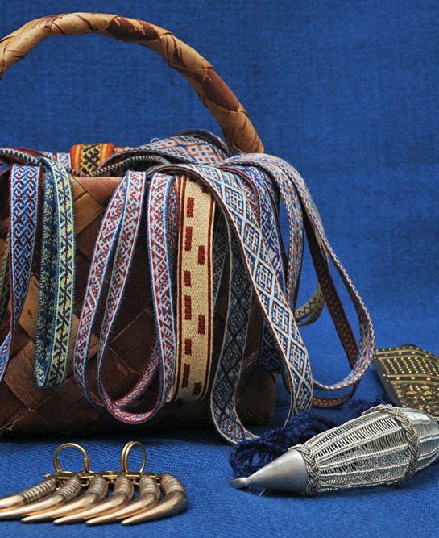

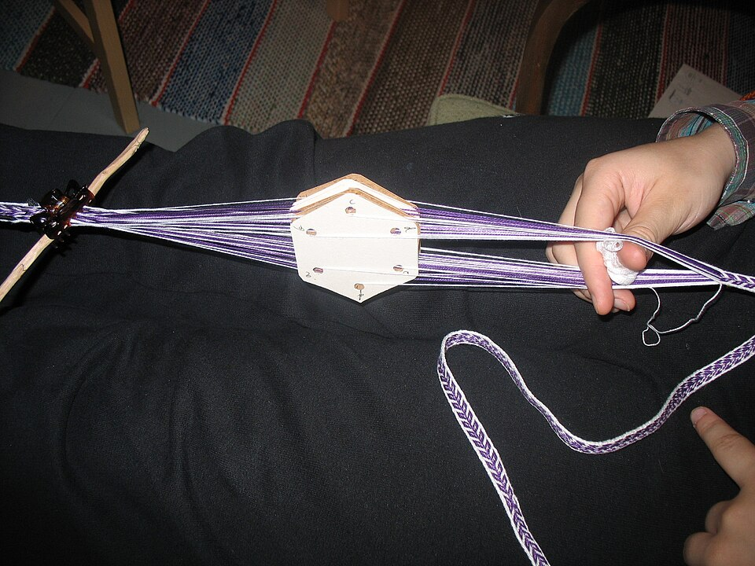

**Interaction**

The first idea I had was to use conductive yarn to see how it works with this weaving method. I wonder If I could achieve some difference in input by touching the belt in different spots.

The other idea is to somehow integrate some sensors in the weaving process itself.

## **Process**

**Refining the idea**

Initially my plan was to play around with weaving and conductive yarn and to “see what happens”. Later my plans got clearer, and I decided to go for a simple touch interface that plays sound.

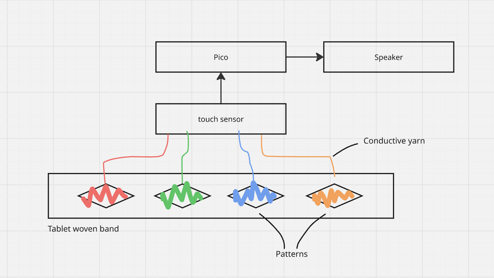

**Prototype 1: conductive weft**

First I wove a short 20 cm band with conductive yarn accompanying the weft throughout the whole band. I took the end of the conductive yarn sticking out from the end of the band, and connected it to a capacitive touch sensor to test it out. It did end up sensing when the band was touched, however there was not much difference in the sensor output  whether I touched the start, the middle, or the end of the band. 

I added keyboard functionality to the code so that everytime the band is touched, it presses the ‘a’ key on my laptop. Matti had suggested this way I could easily play my sound samples from Touchdesigner.

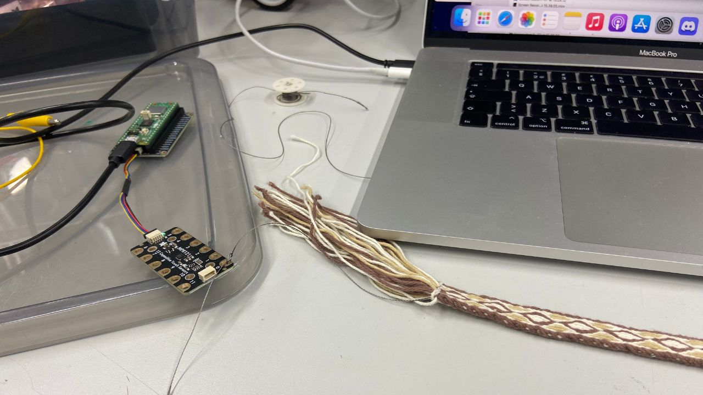

**Prototype 2: touch areas**

Next I wanted to try if I could weave multiple touch areas in the band. Again I wove the conductive yarn in with the weft, but this time I only wove the conductive yarn in each section of a diamond pattern, leaving a couple of rows in between so the conductive yarn doesn’t touch each other in different sections.

This time I did not get any input from the touch sensor, unless I directly touched the tails of the conductive yarn. I suspect it was because the weft is woven quite tightly in the band and I didn’t touch it directly, although it did work with with the first prototype. Not really sure why that one worked and this one didn’t.

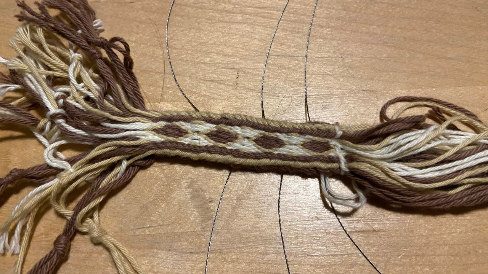

**Prototype 3: brocade**

My mission with the third attempt was to weave better touch areas where the conductive yarn rises on the surface of the band to better get the touch input. To do this, I researched some more complicated weaving techniques. I ended up trying brocade, as it also fit quite well with the theme. In iron age brocade, they used metallic yarn as weft, to create patterns in the weave. 

This prototype was successful functionally, but unsuccessful aesthetically. As my conductive yarn was much thinner than the yarn in my loom (and because of my weaving mediocrity), it created pulling and the pattern turned out quite ugly.

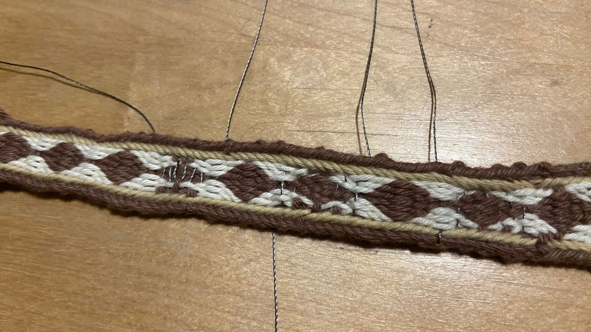

However now I had a prototype where touching each diamond pressed a different key on my laptop!

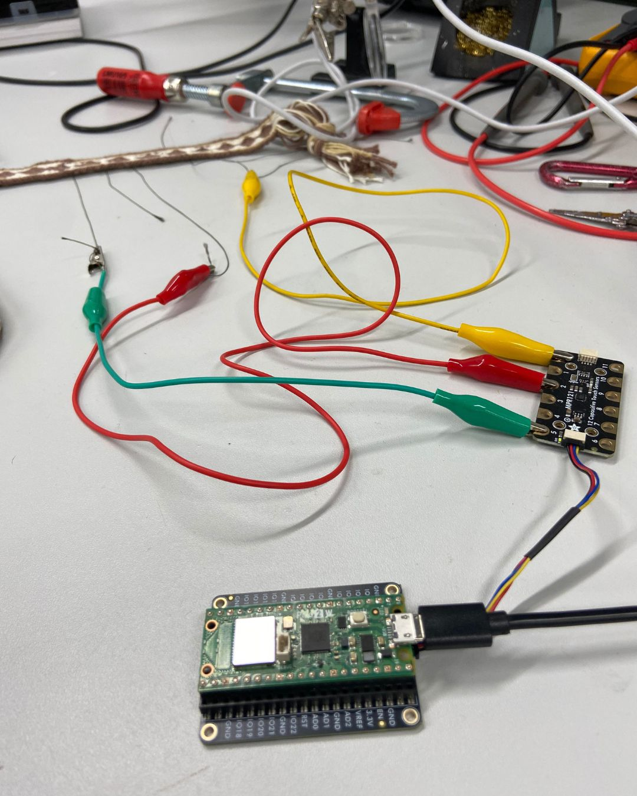

**Final technique: tie-down pattern**

After being dissatisfied by my brocade weaving skills, I moved to another demanding traditional technique: tie-down pattern. It’s a bit hard to explain how it works, but I had to pick out some individual yarns each row to bring the conductive yarn over them instead of under.

This was a risk worth taking: after weaving the first pattern section I tested it and the touch area worked beautifully. After initially fumbling with reading the rapport, the weave started to actually look nice. I’m happy I got the results I wanted with using an actual period-appropriate method — although it was very labor-heavy. Each section took about 2 hours to weave, and I got 4 sections done by the critique.

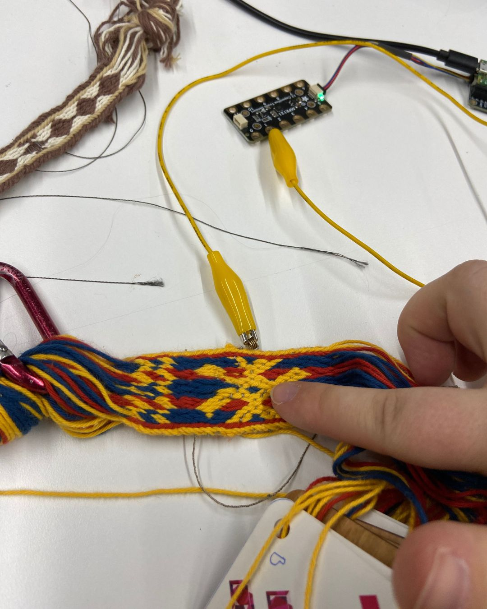

This time instead of leaving out a tail of conductive yarn after weaving each touch area, I wove in a bronze spiral. The bronze spiral is in contact with conductive yarn, and serves as a place where I can attach alligator clips. It’s a bit sturdier than just leaving the tails out, as the tails easily detach from the clips or accidentally touch each other.

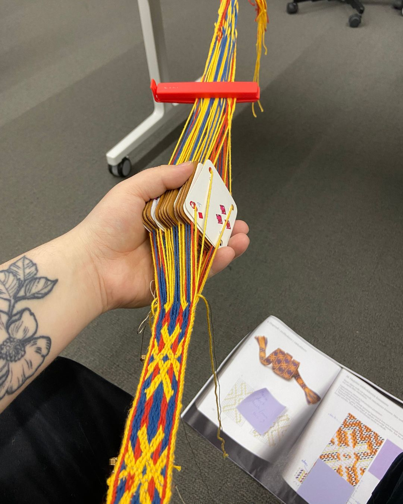

**The result**

The end result is a tablet woven band that works as a simple interface. Each pattern section is woven with conductive yarn, and works as a touch area. Touching each area plays a different sound.

The sounds playing are kantele chords, shoutout to my friend Taneli Kemppi for playing and recording them within only an hour of me asking.

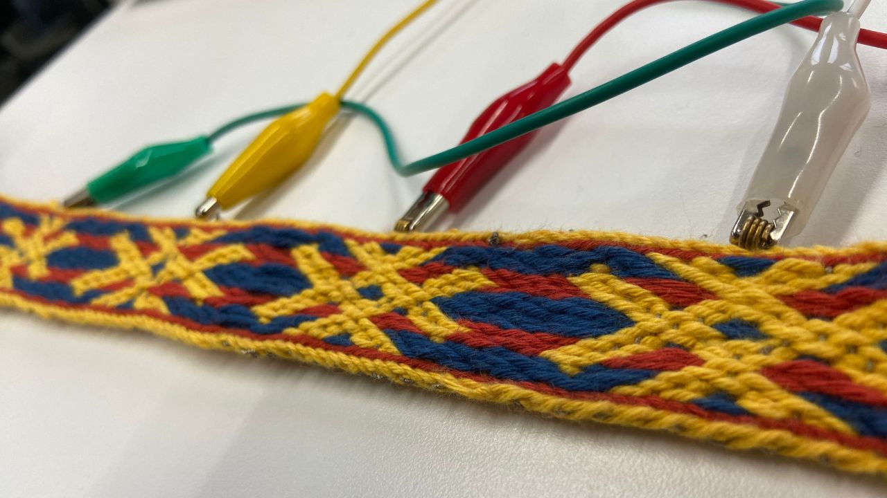

The touch areas are connected to a capacitive touch sensor with alligator clips, and the touch sensor is connected to Pico, which turns the touch input to a keyboard press. Pressing different keys triggers the sounds on Touchdesigner that is open on my laptop.

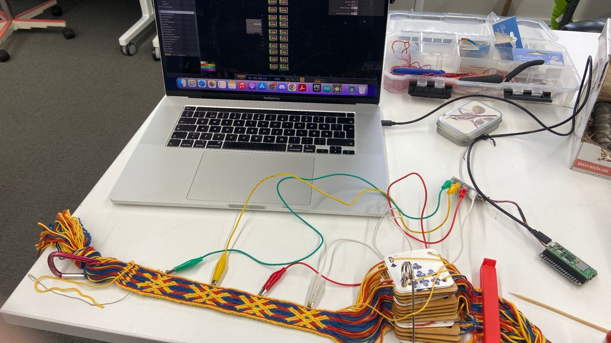

**What’s next?**

Although the technical part of the work was pretty simple, it was a good difficulty level for me as I had to spend so much time weaving. I’m happy with the result, but if I had more time I would have figured out how to make it a standalone system that works with a speaker, without a laptop. I might still work on this as a part of prototyping for my thesis.
