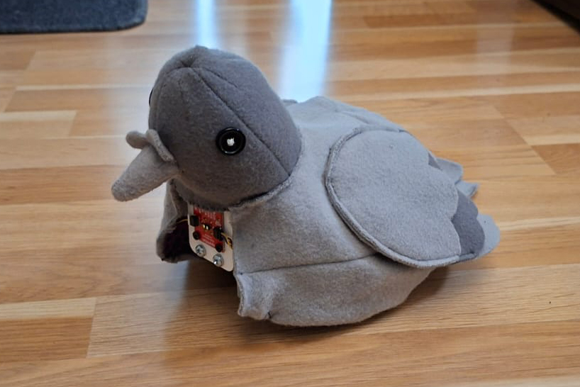

# Toaster the robot pigeon

## Description



## Reflection

### Process

## Code

```
#include <Wire.h>
#include <VL53L1X.h>
#include "Adafruit_MPR121.h"
#include <Servo.h>

// Audio
#include <WiFi.h>
#include <HTTPClient.h>
#include <BackgroundAudio.h>
#include <WebServer.h>

#ifndef STASSID
#define STASSID "wifi name"
#define STAPSK "wifi password"
#endif

const char *ssid = STASSID;
const char *pass = STAPSK;

#ifdef ESP32
#include <ESP32I2SAudio.h>
ESP32I2SAudio audio(4, 5, 6);  // BCLK, LRCLK, DOUT (, MCLK)
// Or for 1-pin PDM with external LPF
//#include <ESP32PDMAudio.h>
//ESP32PDMAudio audio(5);
#else
#include <I2S.h>
#include <PWMAudio.h>
// Uncomment either the PWM or I2S version, being sure to adjust the PWM pin or (BCLK,DATA) pins.
//I2S audio(OUTPUT, 0, 2);
PWMAudio audio(0);
#endif

#ifdef ESP32
// The ESP32 devices seem to have very variable HTTP performance.  Increase the buffer here to sort-of compensate
#define STREAMBUFF (32 * 1024)
#else
// Pico and PicoW work well with much smaller compressed/raw buffer...
#define STREAMBUFF (16 * 1024)
#endif

// Instantiate a MP3 player with the specified raw (compressed) data buffer
BackgroundAudioMP3Class<RawDataBuffer<STREAMBUFF>> mp3(audio);

#ifdef ESP32
NetworkClientSecure client;
#else
WiFiClientSecure client;  // Because URL is HTTPS, need a WiFiSecureClient.  Plain HTTP can use WiFiClient
#endif

String url = "https://dl.dropbox.com/scl/fi/dxclguwijtaei3vyjbaba/Pigeon.mp3?rlkey=k22t5vjdl7xcz6jyepeqxwbxw&st=wz1z9mdj";  // Check out https://fmstream.org/index.php?c=FT for others
HTTPClient http;
uint8_t buff[512];  // HTTP reads into this before sending to MP3
WebServer web(80);

int icyMetaInt = 0;
int icyDataLeft = 0;
int icyMetadataLeft = 0;
int gain = 100;
String status;

void ConnectWiFi() {
#ifndef ESP32
  WiFi.end();
#endif
  Serial.print("Connecting to WiFi...");
  WiFi.begin(ssid, pass);
  while (!WiFi.isConnected()) {
    Serial.print("..");
    delay(100);
  }
  Serial.print("http://");
  Serial.println(WiFi.localIP());
  web.begin();
}

// Robot setup
VL53L1X sensor;
Adafruit_MPR121 touchSensor = Adafruit_MPR121();
int distance;
int distanceThreshold = 350;
int distanceThreshold2 = 100;
//Servo myservo;


bool touched = false;
int i = 0;  // wiggle counter

int nearObjectCounter = 0;

//int servoPos = 0;

// pins for MOTOR 1
int M1_C1 = 2;
int M1_C2 = 3;

// pins for MOTOR 2
int M2_C1 = 6;
int M2_C2 = 7;

// speed of the motors
int speed = 140;

// motor functions
// MOTOR 1

void motorOneForward() {
  analogWrite(M1_C1, speed);
  analogWrite(M1_C2, 0);
}

void motorOneReverse() {
  analogWrite(M1_C1, 0);
  analogWrite(M1_C2, speed);
}

void motorOneStop() {
  analogWrite(M1_C1, 0);
  analogWrite(M1_C2, 0);
}

// MOTOR 2

void motorTwoForward() {
  analogWrite(M2_C1, speed);
  analogWrite(M2_C2, 0);
}

void motorTwoReverse() {
  analogWrite(M2_C1, 0);
  analogWrite(M2_C2, speed);
}

void motorTwoStop() {
  analogWrite(M2_C1, 0);
  analogWrite(M2_C2, 0);
}

void goForward() {
  motorTwoForward();
  motorOneForward();
}

void goReverse() {
  motorTwoReverse();
  motorOneReverse();
}

void goLeft() {
  motorOneForward();
  motorTwoReverse();
}

void goRight() {
  motorTwoForward();
  motorOneReverse();
}

void stopAll() {
  motorTwoStop();
  motorOneStop();
}

void turnAround() {
  if (random(2) == 0) {
    goLeft();
  } else {
    goRight();
  }
  delay(500);
  stopAll();
}

void wiggle() {
  goLeft();
  delay(200);
  goRight();
  delay(200);
  stopAll();
}

/*void peck(int pecks) {
  for (int i = 0; i < pecks; i++) {
    for (servoPos = 0; servoPos <= 160; servoPos += 10) {  // goes from 0 degrees to 160 degrees
      myservo.write(servoPos);                             // tell servo to go to position in variable 'pos'
      delay(10);                                           // waits 15 ms for the servo to reach the position
    }
    for (servoPos = 160; servoPos >= 0; servoPos -= 10) {  // goes from 160 degrees to 0 degrees
      myservo.write(servoPos);                             // tell servo to go to position in variable 'pos'
      delay(10);                                           // waits 15 ms for the servo to reach the position
    }
  }
}*/

void setup() {
  Serial.begin(115200);
  //delay(5000);
  client.setInsecure();  // Don't worry about certs, just use encryption
  mp3.begin();
  //mp3.pause();

  // change the pins to outputs
  pinMode(M1_C1, OUTPUT);
  pinMode(M1_C2, OUTPUT);
  pinMode(M2_C1, OUTPUT);
  pinMode(M2_C2, OUTPUT);

  // make sure that the motors are stopped in the beginning
  stopAll();

  // Setup distance sensor
  Wire.begin();
  Wire.setClock(400000);  // use 400 kHz I2C
  sensor.setTimeout(500);
  if (!sensor.init()) {
    Serial.println("Failed to detect and initialize sensor!");
    while (1)
      ;
  }

  // Setup touch sensor
  Serial.println("Adafruit MPR121 Capacitive Touch sensor test");
  // Default address is 0x5A, if tied to 3.3V its 0x5B
  // If tied to SDA its 0x5C and if SCL then 0x5D
  // &Wire1 is needed for Arduino Uno R4
  while (!touchSensor.begin()) {
    Serial.println("MPR121 not found, check wiring?");
    delay(500);
  }
  Serial.println("MPR121 found!");

  // ROI settings
  // 195 is the center of the array
  sensor.setROICenter(195);
  int center = sensor.getROICenter();
  Serial.print("ROI center: ");
  Serial.println(center);
  // the smallest size for the ROI is 4x4
  sensor.setROISize(16, 8);

  // Start continuous readings at a rate of one measurement every 33 ms (the
  // inter-measurement period). This period should be at least as long as the
  // timing budget.
  sensor.setDistanceMode(VL53L1X::Medium);
  sensor.setMeasurementTimingBudget(33000);  // time is in microseconds
  sensor.startContinuous(33);                // time is in milliseconds

  //myservo.attach(27);

  // Audio
  client.setInsecure();

  mp3.begin();
}

void loop() {
  // read the sensor data
  sensor.read();
  distance = sensor.ranging_data.range_mm;
  //Serial.print("distance:");
  //Serial.println(distance);

  // Audio
  static uint32_t last = 0;

  // Ensure WiFi is up.  If not, retry
  if (!WiFi.isConnected()) {
    ConnectWiFi();
    return;
  }

  web.handleClient();

  // If the HTTP stream drops, reconnect
  if (!http.connected()) {
    stopAll();
    Serial.println("Stopped");
    Serial.printf("(Re)connecting to '%s'...\n", url.c_str());
    http.end();
    http.begin(client, url);
    http.setReuse(true);
    http.setFollowRedirects(HTTPC_FORCE_FOLLOW_REDIRECTS);
    const char *icyHdrs[] = { "icy-metaint" };  // What is the MD interval?
    http.collectHeaders(icyHdrs, 1);
    http.addHeader("Icy-MetaData", "1");
    int code = http.GET();
    if (code != HTTP_CODE_OK) {
      http.end();
      Serial.printf("Can't GET: '%s'\n", url.c_str());
      delay(1000);
      return;
    }
    if (http.hasHeader("icy-metaint")) {
      icyMetaInt = http.header("icy-metaint").toInt();
      icyDataLeft = icyMetaInt;
    } else {
      icyMetaInt = 0;
    }
  }


  // Pump the MP3 player data.  Read what's available from the web and send to the MP3 object
  WiFiClient *stream = http.getStreamPtr();
  do {
    size_t httpavail = stream->available();
    httpavail = std::min(sizeof(buff), httpavail);  // We can only read up to the buffer size
    size_t mp3avail = mp3.availableForWrite();
    if (!httpavail || !mp3avail) {
      break;
    }
    size_t toRead = std::min(mp3avail, httpavail);  // Only read as much as we can send to MP3
    if (icyMetaInt) {
      toRead = std::min(toRead, (size_t)icyDataLeft);
    }
    int read = stream->read(buff, toRead);
    if (read < 0) {
      return;  // Error in the read
    }
    mp3.write(buff, read);

    // If we drop too low, pause playback to let us catch up
    if (mp3.available() < 1024) {
      mp3.pause();
    } else if (mp3.paused() && mp3.available() > (STREAMBUFF / 2)) {  // When paused wait until kind-of full before restarting
      mp3.unpause();
    }

    icyDataLeft -= read;
    if (icyMetaInt && !icyDataLeft) {
      while (!stream->available() && stream->connected()) {
        delay(1);
      }
      if (!stream->connected()) {
        return;
      }
      int totalCnt = stream->read() * 16;
      int cnt = totalCnt;

      // Read up to buff[] of metadata
      int buffCnt = std::min(sizeof(buff), (size_t)cnt);  // The size of data to stuff in buff[]
      uint8_t *p = buff;
      while (buffCnt && stream->connected()) {
        read = stream->read(p, buffCnt);
        p += read;
        buffCnt -= read;
        cnt -= read;
      }

      // Throw out the rest
      while (cnt && stream->connected()) {
        stream->read();  // Throw out metadata larger than 512b buffer
        cnt--;
      }
      if (totalCnt) {
        buff[std::min(sizeof(buff) - 1, (size_t)totalCnt)] = 0;
        Serial.printf("md: '%s'\n", buff);
      }
      icyDataLeft = icyMetaInt;
    }
  } while (true);

  // Can do UI processing, etc. at this point  Just be sure to run loop() often enough to get the 20-30KB/s of transfers needed for MP3 streaming
  if ((millis() - last) > 1000) {
    last = millis();
    sprintf((char *)buff, "buffer: %d, frames %lu, shifts %lu, underflows %lu, errors %lu, dumps %lu, uptime %lu", mp3.available(), mp3.frames(), mp3.shifts(), mp3.underflows(), mp3.errors(), mp3.dumps(), last);
    Serial.println((char *)buff);
    status = (char *)buff;
  }

  // Sensor reading: has the robot been touched
  for (int i = 0; i < 12; i++) {
    if (touchSensor.filteredData(i) < 15) {
      Serial.println("Touched!");
      touched = true;
    }
  }

  if (touched) {
    i += 1;
    speed = 100;
    wiggle();
    Serial.println("Wiggling");
  } else if (distance > distanceThreshold) {  // if nothing is close
    Serial.println("Forward");
    goForward();
    if (random(40) == 1) {
      Serial.println("Left");
      goLeft();
      goLeft();
      delay(100);
    } else if (random(40) == 2) {
      Serial.println("Right");
      goRight();
      goRight();
      delay(100);
    } else if (random(40) == 1) {
      Serial.println("Stopped");
      stopAll();
      //peck(random(2, 3));
      delay(100);
    }
  } else {  //if close to something
    nearObjectCounter++;
    for (int i = 0; i < 3; i++) {
      Serial.print("Close ");
      Serial.println(i);
      goReverse();
      delay(160);

      stopAll();
      delay(200);

      goForward();
      delay(160);

      stopAll();
      //peck(random(1, 3));
      delay(100);
    }
    if (nearObjectCounter > 3) {
    goReverse();
    delay(50);

    stopAll();
    delay(50);
    turnAround();
    Serial.println("Turned around ");
    nearObjectCounter = 0;
  }
  }

  if (touched && i == 8) {
    i = 0;
    touched = false;
    speed = 140;
  }


  // small delay to slow down the loop
  delay(1);
}

```

## Original Idea

A pigeon robot that hops towards people to peck at them. The bird calms down when it is touched. When no people are near, it pecks at the ground. The robot would also make bird-like coos.

**List of (possible) components** 

* Motors
* Motion detector(s)
* Speaker
* Capacitive touch sensor?
* Frame

### Inspiration

* Bird automata

  * <https://collection.sciencemuseumgroup.org.uk/objects/co8607034/bird-in-cage-automaton>
* Bird sculptures made of cutlery

  * <https://airtightartwork.com/collections/october-2025-release/%23oct2025>
* "Birds aren't real" -conspiracy

  * <https://en.wikipedia.org/wiki/Birds_Aren%27t_Real>
