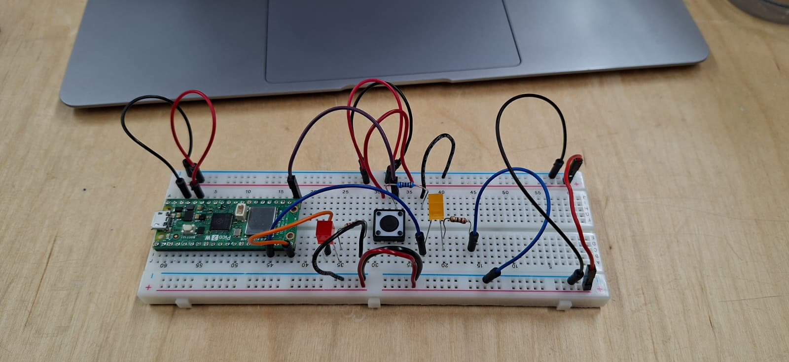

## Circuit



## Code

```cpp
int button;
int prevButton;
int i;
bool isPressed;

void setup() {
  pinMode(15, OUTPUT);
  pinMode(13, OUTPUT);
  pinMode(16, INPUT);
  digitalWrite(15, LOW);
  digitalWrite(13, LOW);
  Serial.begin(9600);

  i = 0;
}

void loop() {

  button = digitalRead(16);

  if (button == HIGH && prevButton == LOW && !isPressed) {
    i++;
    isPressed = true;
    delay(20);
  }

  if (button == LOW && prevButton == HIGH) {
    isPressed = false;
    delay(20);
  }

  if (i == 1) {
    digitalWrite(15, HIGH);
    digitalWrite(13, LOW);
  } else if (i == 2) {
    digitalWrite(15, HIGH);
    digitalWrite(13, HIGH);
  } else if (i == 3) {
    digitalWrite(15, LOW);
    digitalWrite(13, LOW);
    i = 0;
  }

  prevButton = button;
}
```

## Reflection

I found the actual circuit part quite easy, since I only needed to add one more LED (and resistor) after the class example. The basic functionality of the button presses was also pretty simple. I did have some trouble with reading a single button press: distinguishing when the button is held down versus pressed a single time. Storing the previous state of the button helped somewhat, but there was still some inconsistency with the counter going up when it wasn't supposed to. I spent quite a lot of time playing with different delays, but those were still inconsistent. Eventually, I realised that a boolean value of pressed/not pressed was the solution I was looking for. Now the button can be held down for as long as you like, or pressed as rapidly as you can, and the lights still turn on in the correct order. :)

As a computer science student, the base code was pretty simple, but I did quite enjoy fiddling with the button mechanic, since I wasn't immediately sure of how to fix the issues. I'm glad I stuck with it myself, although reading some guides would probably have been a lot faster. I also do enjoy working with circuits, but this was so fast to do on top of the class example that I don't think I really learned anything new from it 😅
