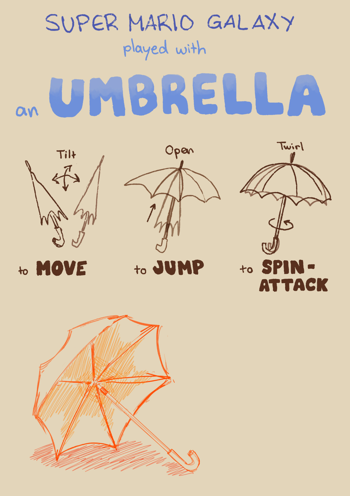

## 1. Find an interesting alt+ctrl interface

### Furbtroller

<https://shakethatbutton.com/furbtroller/>

The Furbtroller is a combination of a Furby toy and an Xbox controller. The whole controller is furry, and the controls have been given Furby-like features: instead of using joysticks, you wiggle the Furby's eyes, instead of pressing on the D-pad, you press on the Furby's mouth, and instead of pressing bumper buttons, you have to press on the Furby's ears.

#### Why I chose this

I chose the Furbtroller because it reminded me of a project I've wanted to do for a while (making a [long furby](<>)), but haven't yet gotten around to it. I think this one had something weirdly nostalgic about it, and making old toys into something completely different seems like a fun idea.

I quite like that the controller itself has not been modified that much, and is definitely still recognizable as an xbox controller that just has Furby parts stuck onto it. The end-result is surprisingly striking despite how simple the changes are. I think this one is a good example of a funny idea can be very memorable, even if it is executed with relatively little effort.

## 2. Come up with a concept for your own alt+ctrl interface

### Super Mario Galaxy played with an umbrella

* Opening/closing the umbrella causes Mario to jump
* Magnetometer
* Tilting the umbrella to move Mario

  * Accelerometer
* Twirling the umbrella to do a spin-attack

  * Gyroscope
