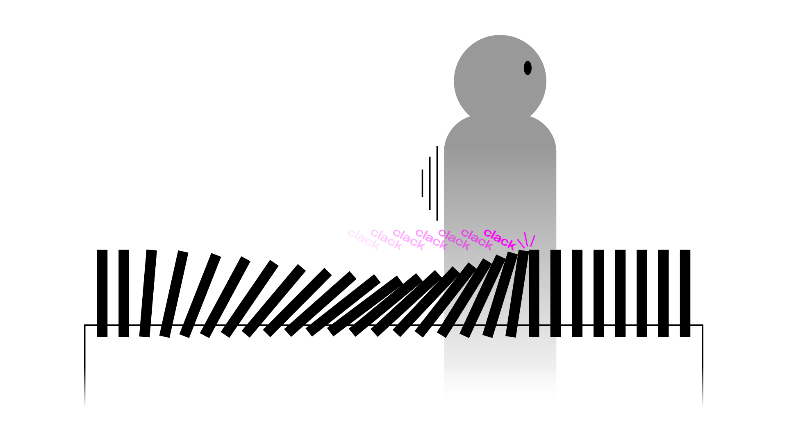
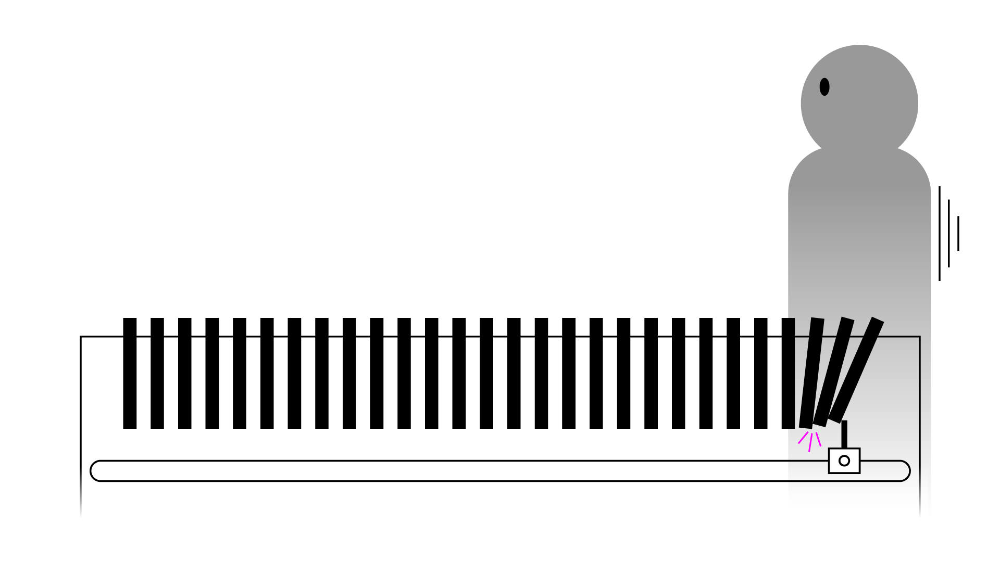

## Experimental interactive sound installation thingy

Row of sticks, standing vertically, spaced out evenly and quite close. Nothing's happening. Person comes closer and walks by, sticks react by individually tilting sideways (toward each other) at the location of the person. Sticks collide, each contact making an interesting sound. These "sticks" could really be any material that produces some intriguing sound, so not necessarily wooden sticks.

Initially I was thinking that each stick would have an independent system to detect a person and react, but I knew that would be quite resource intensive, and therefore probably not feasible.

Matti the elf had an idea: replace the numerous individual systems with a single unit that can follow one person at a time along the length of the installation, on a conveyor belt of sorts. Similar to the "my little piece of privacy" installation by Niklas Roy!



As the unit moves, it collides with the sticks, and sound is produced. The sticks are now hanging from the top, and as the unit passes and releases a stick from its hold, the resulting wavy swinging of the sticks might also produce sound.

This project will be combined with Computational Art and Design course's final project, as a camera will be involved to properly track people, and it will need coding that's a suitable project for the other course.

Maybe this'll be cool, maybe not. Ideally the sounds would be pleasant or interesting, the installation would be large enough for a little back and forward running, and it would reward people for goofing around and testing the installation's limits.

If you have suggestions for interesting sounding stick materials, lmk! ฅ^>⩊<^ฅ

Worries:

* Will the unit be strong enough to push past multiple sticks at once, or will it be limited to one at a time? Depends on the weight of the sticks I suppose.
* Can the unit get stuck with a stick if the person is going back and forth and a swinging stick and the unit meet each other at a particular angle?
