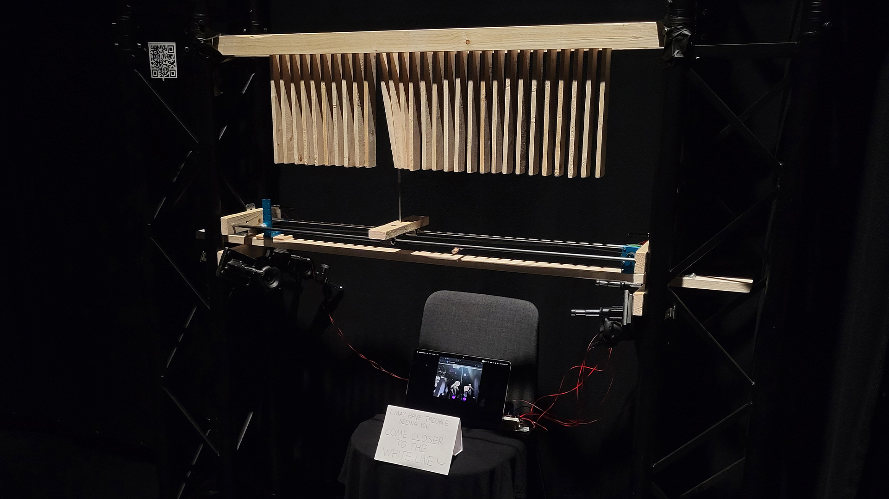

### DESCRIPTION + CODE

The Actions of My Consequences is an experimental interactive prototype installation that scans for unaware passersby and seeks to latch on to a target. A row of small wooden planks hang close together, while a unit beneath them follows a singular person’s X coordinate, resulting in movement and sound as it collides with the planks on its way.



This project was combined with Computational Art and Design as the first step was to single out one target person’s location within a camera view. An exercise in JavaScript [ml5.js BodyPose](https://docs.ml5js.org/#/reference/bodypose) was expanded upon by accessing each identified person’s right and left shoulder X coordinates, calculating the midway in between, and pinpointing a particular target person’s shoulder midway X coordinate through a system of tracking the index and ID values of every person that has entered the view. Shoulders were chosen for tracking the X coordinate of each person due to their tendency to reliably track, compared to facial features for instance. Hips could have been another set of points to track, for they exhibited similar reliability as shoulders.



```
//sketch.js file (Visual Studio Code)

let video;
let bodyPose;
let poses = []; //empty array
let faceEmoji = "🤡";
let lowestID; //store here the lowest ID value found
let lowestIndex; //what is the array index of the person who has the lowestID?
let finalX = 0;
let port; //for connecting to Arduino

function preload() {
  bodyPose = ml5.bodyPose("MoveNet", {flipped:true});
}

function setup() {
  createCanvas(640, 480); //matched resolution with the video
  video = createCapture(VIDEO, {flipped:true});
  video.hide(); //hides the video from below canvas
  textAlign(CENTER,CENTER); //(horizontal align, vertical align);
  port = createSerial(); //for connecting to Arduino

  //START DETECTING
  bodyPose.detectStart(video, gotPoses); //"whenever you get a result, find a function called gotPoses, and do that"
  //^can detect multiple people and creates an array for each
}

function draw() {
  background(220);
  image(video,0,0);

  //FOR LOOP THAT GOES THROUGH ALL THE PEOPLE IT SEES:
  for(let i=0; i<poses.length; i++){
    let pose = poses[i]; //new variable that stores the persons data into it
    //console.log(pose.nose); //open the array to access the individual names of different people parts! ears, ankles...
    if(i==0){
      lowestID = pose.id;
      lowestIndex = i;
    }else{
      if(pose.id<lowestID) {
        lowestID = pose.id;
        lowestIndex = i; //with this can be found out where the index value jumped
      }
    }

    //SHOULDERS TRACK POINTS
    fill('#a2ff00ff');
    noStroke();
    circle(pose.left_shoulder.x, pose.left_shoulder.y, 10);
    circle(pose.right_shoulder.x, pose.right_shoulder.y, 10);

    //SHOULDERS MIDPOINT
    fill("#b700ffff");
    circle(pose.left_shoulder.x /2 + pose.right_shoulder.x /2, 450, 40);
    fill(255);
    textSize(15); //ID text size
    text(i + " " + String(pose.id),pose.left_shoulder.x /2 + pose.right_shoulder.x /2, 450);
    
    //FACE EMOJI
    textSize(75); //emoji size
    text(faceEmoji, pose.nose.x, pose.nose.y);

  } //END OF FOR LOOP

  //console.log("ID: " + lowestID);
  //console.log("Index: " + lowestIndex);

  //IF SAFETY CHECK + LERPED WHITE BALL
  if (poses[lowestIndex]) { //"if poses[lowestID] exists, give it a variable named trackedPerson, and create a white circle with x coordinates from trackedPerson"
  let trackedPerson = poses[lowestIndex]; //store this info in a variable from which data can be retrieved
  //console.log(trackedPerson.left_shoulder.x); //this works now within this if check!
  let target = trackedPerson.left_shoulder.x/2+trackedPerson.right_shoulder.x/2;
  finalX = lerp(finalX, target, 0.05); //finalX is now what we send data from to the Pico
  fill("#ffffffff");
  circle(finalX,30,40);
  port.write(int(finalX)+'\n'); //for connecting to Arduino
  //^int(___) removes decimals
  }
  //^this if statement check is necessary because there are flashes of moments when the person doesn't exist (the data is "asynchronous"), and if data is tried to be retrieved from something that doesn't exist (undefined), the code will crash

  if(port.available()>0){ //reads messages coming from the serial port until a line break (= \n) occurs
    let inputData = port.readUntil("\n");
    console.log(str(inputData));
  } //the idea is that values and what they do can be seen somewhere, otherwise it's difficult to know what's going on
} //END OF DRAW

function gotPoses(results) { //adding 'results' here makes the variable local
  //console.log(results); //open the array [{...}] in console to access the individual names of different parts! ears, ankles...
  poses = results;
}

function mousePressed(){ //click on the canvas to connect to Arduino
  if (!port.opened()) {
    port.open(115200);
  }
}
```

```
<!--index.html file (Visual Studio Code)-->

<!DOCTYPE html>
<html lang="en">
  <head>
    <meta charset="utf-8" />
    <meta name="viewport" content="width=device-width, initial-scale=1.0">

    <title>Sketch</title>

    <link rel="stylesheet" type="text/css" href="style.css">

    <script src="libraries/p5.min.js"></script>
    <script src="libraries/p5.sound.min.js"></script>
    <script src="https://unpkg.com/ml5@1/dist/ml5.js"></script> <!--addition from .dog-->
    <script src="https://unpkg.com/@gohai/p5.webserial@^1/libraries/p5.webserial.js"></script> <!--another addition-->
  </head>

  <body>
    <script src="sketch.js"></script>
  </body>
</html>
```

Green dots track shoulders, purple ball is the midpoint between of each person's shoulders, first value in the purple ball is that person’s index (which tends to jump between persons, so it wasn’t a reliable value to track for a target person on its own), second value is ID (doesn’t jump around, and every person that enters the view gets a new unique ID value that is higher than the previous), and through the combination of tracking the lowest index and lowest ID values a target can be identified and its X coordinate specifically accessed (the white ball). Clown faces are just for fun.

The target’s X coordinate can then be fed to Arduino IDE that controls a single stepper motor. A conveyor belt wraps around the motor on one end, and on the other end around an empty spinning wheel. The collision unit is attached to the conveyor belt, and when the motor spins, the belt along with the unit move.

Further details on this unit + belt contraption include that the belt was originally open-ended, and needed to be joined into a loop with two small blue clamps and some screws. The initial idea was to then attach the actual collision part to this loop joint (metal stick with a flexible silicone tube head to avoid getting stuck with planks), but soon enough it was realised that the belt couldn’t hold it straight, even when tightened around the motor and wheel, and that the unit needed stabilisation. Therefore a stabilising axis was fashioned from two long metal rods skewering two wooden bits on both ends. The belt would then come in between these rods. A third wooden bit was introduced to the middle, attached to the rods with bushings so that it slides along with ease, and the loop joint was drilled to the bottom of this middle bit as well. The belt was finally tightened with a simple zip tie and a wooden piece, as time was of the essence, however the result could have been even tighter. Lastly a hole could be drilled into the middle wooden bit, where the collision part could be securely sticked to.

The motor / collision unit required calibration before it could function, for it needed to know where it is in the limited space it could move along the conveyor belt. As the code starts, the motor would start moving the unit slowly to the left, where it would eventually press a switch attached to the end of the stabilising axis, to let it know this is the start point, move a little away from the switch, and set X coordinate zero there. Additionally there was a risk of the motor skipping steps and the unit becoming offset, and so an additional switch was introduced to the opposite end, and either switch being pressed would tell the system to recalibrate.

The Arduino IDE code below is the version that was presented at the end of the Physical Computing course. It has the main functionalities detailed above, but challenges include slow maximum follow speed of the target, and inability to follow very small / slow movements. No LLMs were used in the production of this code.

```
//CODE PRESENTED AT THE END OF THE COURSE

int dirPin = 20;
int stepPin = 21;
int x; //current coordinate of the motor
int targetX;
int switchOne;
int switchTwo;

void setup() {
  pinMode(dirPin, OUTPUT);
  pinMode(stepPin, OUTPUT);
  pinMode(16, INPUT_PULLUP); //switchOne (PULLUP activates the Pico's inner resistor, and flips the logic (1 is 0 and 0 is 1))
  pinMode(17, INPUT_PULLUP); //switchTwo
  Serial.begin(115200);
  delay(2000);
  Serial.println("calibration begins");
  calibrate();
  Serial.println("calibration done");
}

void loop() {
  //if there's any serial available, read it:
  while (Serial.available()) {
    String input = Serial.readStringUntil('\n'); //created local string type variable called input
    targetX = input.toInt(); //local string type variable input is converted to an integer type variable and stored into global integer variable targetX
    Serial.print("targetX: ");
    Serial.println(targetX);
  }

  switchOne = digitalRead(16);
  switchTwo = digitalRead(17);

  moveTowardX();

  //IF EITHER SWITCH IS ACTIVATED DURING FOLLOW X, RECALIBRATE!
  if (switchOne == 0 || switchTwo == 0) { //single = means were storing new information to the variable, == means we're checking what the information is, and === (in JavaScript, doesn't exist in Arduino) is a strict check of information
    calibrate();
  }
}

//MOTOR, CALIBRATE!
void calibrate() {
  switchOne = digitalRead(16);
  while (switchOne == 1) {
    Serial.println("going home");
    digitalWrite(dirPin, HIGH);
    oneStep();
    switchOne = digitalRead(16);
  }
  delay(1000);
  digitalWrite(dirPin, LOW);
  for (int i = 0; i < 50; i++) {
    oneStep(); //repeat oneStep 50 times
    delay(1);
  }
  x = 0; //the result of the calibration is that the unit has safely moved slightly away from switchOne, and has set it's 0 x coordinate there
}

//MOTOR, FOLLOW X!
void moveTowardX() {
  if(x>targetX) {
    x = x - 1; //keeps track of where motor x coordinate goes
    digitalWrite(dirPin, HIGH);
  }
  if(x<targetX) {
    x = x + 1;
    digitalWrite(dirPin, LOW);
  }
  if(x!=targetX) { //only if motor's x coordinate is different to the targetX coordinate, take a step
  oneStep();
  }
}

//MOTOR, TAKE ONE STEP!
void oneStep() {
  digitalWrite(stepPin, HIGH);
  digitalWrite(stepPin, LOW);
  delay(1);
}
```

The modified code below was developed with the help of a friend to tackle the previously mentioned challenges. This code was employed at the Demo Day exhibit, and can be seen in action in the earlier video. With this the unit can speed up when at further distances apart from the target X coordinate, and it can also replicate even the slightest movements.

```
//MODIFIED CODE USED DURING DEMO DAY

int dirPin = 20;
int stepPin = 21;
int x; //current coordinate of the motor
int targetX;
int switchOne;
int switchTwo;

// Speed control variables
const int MAX_SPEED = 2500; //steps per second
const int MIN_STEP_DELAY = 1000000 / (MAX_SPEED * 2); //microseconds between pulses
const int ACCEL_STEPS = 200; //number of steps to accelerate/decelerate over

void setup() {
  pinMode(dirPin, OUTPUT);
  pinMode(stepPin, OUTPUT);
  pinMode(16, INPUT_PULLUP);
  pinMode(17, INPUT_PULLUP);
  Serial.begin(115200);
  delay(2000);
  Serial.println("calibration begins");
  calibrate();
  Serial.println("calibration done");
}

void loop() {
  //if there's any serial available, read it:
  while (Serial.available()) {
    String input = Serial.readStringUntil('\n');
    targetX = input.toInt();
    targetX = targetX * 7.1;
    Serial.print("targetX: ");
    Serial.println(targetX);
  }
  
  switchOne = digitalRead(16);
  switchTwo = digitalRead(17);
  
  moveTowardX();
  
  //IF EITHER SWITCH IS ACTIVATED DURING FOLLOW X, RECALIBRATE!
  if (switchOne == 0 || switchTwo == 0) {
    calibrate();
  }
}

//MOTOR, CALIBRATE!
void calibrate() {
  switchOne = digitalRead(16);
  while (switchOne == 1) {
    Serial.println("going home");
    digitalWrite(dirPin, HIGH);
    oneStep();
    switchOne = digitalRead(16);
  }
  delay(1000);
  digitalWrite(dirPin, LOW);
  for (int i = 0; i < 25; i++) {
    oneStep();
    delay(1);
  }
  x = 0;
}

//MOTOR, FOLLOW X! (MODIFIED VERSION)
void moveTowardX() {
  int stepsToGo = abs(targetX - x);
  
  if (stepsToGo == 0) return; // Already at target
  
  // Set direction
  if (x > targetX) {
    digitalWrite(dirPin, HIGH);
  } else {
    digitalWrite(dirPin, LOW);
  }
  
  // Take multiple steps if we're far from target
  // This makes movement MUCH faster
  int stepsThisLoop = min(stepsToGo, 50); // Take up to 50 steps per loop
  
  for (int i = 0; i < stepsThisLoop; i++) {
    // Check switches during movement for safety
    switchOne = digitalRead(16);
    switchTwo = digitalRead(17);
    if (switchOne == 0 || switchTwo == 0) {
      break; // Stop immediately if switch hit
    }
    
    // Optional: Implement ramping for smoother start/stop
    int currentDelay = MIN_STEP_DELAY;
    if (i < ACCEL_STEPS || (stepsToGo - i) < ACCEL_STEPS) {
      // Slow down at start and end for smoother motion
      currentDelay = MIN_STEP_DELAY * 2;
    }
    
    fastStep(currentDelay);
    
    // Update position
    if (x > targetX) {
      x--;
    } else {
      x++;
    }
  }
}

//MOTOR, TAKE ONE STEP! (ORIGINAL - for slow movements)
void oneStep() {
  digitalWrite(stepPin, HIGH);
  delayMicroseconds(800);
  digitalWrite(stepPin, LOW);
  delayMicroseconds(800);
}

//MOTOR, TAKE A FAST STEP!
void fastStep(int stepDelay) {
  digitalWrite(stepPin, HIGH);
  delayMicroseconds(stepDelay);
  digitalWrite(stepPin, LOW);
  delayMicroseconds(stepDelay);
}
```

### WHAT I LEARNT

This project ended up being quite challenging for someone like me who didn’t have much experience in programming, woodworking, or let alone metalworking, but that also meant I acquired plenty new knowledge in all areas.

Among other things I learnt:

* How to single out one person to be tracked in a camera view
* How to feed data from JavaScript to Arduino IDE
* How to do an if statement safety check for data that doesn’t always exist
* I can activate internal resistors in a Pico, and doing so reverses zeroes and ones
* The importance of calibration and how to perform a type of calibration
* How to cut, file and clean up metal rods
* How to use vertical drills
* The significance of pre-drilling for screws (prevents wood splitting, guides the screws, screws bite in tighter)
* The importance of advance planning, drawing and mapping out what materials I need (couldn’t do much in the beginning due to lack of experience, and that made advancing challenging. I could only start drawing plans towards the end)
* Workshop etiquette in terms of requesting aid and materials (the workshops masters don’t fancy last minute requests, but if they’re small enough they might just be willing to help)
* I quite enjoy wood and metalworking, and that I’d like to learn more to be able to build better installations independently
* To look out for kissing alligator clips, even when I think they’re not going to kiss (I melted a power supply, oops)
* That I should doubt a Pico as well if something doesn’t seem to work in my circuit, and that it might just be a singular pin in the Pico that’s busted, not the whole Pico
* The further apart the hanging planks are, the further apart they will also make noise upon collision. Who would have thought!
* Wood is not automatically straight, and that bent wood is not great for precision work like CNC milling, laser cutting, or drilling a series of holes along a plank
* Wood types have different densities and weights, and therefore also sounds
* People have varied reactions to interactive installations; many try its limits quite conservatively (not moving much), and few go “all out” (dashing back and forth).

### FOR THE FUTURE

This was very much a prototype, and a lot of its decisions were made on the spot with not much time to explore or contemplate. I’d love to rebuild a more polished version, experiment with harder wood or entirely different materials, have a longer belt and a row of planks, focus more on the aesthetics, have the unit move even faster to better match fast movement, smooth out the units movements, and improve the lighting of the situation and camera view.

BodyPose struggled to recognise people due to harsh above lighting and a dark background, though this could be countered enough by placing white tape on the floor and with a sign asking people to come closer to it.

Another challenge was that the laptop camera could see the entire space on the background, sometimes recognising people from way further behind that are not engaged with the installation. In the ideal situation the camera would be situated somewhere where it could point downward, limiting the depth at which people are detected, with better illumination on the people, and perhaps a lighter background. Many in Finland wear black clothing, and against a black background it was slightly problematic.

### 
WORKSHOPS USED

(In addition to mechatronics.) If you're planning to build anything similar, do the workshop intros!\
\
Multi-material\
Wood\
Metal

### SOME PARTS LINKS

[Raspberry Pi Pico 2 W](https://www.raspberrypi.com/documentation/microcontrollers/pico-series.html)\
[](https://www.raspberrypi.com/documentation/microcontrollers/pico-series.html)[SY42STH38-1684A Stepper Motor](https://www.pololu.com/product/2267)\
[A4988 Stepper Motor Driver](https://www.pololu.com/product/2128)[](https://www.pololu.com/product/2128)

### CLOSE-UP PHOTO DOCUMENTATION

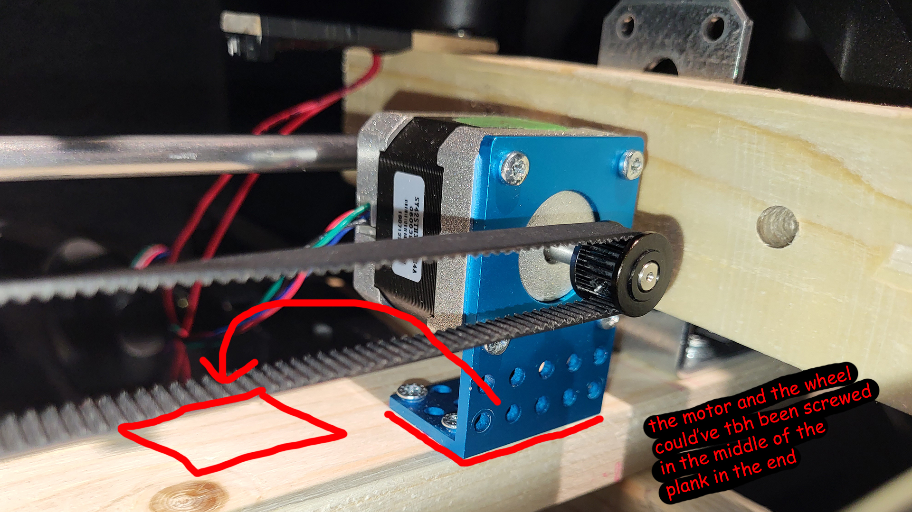

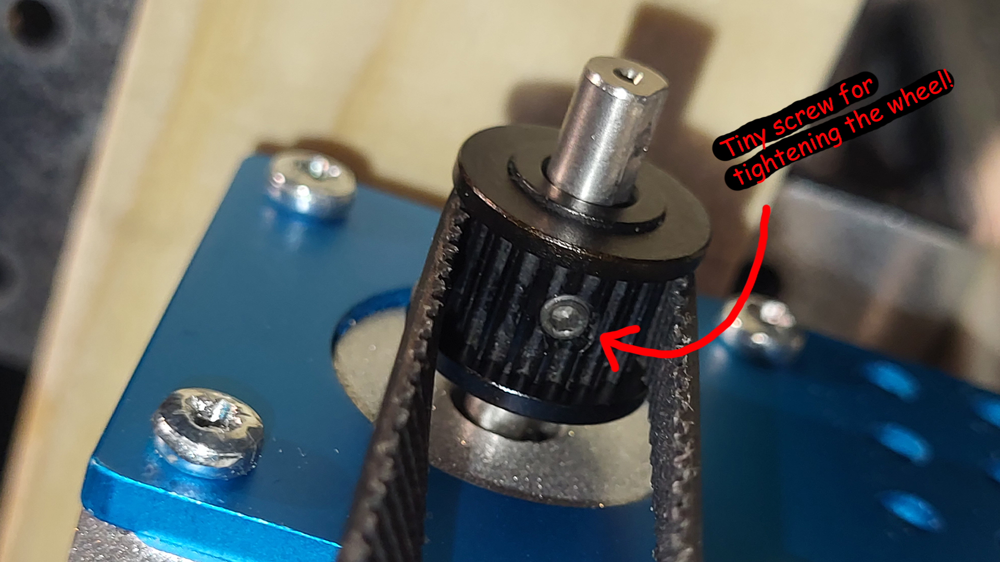

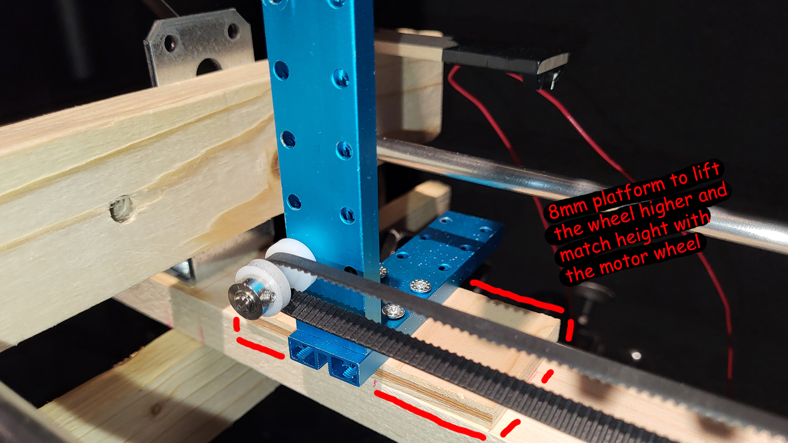

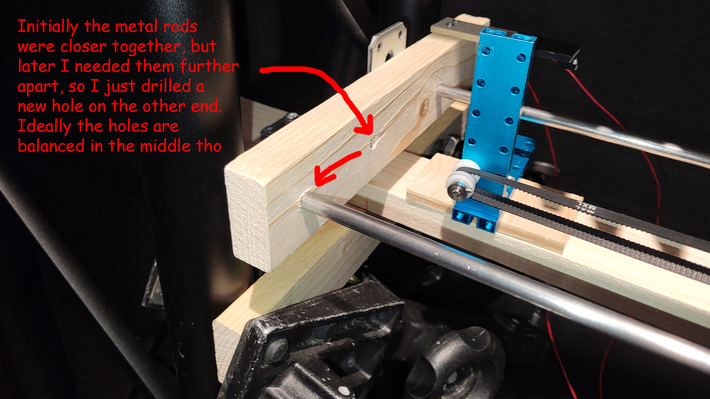


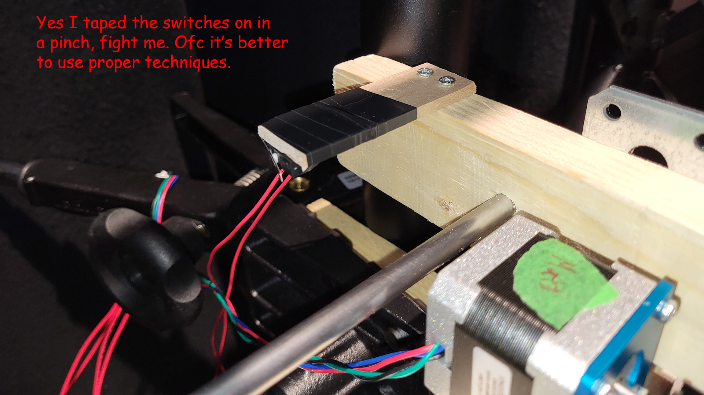

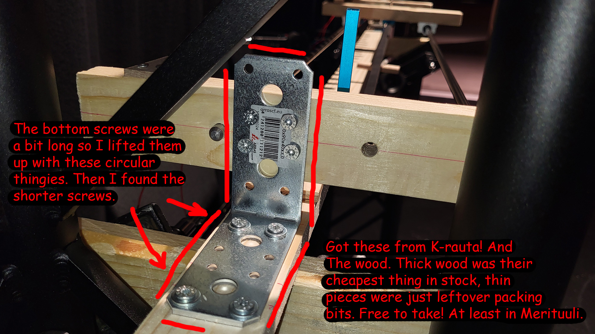

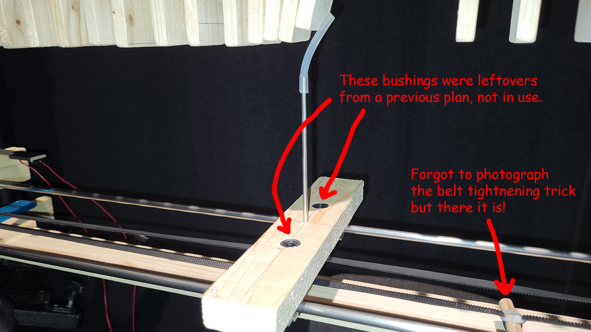

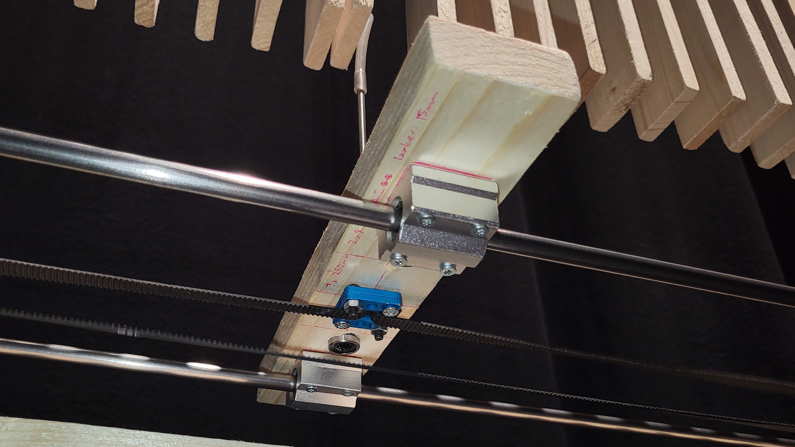

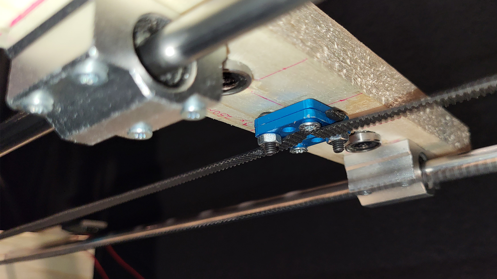

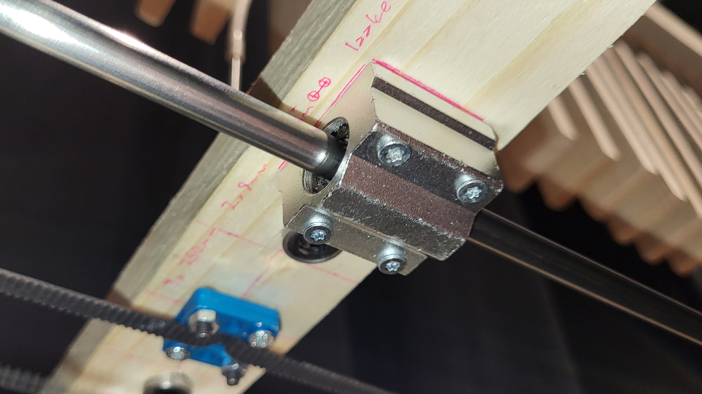

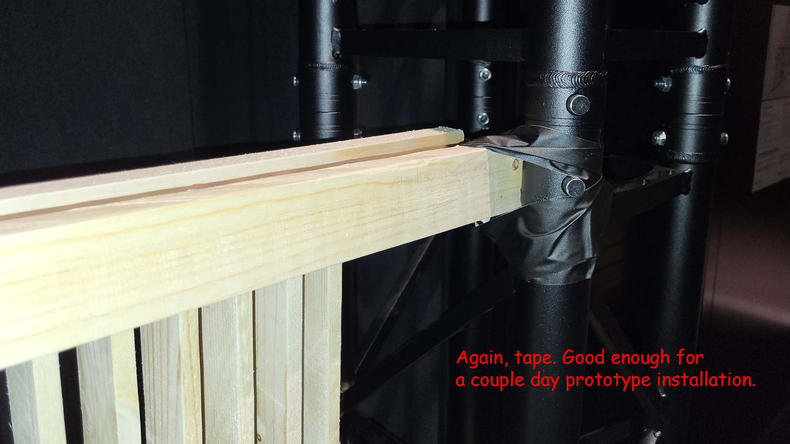

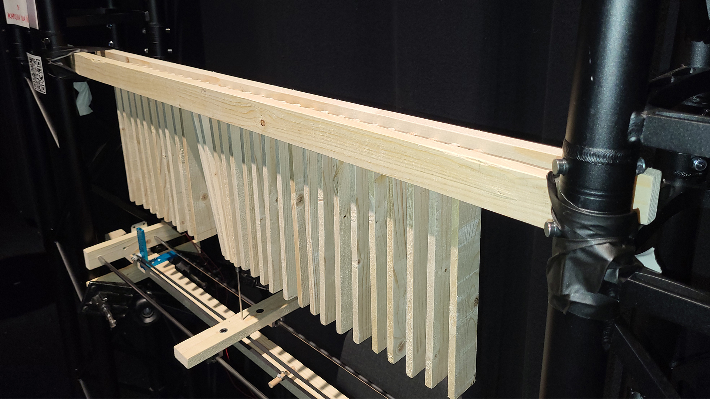

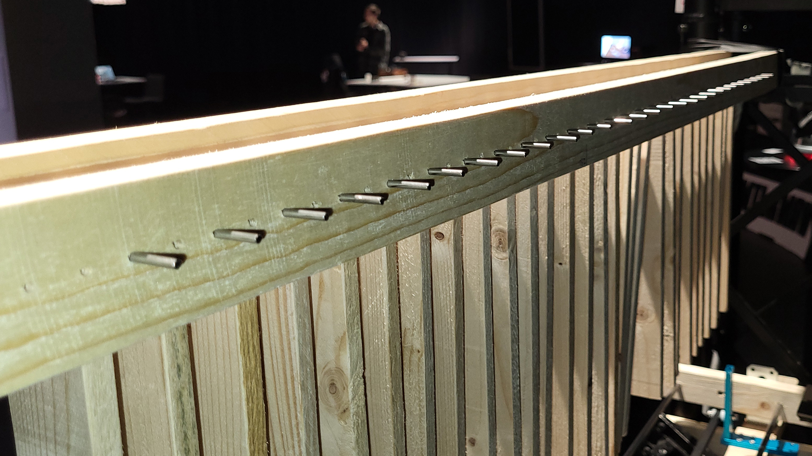

### SKETCHES AND NOTES


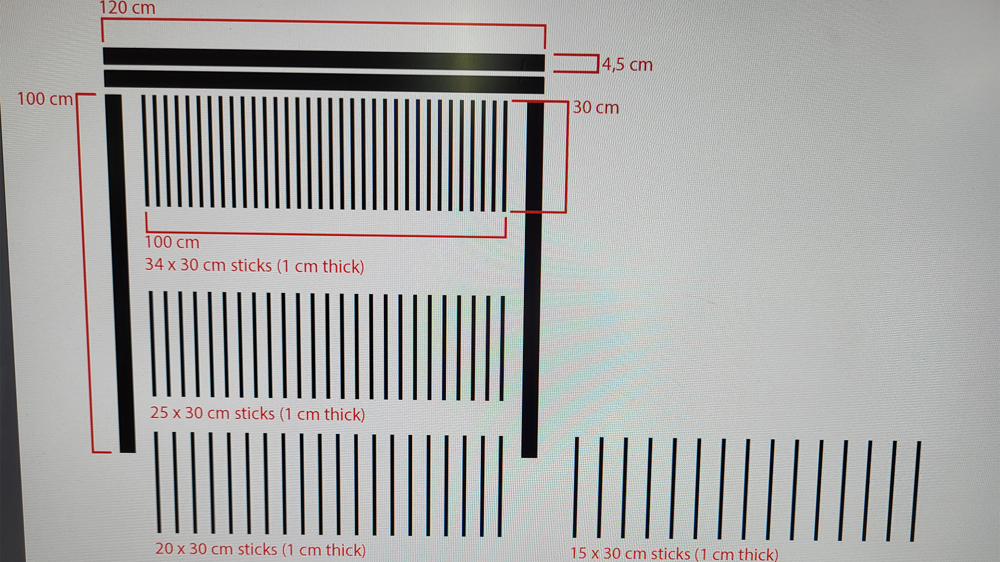

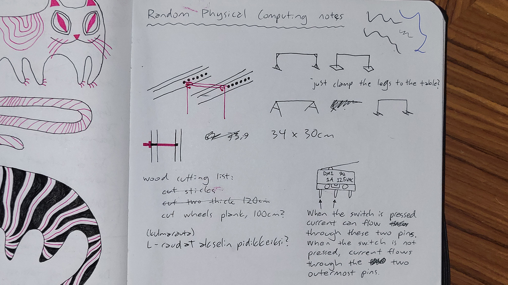

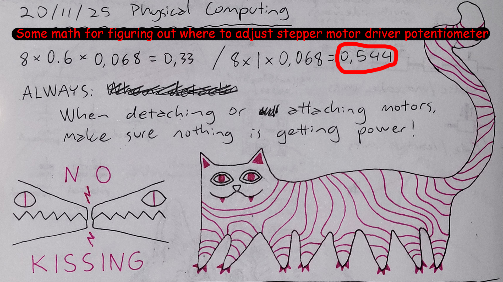

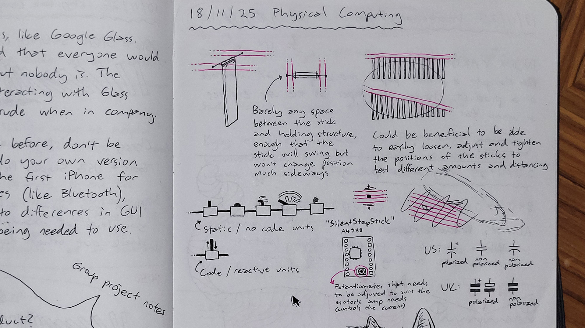

### RANDOM PROCESS PHOTOS

TBA
