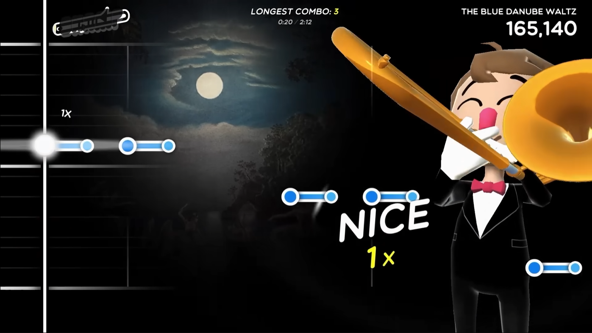

The salad sling. Pleasant rotation movement in both directions by rotating a crank on the lid. You can go slow and steady, or real fasty blasty. I recently thrifted this, and thought it could be a fun controller for a game, paired with a gyroscope(?). The rotation velocity sensing thingy that also senses the direction.

The kind of game this salad sling could control, for instance, could be a game akin to Nintendo's Trombone Champ: the speed of the rotation would determine the "pitch", and you'd have to match it with varying "notes". There could be notes that demand a certain direction of rotation.

