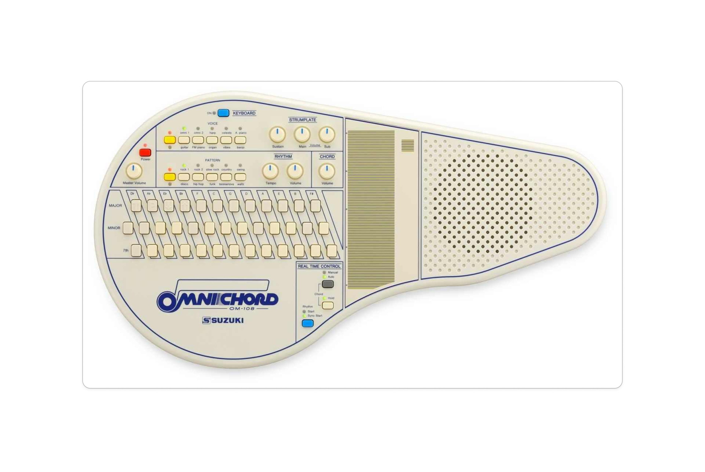

# Junkbox

The junkbox is a 4x stepper motor MIDI to analog vibration box inspired by Koka Nikoladze.

As a bonus thing to play with, for the Computational Art & Design part, I created a P5js sketch that is inspired by the Omnichord instrument.





## Motor tuning code

```

//including the MIDI libraries
#include <Arduino.h>
#include <Adafruit_TinyUSB.h>
#include <MIDI.h>

// USB MIDI object - library accessing
Adafruit_USBD_MIDI usb_midi;

// Create a new instance of the Arduino MIDI Library,
// and attach usb_midi as the transport.
MIDI_CREATE_INSTANCE(Adafruit_USBD_MIDI, usb_midi, MIDI);

//          SETTING UP THE MOTORS
int potentiometer;
int speed;

//  MOTOR 1
#define EN_PIN_1 5

#define STEP_PIN_1 21
#define DIR_PIN_1 20

//  MOTOR 2
#define EN_PIN_2 4

#define STEP_PIN_2 19
#define DIR_PIN_2 18

//  MOTOR 3
#define EN_PIN_3 1

#define STEP_PIN_3 12
#define DIR_PIN_3 13

//  MOTOR 4 (silent driver)
#define EN_PIN_4 0

#define STEP_PIN_4 3
#define DIR_PIN_4 2

const bool motorDirection = LOW; //you can use this to change the motor direction, comment out if you aren't using it.

// THE MILLIS STUFF
//Index 0 is not used.
unsigned long motorSpeeds[] = {0, 0, 0, 0, 0}; //holds the speed value of the motors. 
unsigned long prevStepMicros[] = {0, 0, 0, 0, 0}; //last time
unsigned long startMicros;

unsigned long lastTime; //Will store the time that the last event occured.
int TIME = 1000; // Number of milliseconds for millis()

//SETUP
void setup() {
  analogReadResolution(12);
  pinMode(5, OUTPUT);
  pinMode(4, OUTPUT);
  pinMode(1, OUTPUT);
  pinMode(0, OUTPUT);
  //lastTime = millis(); //variable that holds the start time
   // put your setup code here, to run once:
  Serial.begin(9600);
  // Manual begin() is required on core without built-in support e.g. mbed rp2040
  if (!TinyUSBDevice.isInitialized()) {
    TinyUSBDevice.begin(0);
  }
  usb_midi.setStringDescriptor("TinyUSB MIDI");

  // Initialize MIDI, and listen to all MIDI channels
  // This will also call usb_midi's begin()
  MIDI.begin(MIDI_CHANNEL_OMNI);
  MIDI.turnThruOff(); //turning off the sending of the recieved MIDI info

  // If already enumerated, additional class driverr begin() e.g msc, hid, midi won't take effect until re-enumeration
  if (TinyUSBDevice.mounted()) {
    TinyUSBDevice.detach();
    delay(10);
    TinyUSBDevice.attach();
  }
  digitalWrite(EN_PIN_1, HIGH);  // Start with motors disabled
  digitalWrite(EN_PIN_2, HIGH);
  digitalWrite(EN_PIN_3, HIGH);
  digitalWrite(EN_PIN_4, HIGH);

  // Attach the handleNoteOn function to the MIDI Library. It will
  // be called whenever the Bluefruit receives MIDI Note On messages.
  MIDI.setHandleNoteOn(handleNoteOn);

  // Do the same for MIDI Note Off messages.
  MIDI.setHandleNoteOff(handleNoteOff);

      //MOTOR NR 1.
  //enable pin
  pinMode(5, OUTPUT);
  //step pin
  pinMode(21, OUTPUT);
  //direction pin
  pinMode(20, OUTPUT);

      //MOTOR NR 2.
  //enable pin
  pinMode(4, OUTPUT);
  //step pin
  pinMode(19, OUTPUT);
  //direction pin
  pinMode(18, OUTPUT);

      //MOTOR NR 3.
  //enable pin
  pinMode(1, OUTPUT);
  //step pin
  pinMode(12, OUTPUT);
  //direction pin
  pinMode(13, OUTPUT);

      //MOTOR NR 4.
  //enable pin
  pinMode(0, OUTPUT);
  //step pin
  pinMode(3, OUTPUT);
  //direction pin
  pinMode(4, OUTPUT);

  digitalWrite(DIR_PIN_1, motorDirection);
  digitalWrite(DIR_PIN_2, motorDirection);
  digitalWrite(DIR_PIN_3, motorDirection);
  digitalWrite(DIR_PIN_4, motorDirection); //and this one too. */

  //reading from the potentiometer
  pinMode(26,INPUT);
  lastTime = millis(); // Initialize lastTime

}


void loop() {
  
  
  // read any new MIDI messages
  MIDI.read();

    //updating the MIDI
      #ifdef TINYUSB_NEED_POLLING_TASK
      // Manual call tud_task since it isn't called by Core's background
      TinyUSBDevice.task();
      #endif

  
  // calling the one step function for each stepper motor
    oneStep(1, STEP_PIN_1);
    oneStep(2, STEP_PIN_2);
    oneStep(3, STEP_PIN_3);
    oneStep(4, STEP_PIN_4);


  potentiometer = analogRead(26);
  speed = map(potentiometer, 0, 4095, 10, 15000);
  if(millis() - lastTime >= TIME){
    Serial.println(speed);
    lastTime = millis(); // Add this line to update lastTime
  }
  
}

//MOTOR STEP FUNCTION

void oneStep(byte motorNumber, byte stepPin) {
  if ((micros() - prevStepMicros[motorNumber] >= motorSpeeds[motorNumber]) && (motorSpeeds[motorNumber] != 0))  //test whether the period has elapsed and don't use index 0
  {
    prevStepMicros[motorNumber] += motorSpeeds[motorNumber];
    digitalWrite(stepPin, HIGH);
    digitalWrite(stepPin, LOW);
  
  }
}


void handleNoteOn(byte channel, byte pitch, byte velocity) {
  if(channel == 1){
    digitalWrite(EN_PIN_1, 0);
    //gate_1 = true; //we have signal
    //update motor speed
    motorSpeeds[1] = speed;
  }
    if(channel == 2){
    digitalWrite(EN_PIN_2, 0);
    //gate_2 = true; //we have signal
    //update motor speed
    motorSpeeds[2] = speed;
  }
   if(channel == 3){
    digitalWrite(EN_PIN_3, 0);
    //gate_3 = true; //we have signal
    //update motor speed
    motorSpeeds[3] = speed;
  }
   if(channel == 4){
    digitalWrite(EN_PIN_4, 0);
    //gate_4 = true; //we have signal
    //update motor speed
    motorSpeeds[4] = speed;
  }

}

void handleNoteOff(byte channel, byte pitch, byte velocity) {
 
  if(channel == 1 ){
    //gate_1  = false;
    //motorSpeeds[1] = motorSpeedPitch_1[0];
    digitalWrite(EN_PIN_1, 1);
  }
  if(channel == 2 ){
    digitalWrite(EN_PIN_2, 1);
    //gate_2  = false;
    //motorSpeeds[2] = motorSpeedPitch_2[0];
  }
  if(channel == 3 ){
    digitalWrite(EN_PIN_3, 1);
    //gate_3  = false;
    //motorSpeeds[3] = motorSpeedPitch_3[0];
  }
  if(channel == 4 ){
    digitalWrite(EN_PIN_4, 1);
    //gate_4  = false;
    //motorSpeeds[4] = motorSpeedPitch_4[0];
  }

}

```

## This is version 8 of the code.

```
//including the MIDI libraries
#include <Arduino.h>
#include <Adafruit_TinyUSB.h>
#include <MIDI.h>

// USB MIDI object - library accessing
Adafruit_USBD_MIDI usb_midi;

// Create a new instance of the Arduino MIDI Library,
// and attach usb_midi as the transport.
MIDI_CREATE_INSTANCE(Adafruit_USBD_MIDI, usb_midi, MIDI);

//          SETTING UP THE MOTORS


//  MOTOR 1
#define EN_PIN_1 5

#define STEP_PIN_1 21
#define DIR_PIN_1 20

//  MOTOR 2
#define EN_PIN_2 4

#define STEP_PIN_2 19
#define DIR_PIN_2 18

//  MOTOR 3
#define EN_PIN_3 1

#define STEP_PIN_3 12
#define DIR_PIN_3 13

//  MOTOR 4 (silent driver)
#define EN_PIN_4 0

#define STEP_PIN_4 3
#define DIR_PIN_4 2

uint32_t motorSpeed_1; //motor one speed
uint32_t motorSpeed_2; // motor two speed
bool gate_1; //making the motor spin and stop TRUE = NOTE IS ON
bool gate_2; //making the motor spin and stop TRUE = NOTE IS ON
bool gate_3; //making the motor spin and stop TRUE = NOTE IS ON
bool gate_4; //making the motor spin and stop TRUE = NOTE IS ON
const bool motorDirection = LOW; //you can use this to change the motor direction, comment out if you aren't using it.

// THE MILLIS STUFF
//Index 0 is not used.
unsigned long motorSpeeds[] = {0, 0, 0, 0, 0}; //holds the speed value of the motors. 
unsigned long prevStepMicros[] = {0, 0, 0, 0, 0}; //last time
unsigned long startMicros;

unsigned long lastEvent; //Will store the time that the last event occured.
int notMoving = 0;


// MIDI note to motor delay (microseconds) lookup table
// Based on measurements: C1 (MIDI 24) ≈ 29500µs, C3 (MIDI 48) ≈ 6500µs, C5 (MIDI 72) ≈ 879µs
// MORE delay = LOWER pitch
//                          MOTOR SPEED VALUE ARRAYS
const uint32_t motorSpeedPitch_1[128] = {
  // Octave -1 (C-1 to B-1, MIDI 0-11) - extrapolated
  476800, 449824, 424320, 400224, 377472, 356032, 335840, 316864, 299040, 282336, 266720, 251648,
  
  // Octave 0 (C0 to B0, MIDI 12-23) - extrapolated
  238400, 224912, 212160, 200112, 188736, 178016, 167920, 158432, 149520, 141168, 133360, 125824,
  
  // Octave 1 (C1 to B1, MIDI 24-35)
  // C1=29800, G#1=18600, E1=23800, G1=19100, A#1=15800
  29800, 28131, 26546, 25042, 23800, 22456, 21185, 19993, 18600, 17564, 16580, 15646,
  
  // Octave 2 (C2 to B2, MIDI 36-47)
  // D2=12700, E2=10800, F2=10250, A2=8050
  14900, 14065, 12700, 11990, 10800, 10250, 9673, 9128, 8613, 8050, 7594, 7168,
  
  // Octave 3 (C3 to B3, MIDI 48-59)
  // C3=6500, D3=5250, D#3=5300, F#3=4354, B3=2903
  6500, 6137, 5250, 5300, 5011, 4728, 4354, 4108, 3877, 3661, 3249, 3066,
  
  // Octave 4 (C4 to B4, MIDI 60-71)
  // E4=1879
  2903, 2740, 2586, 2440, 1879, 1773, 1673, 1579, 1490, 1407, 1328, 1254,
  
  // Octave 5 (C5 to B5, MIDI 72-83)
  // C5=929, E5=483, G5=300
  929, 877, 828, 781, 483, 455, 430, 300, 283, 267, 252, 238,
  
  // Octave 6 (C6 to B6, MIDI 84-95)
  224, 211, 199, 188, 178, 168, 158, 149, 141, 133, 126, 119,
  
  // Octave 7 (C7 to B7, MIDI 96-107)
  112, 105, 99, 94, 89, 84, 79, 75, 70, 66, 63, 59,
  
  // Octave 8 (C8 to B8, MIDI 108-119)
  56, 53, 50, 47, 44, 42, 39, 37, 35, 33, 31, 29,
  
  // Octave 9-10 (C9 to G10, MIDI 120-127)
  28, 26, 25, 23, 22, 21, 19, 18
};
const uint32_t motorSpeedPitch_2[128] = {
  // Octave -1 (C-1 to B-1, MIDI 0-11) - extrapolated
  476800, 449824, 424320, 400224, 377472, 356032, 335840, 316864, 299040, 282336, 266720, 251648,
  
  // Octave 0 (C0 to B0, MIDI 12-23) - extrapolated
  238400, 224912, 212160, 200112, 188736, 178016, 167920, 158432, 149520, 141168, 133360, 125824,
  
  // Octave 1 (C1 to B1, MIDI 24-35)
  // C1=29800, G#1=18600, E1=23800, G1=19100, A#1=15800
  29800, 28131, 26546, 25042, 23800, 22456, 21185, 19993, 18600, 17564, 16580, 15646,
  
  // Octave 2 (C2 to B2, MIDI 36-47)
  // D2=12700, E2=10800, F2=10250, A2=8050
  14900, 14065, 12700, 11990, 10800, 10250, 9673, 9128, 8613, 8050, 7594, 7168,
  
  // Octave 3 (C3 to B3, MIDI 48-59)
  // C3=6500, D3=5250, D#3=5300, F#3=4354, B3=2903
  6500, 6137, 5250, 5300, 5011, 4728, 4354, 4108, 3877, 3661, 3249, 3066,
  
  // Octave 4 (C4 to B4, MIDI 60-71)
  // E4=1879
  2903, 2740, 2586, 2440, 1879, 1773, 1673, 1579, 1490, 1407, 1328, 1254,
  
  // Octave 5 (C5 to B5, MIDI 72-83)
  // C5=929, E5=483, G5=300
  929, 877, 828, 781, 483, 455, 430, 300, 283, 267, 252, 238,
  
  // Octave 6 (C6 to B6, MIDI 84-95)
  224, 211, 199, 188, 178, 168, 158, 149, 141, 133, 126, 119,
  
  // Octave 7 (C7 to B7, MIDI 96-107)
  112, 105, 99, 94, 89, 84, 79, 75, 70, 66, 63, 59,
  
  // Octave 8 (C8 to B8, MIDI 108-119)
  56, 53, 50, 47, 44, 42, 39, 37, 35, 33, 31, 29,
  
  // Octave 9-10 (C9 to G10, MIDI 120-127)
  28, 26, 25, 23, 22, 21, 19, 18
};
const uint32_t motorSpeedPitch_3[128] = {
  // Octave -1 (C-1 to B-1, MIDI 0-11) - extrapolated
  476800, 449824, 424320, 400224, 377472, 356032, 335840, 316864, 299040, 282336, 266720, 251648,
  
  // Octave 0 (C0 to B0, MIDI 12-23) - extrapolated
  238400, 224912, 212160, 200112, 188736, 178016, 167920, 158432, 149520, 141168, 133360, 125824,
  
  // Octave 1 (C1 to B1, MIDI 24-35)
  // C1=29800, G#1=18600, E1=23800, G1=19100, A#1=15800
  29800, 28131, 26546, 25042, 23800, 22456, 21185, 19993, 18600, 17564, 16580, 15646,
  
  // Octave 2 (C2 to B2, MIDI 36-47)
  // D2=12700, E2=10800, F2=10250, A2=8050
  14900, 14065, 12700, 11990, 10800, 10250, 9673, 9128, 8613, 8050, 7594, 7168,
  
  // Octave 3 (C3 to B3, MIDI 48-59)
  // C3=6500, D3=5250, D#3=5300, F#3=4354, B3=2903
  6500, 6137, 5250, 5300, 5011, 4728, 4354, 4108, 3877, 3661, 3249, 3066,
  
  // Octave 4 (C4 to B4, MIDI 60-71)
  // E4=1879
  2903, 2740, 2586, 2440, 1879, 1773, 1673, 1579, 1490, 1407, 1328, 1254,
  
  // Octave 5 (C5 to B5, MIDI 72-83)
  // C5=929, E5=483, G5=300
  929, 877, 828, 781, 483, 455, 430, 300, 283, 267, 252, 238,
  
  // Octave 6 (C6 to B6, MIDI 84-95)
  224, 211, 199, 188, 178, 168, 158, 149, 141, 133, 126, 119,
  
  // Octave 7 (C7 to B7, MIDI 96-107)
  112, 105, 99, 94, 89, 84, 79, 75, 70, 66, 63, 59,
  
  // Octave 8 (C8 to B8, MIDI 108-119)
  56, 53, 50, 47, 44, 42, 39, 37, 35, 33, 31, 29,
  
  // Octave 9-10 (C9 to G10, MIDI 120-127)
  28, 26, 25, 23, 22, 21, 19, 18
};
const uint32_t motorSpeedPitch_4[128] = {
  // Octave -1 (C-1 to B-1, MIDI 0-11) - extrapolated
  476800, 449824, 424320, 400224, 377472, 356032, 335840, 316864, 299040, 282336, 266720, 251648,
  
  // Octave 0 (C0 to B0, MIDI 12-23) - extrapolated
  238400, 224912, 212160, 200112, 188736, 178016, 167920, 158432, 149520, 141168, 133360, 125824,
  
  // Octave 1 (C1 to B1, MIDI 24-35)
  // C1=29800, G#1=18600, E1=23800, G1=19100, A#1=15800
  29800, 28131, 26546, 25042, 23800, 22456, 21185, 19993, 18600, 17564, 16580, 15646,
  
  // Octave 2 (C2 to B2, MIDI 36-47)
  // D2=12700, E2=10800, F2=10250, A2=8050
  14900, 14065, 12700, 11990, 10800, 10250, 9673, 9128, 8613, 8050, 7594, 7168,
  
  // Octave 3 (C3 to B3, MIDI 48-59)
  // C3=6500, D3=5250, D#3=5300, F#3=4354, B3=2903
  6500, 6137, 5250, 5300, 5011, 4728, 4354, 4108, 3877, 3661, 3249, 3066,
  
  // Octave 4 (C4 to B4, MIDI 60-71)
  // E4=1879
  2903, 2740, 2586, 2440, 1879, 1773, 1673, 1579, 1490, 1407, 1328, 1254,
  
  // Octave 5 (C5 to B5, MIDI 72-83)
  // C5=929, E5=483, G5=300
  929, 877, 828, 781, 483, 455, 430, 300, 283, 267, 252, 238,
  
  // Octave 6 (C6 to B6, MIDI 84-95)
  224, 211, 199, 188, 178, 168, 158, 149, 141, 133, 126, 119,
  
  // Octave 7 (C7 to B7, MIDI 96-107)
  112, 105, 99, 94, 89, 84, 79, 75, 70, 66, 63, 59,
  
  // Octave 8 (C8 to B8, MIDI 108-119)
  56, 53, 50, 47, 44, 42, 39, 37, 35, 33, 31, 29,
  
  // Octave 9-10 (C9 to G10, MIDI 120-127)
  28, 26, 25, 23, 22, 21, 19, 18
};

//SETUP
void setup() {
  pinMode(5, OUTPUT);
  pinMode(4, OUTPUT);
  pinMode(1, OUTPUT);
  pinMode(0, OUTPUT);
  lastEvent = millis(); //variable that holds the start time
   // put your setup code here, to run once:
  Serial.begin(9600);
  // Manual begin() is required on core without built-in support e.g. mbed rp2040
  if (!TinyUSBDevice.isInitialized()) {
    TinyUSBDevice.begin(0);
  }
  usb_midi.setStringDescriptor("TinyUSB MIDI");

  // Initialize MIDI, and listen to all MIDI channels
  // This will also call usb_midi's begin()
  MIDI.begin(MIDI_CHANNEL_OMNI);
  MIDI.turnThruOff(); //turning off the sending of the recieved MIDI info

  // If already enumerated, additional class driverr begin() e.g msc, hid, midi won't take effect until re-enumeration
  if (TinyUSBDevice.mounted()) {
    TinyUSBDevice.detach();
    delay(10);
    TinyUSBDevice.attach();
  }
  digitalWrite(EN_PIN_1, HIGH);  // Start with motors disabled
  digitalWrite(EN_PIN_2, HIGH);
  digitalWrite(EN_PIN_3, HIGH);
  digitalWrite(EN_PIN_4, HIGH);

  // Attach the handleNoteOn function to the MIDI Library. It will
  // be called whenever the Bluefruit receives MIDI Note On messages.
  MIDI.setHandleNoteOn(handleNoteOn);

  // Do the same for MIDI Note Off messages.
  MIDI.setHandleNoteOff(handleNoteOff);

      //MOTOR NR 1.
  //enable pin
  pinMode(5, OUTPUT);
  //step pin
  pinMode(21, OUTPUT);
  //direction pin
  pinMode(20, OUTPUT);

      //MOTOR NR 2.
  //enable pin
  pinMode(4, OUTPUT);
  //step pin
  pinMode(19, OUTPUT);
  //direction pin
  pinMode(18, OUTPUT);

      //MOTOR NR 3.
  //enable pin
  pinMode(1, OUTPUT);
  //step pin
  pinMode(12, OUTPUT);
  //direction pin
  pinMode(13, OUTPUT);

      //MOTOR NR 4.
  //enable pin
  pinMode(0, OUTPUT);
  //step pin
  pinMode(3, OUTPUT);
  //direction pin
  pinMode(4, OUTPUT);

  digitalWrite(DIR_PIN_1, motorDirection);
  digitalWrite(DIR_PIN_2, motorDirection);
  digitalWrite(DIR_PIN_3, motorDirection);
  digitalWrite(DIR_PIN_4, motorDirection); //and this one too. */


}


void loop() {
  
  
  // read any new MIDI messages
  MIDI.read();

    //updating the MIDI
      #ifdef TINYUSB_NEED_POLLING_TASK
      // Manual call tud_task since it isn't called by Core's background
      TinyUSBDevice.task();
      #endif

  
  // calling the one step function for each stepper motor
  oneStep(1, STEP_PIN_1);
  oneStep(2, STEP_PIN_2);
  oneStep(3, STEP_PIN_3);
  oneStep(4, STEP_PIN_4);


}
//MOTOR STEP FUNCTION
void oneStep(byte motorNumber, byte stepPin) {
  if ((micros() - prevStepMicros[motorNumber] >= motorSpeeds[motorNumber]) && (motorSpeeds[motorNumber] != 0))  //test whether the period has elapsed and don't use index 0
  {
    prevStepMicros[motorNumber] += motorSpeeds[motorNumber];
    digitalWrite(stepPin, HIGH);
    digitalWrite(stepPin, LOW);
  }
}


void handleNoteOn(byte channel, byte pitch, byte velocity) {
  if(channel == 1){
    digitalWrite(EN_PIN_1, 0);
    //gate_1 = true; //we have signal
    //update motor speed
    motorSpeeds[1] = motorSpeedPitch_1[pitch];
  }
    if(channel == 2){
    digitalWrite(EN_PIN_2, 0);
    //gate_2 = true; //we have signal
    //update motor speed
    motorSpeeds[2] = motorSpeedPitch_2[pitch];
  }
   if(channel == 3){
    digitalWrite(EN_PIN_3, 0);
    //gate_3 = true; //we have signal
    //update motor speed
    motorSpeeds[3] = motorSpeedPitch_3[pitch];
  }
   if(channel == 4){
    digitalWrite(EN_PIN_4, 0);
    //gate_4 = true; //we have signal
    //update motor speed
    motorSpeeds[4] = motorSpeedPitch_4[pitch];
  }

}

void handleNoteOff(byte channel, byte pitch, byte velocity) {
 
  if(channel == 1 ){
    //gate_1  = false;
    //motorSpeeds[1] = motorSpeedPitch_1[0];
    digitalWrite(EN_PIN_1, 1);
  }
  if(channel == 2 ){
    digitalWrite(EN_PIN_2, 1);
    //gate_2  = false;
    //motorSpeeds[2] = motorSpeedPitch_2[0];
  }
  if(channel == 3 ){
    digitalWrite(EN_PIN_3, 1);
    //gate_3  = false;
    //motorSpeeds[3] = motorSpeedPitch_3[0];
  }
  if(channel == 4 ){
    digitalWrite(EN_PIN_4, 1);
    //gate_4  = false;
    //motorSpeeds[4] = motorSpeedPitch_4[0];
  }

}
```
