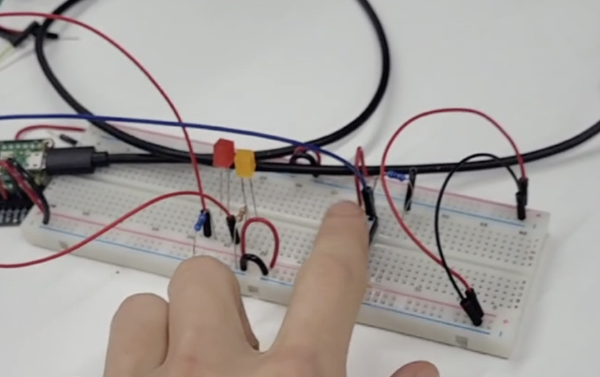
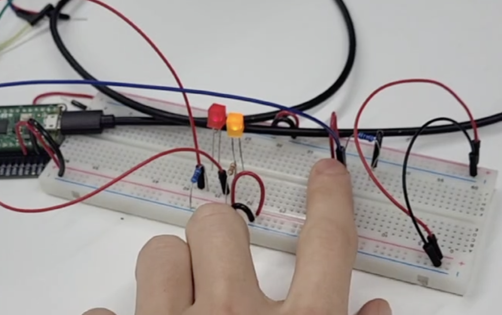
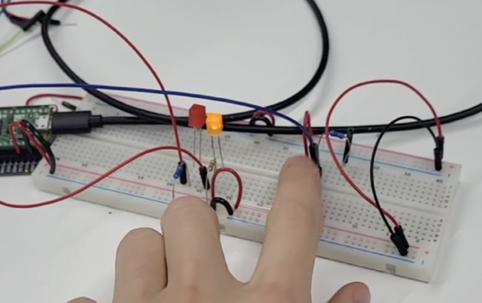

### **Exercise:**

**Circuit**[](https://learn.newmedia.dog/courses/physical-computing/assignments/week-01/#circuit)

* Connect two LEDs to your Arduino using a breadboard
* Connect one switch to your Arduino using a breadboard

**Code**[](https://learn.newmedia.dog/courses/physical-computing/assignments/week-01/#code)

1. Read a momentary switch being pressed
2. When the program starts, both LEDs are off
3. When the switch is pressed once, the first LED turns on
4. When the switch is pressed the second time, the second LED turns on (the first one should also still be on)
5. When the switch is pressed the third time, both LEDs turn off
6. Repeat this same cycle of LEDs turning on and off in sequence (off, one LED, two LEDs, off…)

### My progress:

I got to the point of turning the lights on and off, but in the wrong sequence. Going from both off, to both on, to one on and then looping again.








I had a LOT of trouble with figuring out how could I read the button press in a way that isn't constantly changing my variables.

## Fixed version:

The problem was putting the //lastState = currentState;    //currentState = button; in the if statement and having a second if statement.

### Code:

```
int button;
int lastState;
int currentState;
int count;

void setup() {
  pinMode(15, OUTPUT);  // orange LED
  pinMode(13, OUTPUT);  // red LED
  pinMode(16, INPUT);  // button
  
  digitalWrite(15, LOW);  // start with LEDs off
  digitalWrite(13, LOW);
  
  Serial.begin(9600);
  lastState = 0;
  count = 0;
  currentState = 0;
}

void loop() {
  button = digitalRead(16);
  Serial.println(button);
  
  
  currentState = button;

  if(currentState == 1 && lastState == 0){
    // button was pressed
    
    //digitalWrite(15, HIGH);
    count = count+1;
    if(count>2){
      count = 0;
    }
    
    //lastState = currentState;
    //currentState = button;
  }
  lastState = currentState;
  
  //The three different states
  if(count == 0){
    // both lights off
    digitalWrite(13, LOW);
    digitalWrite(15, LOW);
  }
  if(count == 1){
    // one light on
    digitalWrite(13, LOW);
    digitalWrite(15, HIGH);
  }
  if(count == 2){
    // both lights off
    digitalWrite(13, HIGH);
    digitalWrite(15, HIGH);
  }
  delay(120); //delay for lazily debouncing the button
}
```
