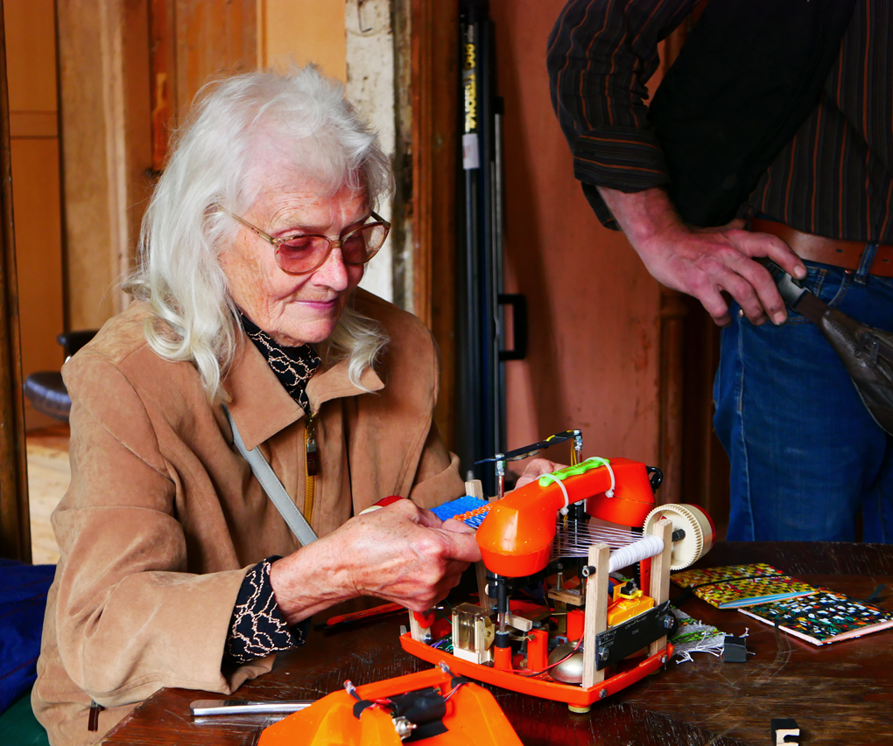

Post-apocalyptic Weaving

<https://shakethatbutton.com/post-apocalyptic-weaving/>

<https://vimeo.com/258513340?fl=pl&fe=sh>

It's an interactive weaving loom made out of waste. I like hope kinda absurd this is, from a vintage toy phone to plastic bag as a yarn and it make a toy sound. It look sophisticated yet trashy. I like it because i plan to do something similar, not the trash (but maybe?) but the weaving loom.
