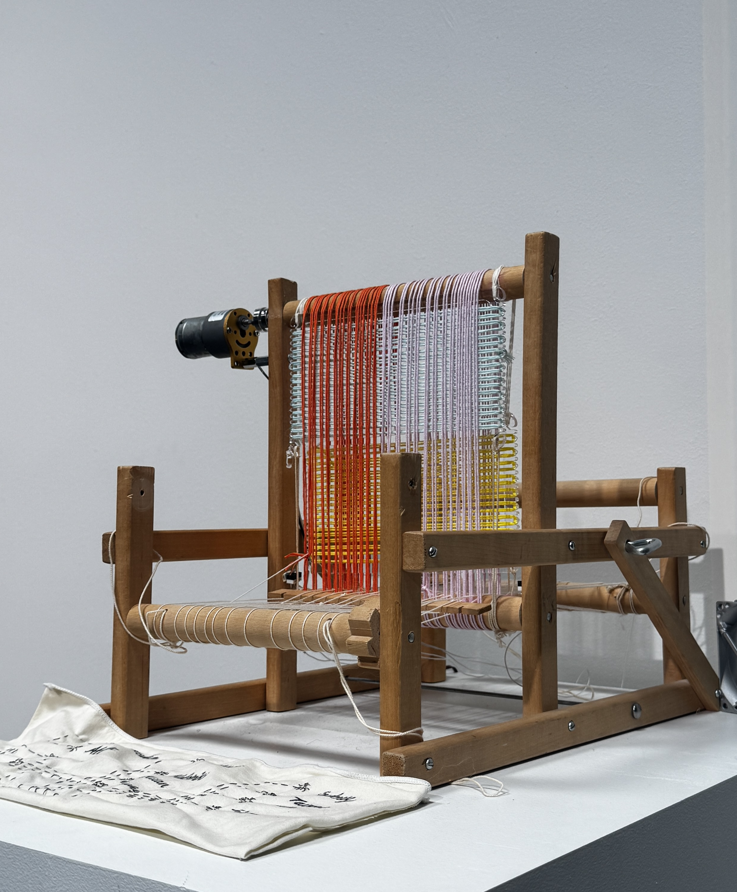
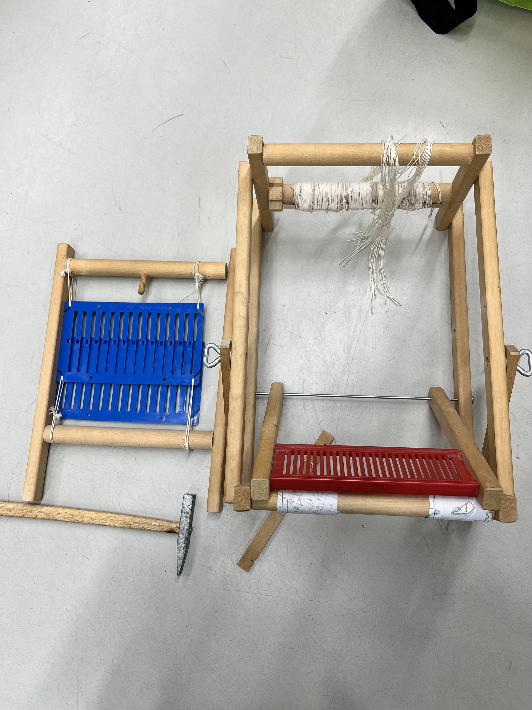
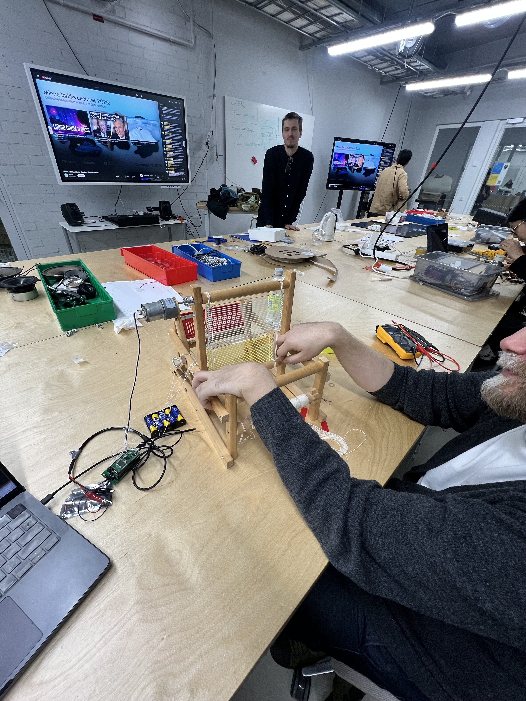
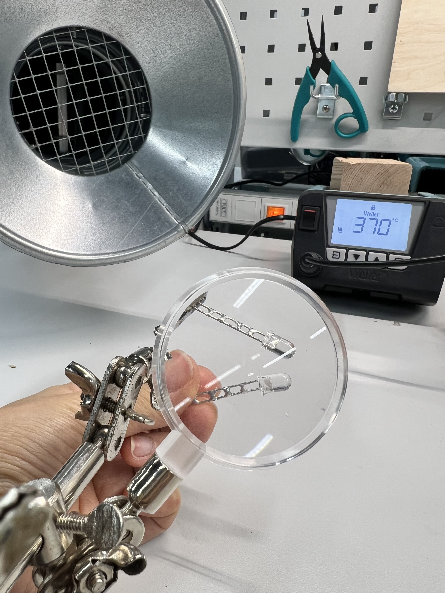
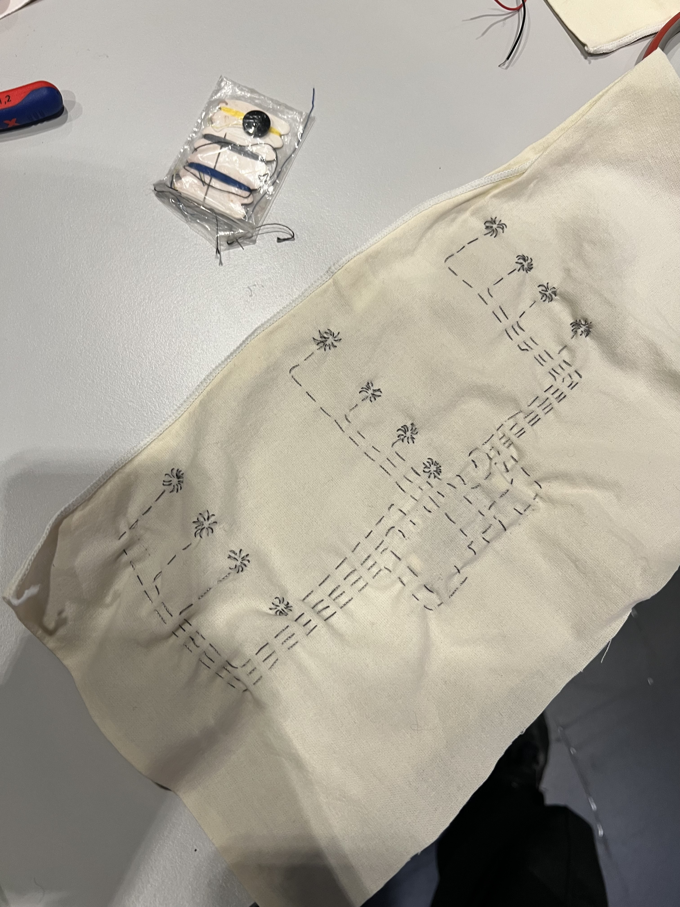
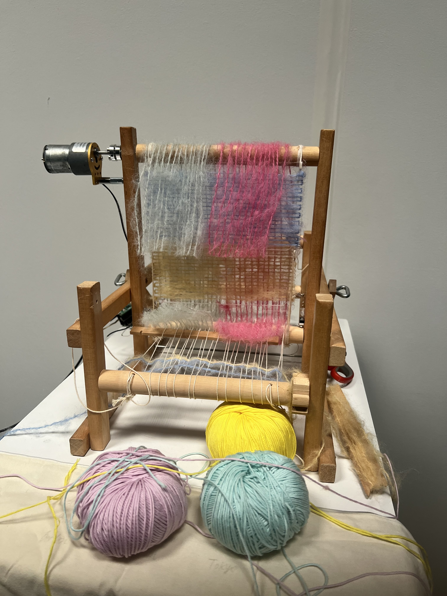
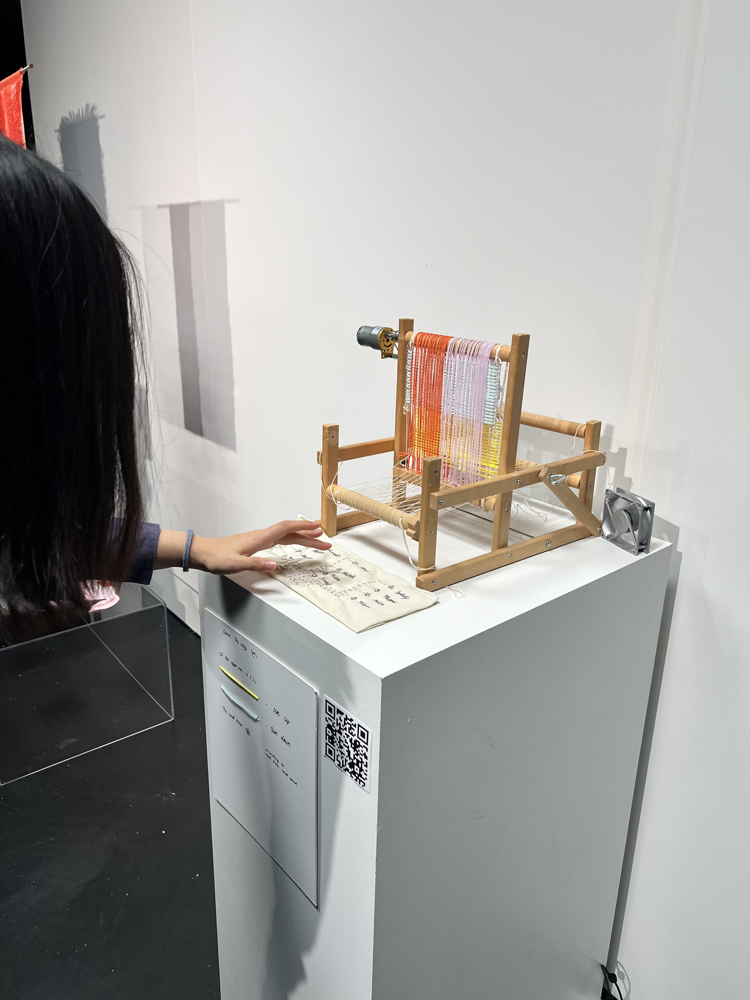

Where have we left off? Oh right, from my last episode, I couldn't decide which final project proposal should I go for. Well, In the end I just kind of merge them both in a one final project. 

Drumroll please........... incoming, "The Weather Loom"!



So I still maintain the idea of the missing of places and friends and connecting with them through weather but by a textile and craftsmanship approach.

My initial idea was to build a new mechanical tool that allow the weaving textile to move according to the weather API. The physicality of it is challenging because apparently this world have gravity, friction, force and what not, something that doesn't come naturally to me when sketching the prototype. I almost gave up but later realized that I purchase an old weaving loom from recycling center in summer and I can 'hack' it in a way that serve my purpose.




Then incoming the physical computing part. Software will betray you once in a while but Hardware will betray you every 5 minutes or so (that is probably because I just learn everything this class) so debugging sensor, port, connection, wifi, osc, etc. was a tug of war game. But I actually enjoy doing it in the end and I'm actually proud that I tried to debug and do most of the thing myself first and if it's too hard to solve then I'll blink twice for Matti to help. Here is the picture of Matti holding mini switch for me, we called this Matti's tortured machine.



The switch and what to click with and when is also a challenge. in the end i made a clicker from LED lights and soldered them together.



The next question is how would the interface be? I don't want it to be so craft-inspired looking but hey! here are the buttons, knobs, and keyboard for you to tangle with, go nut kids! I want it to be the same look and narrative. so I made a textile keyboard (?) which comprised of capacities sensor to 12 possible pins and conductive yarn that I sewed it to the fabric. Each 12 pins will connect to each 12 cities that my friends live and it will use the designated string and use it as an inquiry through API key.



And then everyone have those moment where they think they are a genius and proud of themselves for a day to only realized it was all a dream the next day. This was me when an idea of a wind come up. WIND! Imagine feeling the same wind blow as your friends might experience right now, ooh cool! let's get the fluffiest yarn ever to catch the wind from the fan, oh what a visual, Aren't I the greatest ever (blah blah blah). Then when I wrapped it all together with those fluffy yarn..........NOPE, I hated it. 



I couldn't live with this visual and it will forever kept me up at night so I changed the whole thing to cotton yarn in the last hours before exhibition. Risky move, but a mandatory one!



**In short, the workflow is as follow**

1. Choose a city (where my friends live) to see and feel the weather.{"Amsterdam", "Atlanta", "Bangkok", "Berlin", "Hanoi", "Helsinki", "Michigan", "Milan", "Sydney", "Taipei", "Tallinn", "Tokyo"};

2. The loom will rotate the pattern (yellow side up if the sun still up (day time), blue side up if the sun has set (night time))

3. the fan will blow the wind according to the real time wind speed at the moment at that specific city

4. feel as if you are with that friend in that city right now.....

**In the end, the equipment is comprised of** 

1. arduino pico 2w
2. SparkFun Qwiic OLED (did not use in the end, actually)
3. capacitive sensor
4. fan motor
5. dc motor
6. API key to openweathermap

Here is the Final Arduino code

```
// include OSC library
#include <ArduinoOSCWiFi.h>
#include <SparkFun_Qwiic_OLED.h>
#include <res/qw_fnt_8x16.h>
#include <Wire.h>
#include "Adafruit_MPR121.h"
#ifndef _BV
#define _BV(bit) (1 << (bit))
#endif


Adafruit_MPR121 cap = Adafruit_MPR121();
QwiicNarrowOLED myOLED;

uint16_t lasttouched = 0;
uint16_t currtouched = 0;
int btnState0 = 1;
int btnState1 = 1;
int speed1 = 200;
float speed2;
int sunrise = 0;
int where[] = { 0, 0, 0, 0, 0, 0, 0, 0, 0, 0, 0, 0};
int currentCity;
// String message = "Hello";

// WiFi stuff

// const char* ssid = "Sinephone";
// const char* pwd = "sine12345";

const char* ssid = "Matti";
const char* pwd = "12345678";

// for ArduinoOSC
// The IP address below is the IP of the device sending the control signal to your robot (computer, phone etc.)
const char* host = "172.20.10.11";
// port for receiving data
const int recv_port = 12345;
// port for sending
const int publish_port = 54321;

// receive variable
String location = "default";
bool day = true;
float wind ;
String dayword = "";

void setup() {
  // put your setup code here, to run once:
  Serial.begin(115200);
  pinMode(2, OUTPUT);
  pinMode(3, OUTPUT);
  pinMode(6, OUTPUT);
  pinMode(7, OUTPUT);
  pinMode(0, INPUT_PULLUP);
  pinMode(1, INPUT_PULLUP);
  analogWrite(2, 0);
  analogWrite(3, 0);
  analogWrite(6, 0);
  analogWrite(7, 0);
/*
  Wire.begin();
      if (myOLED.begin() == false)
    {
        Serial.println("Device begin failed. Freezing...");
        while (true)
            ;
    }
    Serial.println("Begin success");

  myOLED.setFont(&QW_FONT_8X16);

    while (!Serial) { // needed to keep leonardo/micro from starting too fast!
    delay(10);
  }
  */

  Serial.println("Adafruit MPR121 Capacitive Touch sensor test");
  if (!cap.begin(0x5A)) {
    Serial.println("MPR121 not found, check wiring?");
    while (1);
  }
  Serial.println("MPR121 found!");

  Serial.println("Running auto configuration.");
  cap.setAutoconfig(true);
  Serial.println("Initialization complete.");
  // WiFi ------------------>
  // WiFi stuff (no timeout setting for WiFi)
  WiFi.mode(WIFI_STA);
  // delay(2000);
  // Connect to the WiFi network
  WiFi.begin(ssid, pwd);
  
while (WiFi.status() != WL_CONNECTED) {
 Serial.print(".");
 delay(500);
}

  Serial.print("WiFi connected, IP = ");
  Serial.println(WiFi.localIP());

  OscWiFi.publish(host, publish_port, "/where", currentCity)
  ->setFrameRate(60.f);
  // subscribe to receive osc messages that control the loom
  OscWiFi.subscribe(recv_port, "/loom",
                    [](const OscMessage& m) {
                      Serial.print(m.remoteIP());
                      Serial.print(" ");
                      Serial.print(m.remotePort());
                      Serial.print(" ");
                      Serial.print(m.size());
                      Serial.print(" ");
                      Serial.print(m.address());
                      Serial.print(" ");
                      Serial.print(m.arg<String>(0));
                      Serial.println();
                      Serial.print(m.arg<bool>(1));
                      Serial.println();
                      // take the first value in the message (that should be an int).
                      location = m.arg<String>(0);
                      day = m.arg<bool>(1);
                      wind = m.arg<float>(2);
                      //false = 0, true = 1
                      if (day == 0) {
                        dayword = "false";
                      } else if (day == 1) {
                        dayword = "true";
                      }
                    });
    //myOLED.begin();

}


void loop() {
  currtouched = cap.touched();
  //Serial.println(currtouched);
  for (uint8_t i=0; i<12; i++) {
    // it if *is* touched and *wasnt* touched before, alert!
    if ((currtouched & _BV(i)) && !(lasttouched & _BV(i)) ) {
      Serial.print(i); Serial.println(" touched");
      where[i] = 1;
    }
    // if it *was* touched and now *isnt*, alert!
    if (!(currtouched & _BV(i)) && (lasttouched & _BV(i)) ) {
      Serial.print(i); Serial.println(" released");
      where[i] = 0;
    }
  }
  for (int i=0; i<12; i++){
    if(where[i] == 1){
      currentCity = i;
      break;
    }
  }
  lasttouched = currtouched;
  
  OscWiFi.update();
  btnState0 = digitalRead(0);
  btnState1 = digitalRead(1);
  speed2 = (wind * 100);

  // Serial.print("Button state: ");
  // Serial.println(btnState2);
  /*
  Serial.print("\n City: ");
  Serial.print(location);
  Serial.print("\n day: ");
  Serial.print(dayword);

  //Serial.print(btnState0);
  //Serial.print(btnState1);
  Serial.print("\n wind: ");
  Serial.print(wind);
  Serial.print("\n speed2: ");
  Serial.print(speed2);
  */

  if (day == false) {
    if(btnState0 == 0){
      analogWrite(2, 0);
      analogWrite(3, 0);
    }else if (btnState0 == 1){
      analogWrite(2, speed1);
      analogWrite(3, 0);
    }
  } else if (day == true) {
    if(btnState1 == 0){
      analogWrite(2, 0);
      analogWrite(3, 0);
    }else if (btnState1 == 1){
      analogWrite(2, 0);
      analogWrite(3, speed1);
    }

    analogWrite(6, 0);
    analogWrite(7, speed2);
  }
  // 1 is off 0 is on
  delay(100);
  /*
      // starting x position - screen width minus string width  / 2
  int x0 = (myOLED.getWidth() - myOLED.getStringWidth(location)) / 2;
    // starting y position - screen height minus string height / 2 
  int y0 = (myOLED.getHeight() - myOLED.getStringHeight(location)) / 2;
      // Draw the text - color of black (0)
  myOLED.text(x0, y0, location);

    // There's nothing on the screen yet - Now send the graphics to the device
  myOLED.display();
   */
  
}
```

Here is the Final Processing code

```
import oscP5.*;
import netP5.*;

OscP5 oscP5;
NetAddress myRemoteLocation;
String city = "";
String prevcity = "";
JSONObject weather;
boolean day;
String Chihiro = "Tokyo";
String Kat = "Tallinn";
String MyGang = "Bangkok";
String Family = "Paris";
String Hana = "Durham";
String Lola = "Atlanta";
String Kelly = "Boston";
String Matti = "Helsinki";
String Sine = "Kyoto";
String Sini = "Kyoto";
String Soili = "Kyoto";
String Susie = "Kyoto";

//String [] citysine_friend = {Chihiro, MyGang, Family, Kat, Hana, Lola, Matti, Kelly};
String [] cities = {"Amsterdam", "Atlanta", "Bangkok", "Berlin", "Hanoi", "Helsinki", "Michigan", "Milan", "Sydney", "Taipei", "Tallinn", "Tokyo"};
//HashMap<String, String> friendCity = new HashMap<String, String>();
//HashMap<int, String> currentCity = new HashMap<String, String>();
int currentCity = 0;
String apiKey = "6482705bbb79dfa693df68fd55f58949";
String url = "https://api.openweathermap.org/data/2.5/weather?q=" 
                + cities[currentCity] + "&appid=" + apiKey + "&units=metric";

void setup() {
   size(600, 400);
/*
  friendCity.put("Chihiro", "Tokyo");
  friendCity.put("Kat", "Tallinn");
  friendCity.put("MyGang", "Bangkok");
  friendCity.put("Family", "Paris");
  friendCity.put("Hana", "Durham");
  friendCity.put("Lola", "Atlanta");
  friendCity.put("Kelly", "Boston");
  friendCity.put("Matti", "Helsinki");
  */
  /* start oscP5, listening for incoming messages at port 55556 */
  oscP5 = new OscP5(this, 54321);
  //String city = friendCity.get("Lola");

  weather = loadJSONObject(url);   // Loads JSON from the URL
  

  /* myRemoteLocation is a NetAddress. a NetAddress takes 2 parameters,
   * an ip address and a port number. myRemoteLocation is used as parameter in
   * oscP5.send() when sending osc packets to another computer, device,
   * application.
   */
  myRemoteLocation = new NetAddress("172.20.10.12", 12345);
}


void draw() {
  background(0);

  if (weather != null) {

    float temp = weather.getJSONObject("main").getFloat("temp");
    int sunrise = weather.getJSONObject("sys").getInt("sunrise");
    int sunset = weather.getJSONObject("sys").getInt("sunset");
    String location = weather.getString("name");
    int timestamp = weather.getInt("dt");
    float wind = weather.getJSONObject("wind").getFloat("speed");
    
    if (timestamp > sunset){
      day = false;
    }else if (timestamp < sunset){
      day = true;
    }
    
    textSize(24);
    fill(255);
    
    text("City: " + location, 20, 100);
    text("Temperature: " + temp + " °C", 20, 60);
    text("Sunrise: " + sunrise, 20, 140);
    text("Sunset: " + sunset, 20, 180);
    text("Day: " + day, 20, 220);
    text("Wind: " + wind, 20, 260);
    
    //if(city!=prevcity){
    OscMessage myMessage;
    myMessage = new OscMessage("/loom");
    myMessage.add(location);
    myMessage.add(day);
    myMessage.add(wind);
    oscP5.send(myMessage, myRemoteLocation);
    //}
  }
  prevcity=city;
}

/* incoming osc message are forwarded to the oscEvent method. */
void oscEvent(OscMessage theOscMessage) {

  //print("### received an osc message.");
  //print(" addrpattern: "+theOscMessage.addrPattern());
  //println(" typetag: "+theOscMessage.typetag());
  if(theOscMessage.checkAddrPattern("/where")){
    //println("got distance");
    currentCity = theOscMessage.get(0).intValue();
    println("city: " + currentCity);
    url = "https://api.openweathermap.org/data/2.5/weather?q=" 
                + cities[currentCity] + "&appid=" + apiKey + "&units=metric";
    weather = loadJSONObject(url);
  }
}
```

Then these will come later as well, stay tuned

\- A short description of my project and reflection on the things I learned.

\- A guide/tutorial on how to build your project from the technical side.
