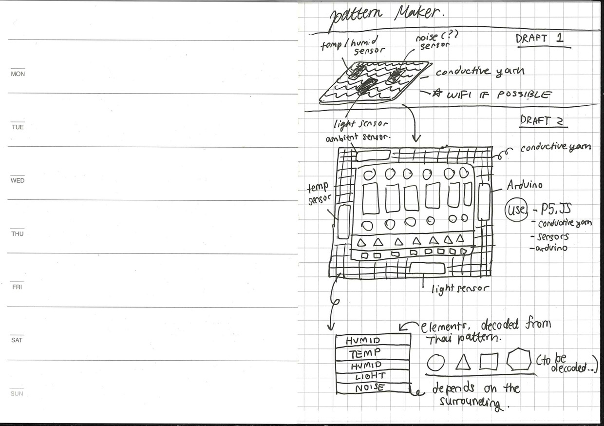
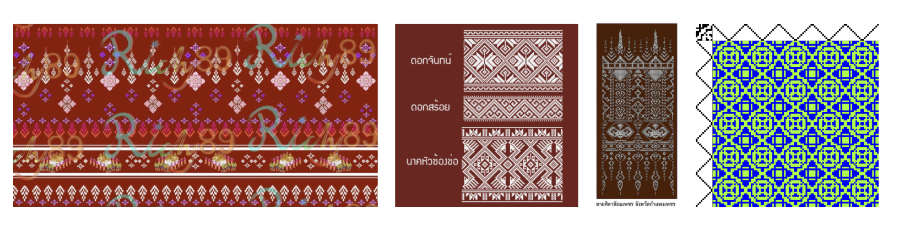
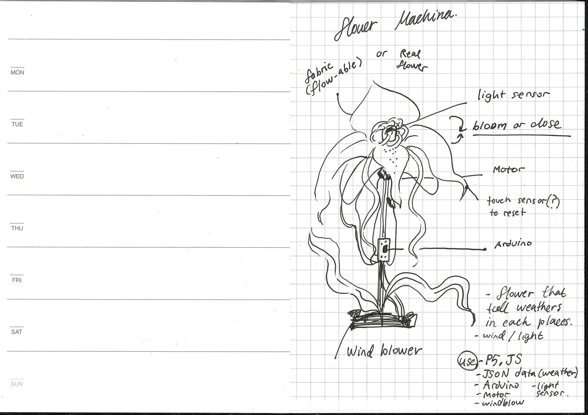
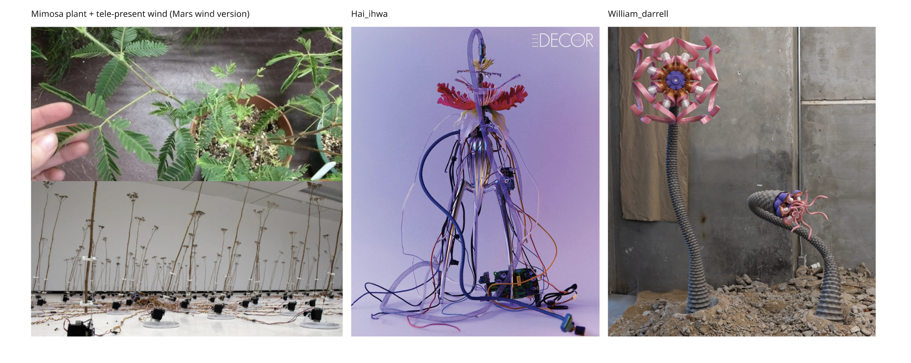

I of course will have many ideas floating around.

My shortlisted candidates

1. Pattern maker (fabric / screen / p5.js / light, temp, humid, sound sensor)
2. Flower Machina (fabric / touchdesigner or p5.js / weather API, compass?, wind blower, motors, touch sensor)

Ref: 

")
