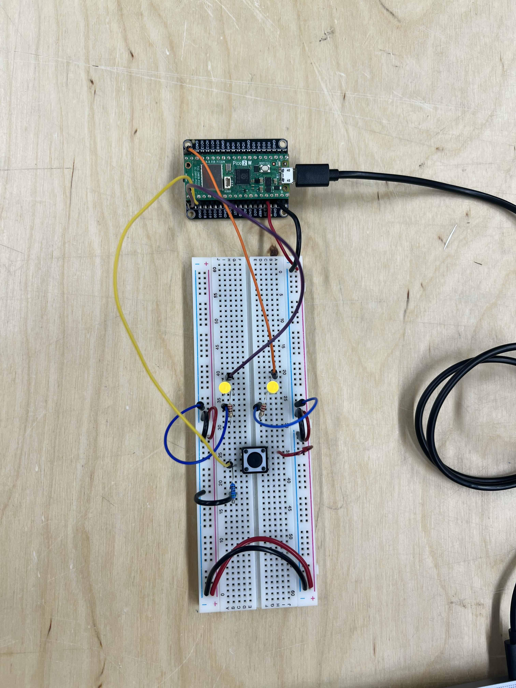
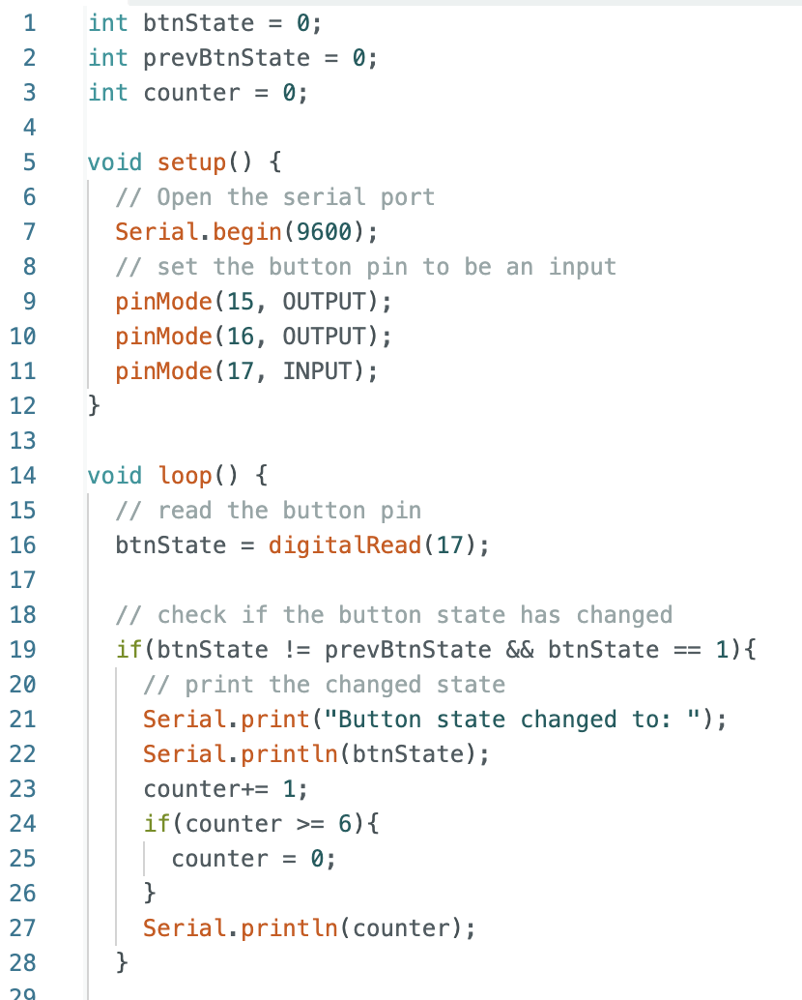
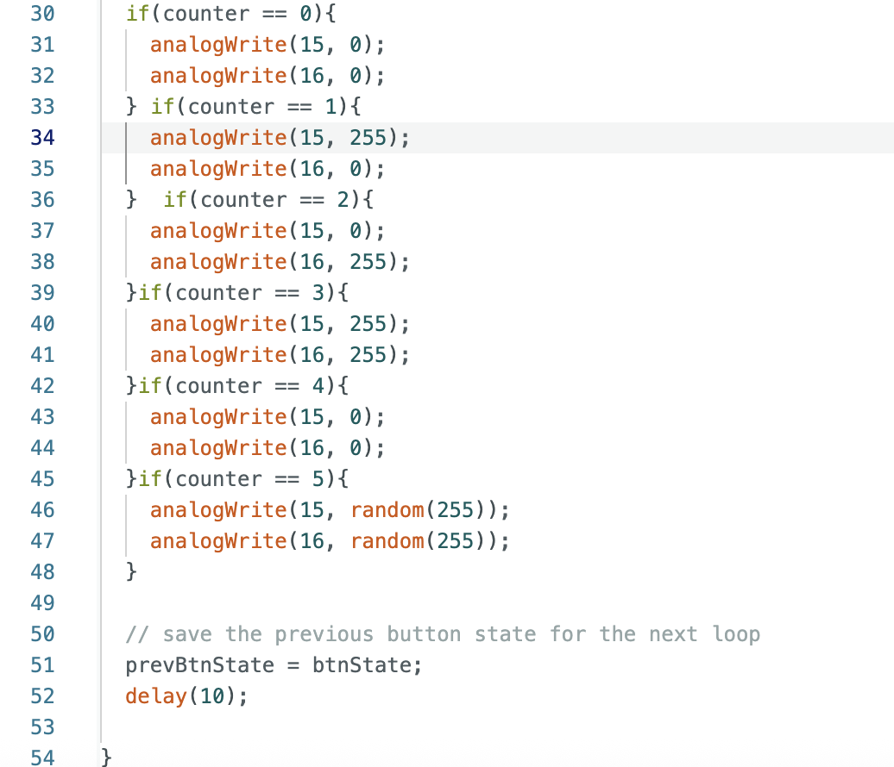

**MY CODE:**

int btnState = 0;
int prevBtnState = 0;
int counter = 0;

**REFLECTION ON MY PROCESS:**

**Hardware part:**

The button didn't work properly at first because i did not understand i have to wire 3.3 volt from the side of the breadboard to the button too (I thought the pin connected from pico to read input would also provide electricity, but nope, rookie mistake!)

**Coding part**

It sounds easier than done. I tried many way of storing the action of button being pressed into a variable and either + or - 1 in each step or then I tried the modulus way (%) but somehow get lost in my thought again and did not arrive to the destination via that route. All of those routes (and many more) can take me there but the final version is the one I can wrap my mind around. It compares if the button state is the same or different than the previous one, if yes, it will add 1 to the counter variable. Then the options of lights (left, right, both, none, blink) depended on how many counters are there already. When it exceed 6, then  it return to 0 and reset the stage.
