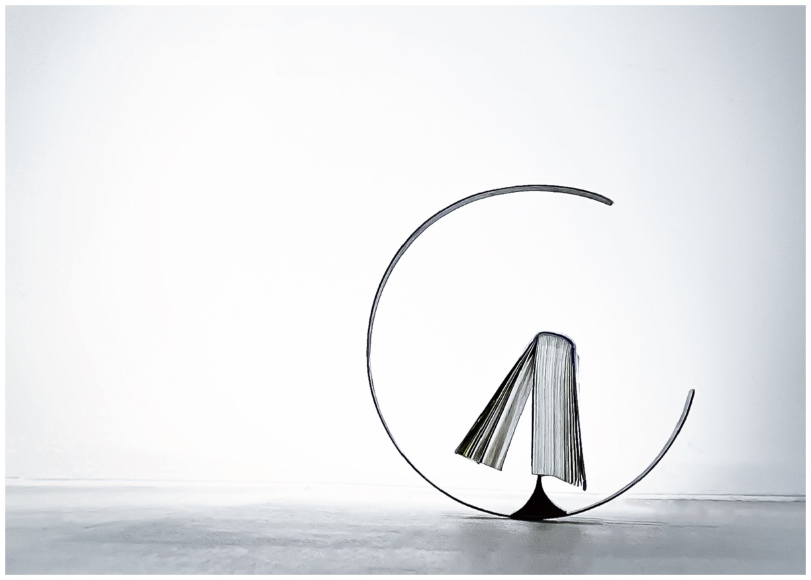

Independent production

Duration: Apr 11, 2022 – May 27, 2022

\
**The ebb and flow of life through the ratio of reading**

mici : cace is a product designed to hold books that are in the middle of being read.  

The term "micicace" derives from the Japanese word for "wax and wane."  

By covering the part of the book that has been read with a bookmark-like mechanism, the arc rolls and stabilizes in balance. As the book is read, the weight ratio of the left and right pages changes, and the stability shifts daily, bringing a sense of transition to life, much like the phases of the moon.

Material: Steel  \
Size: W300mm×D32mm×H255mm, W380mm×D36mm×H320mm
