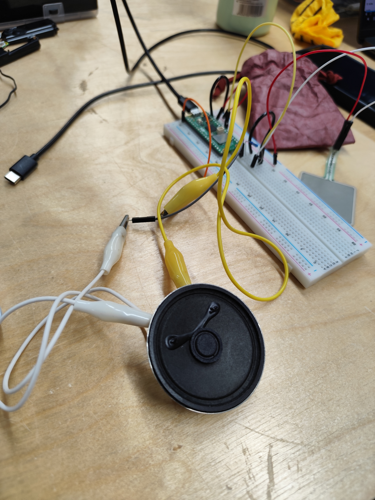
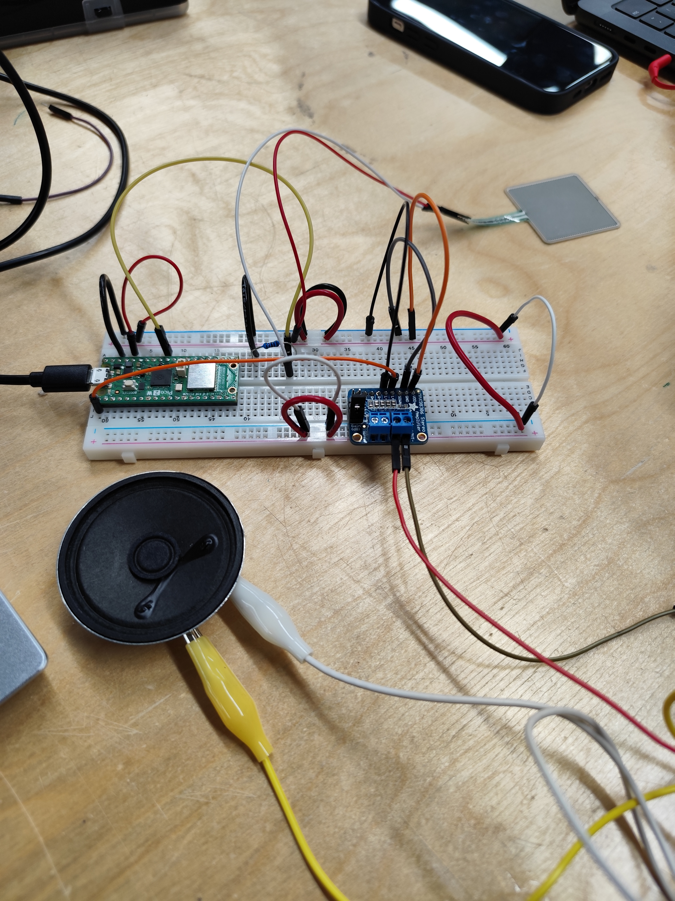
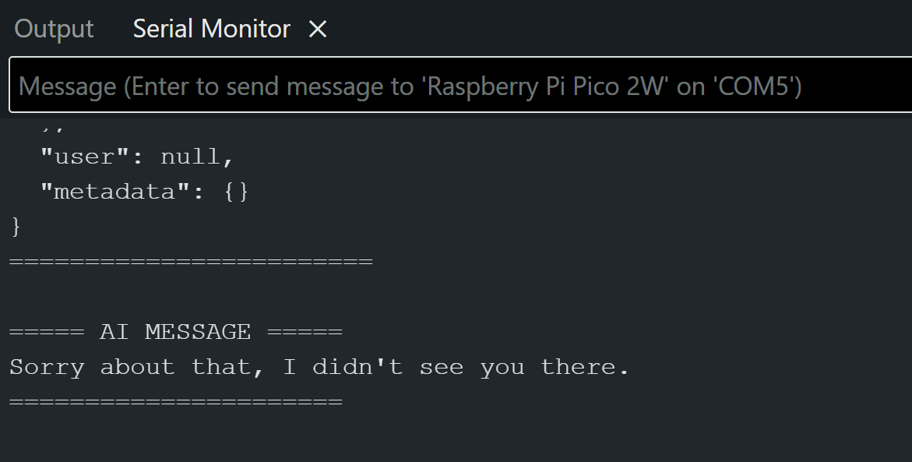
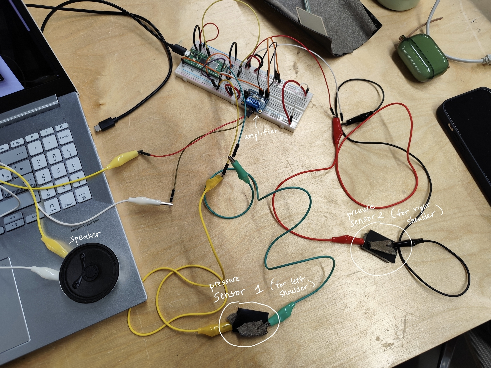
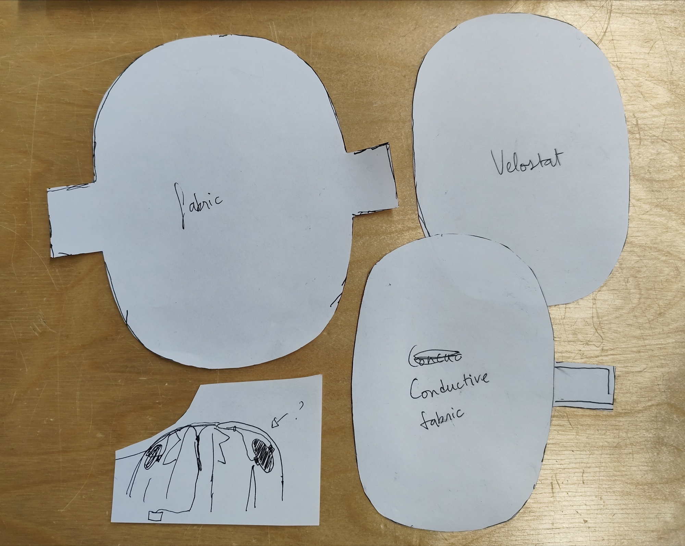
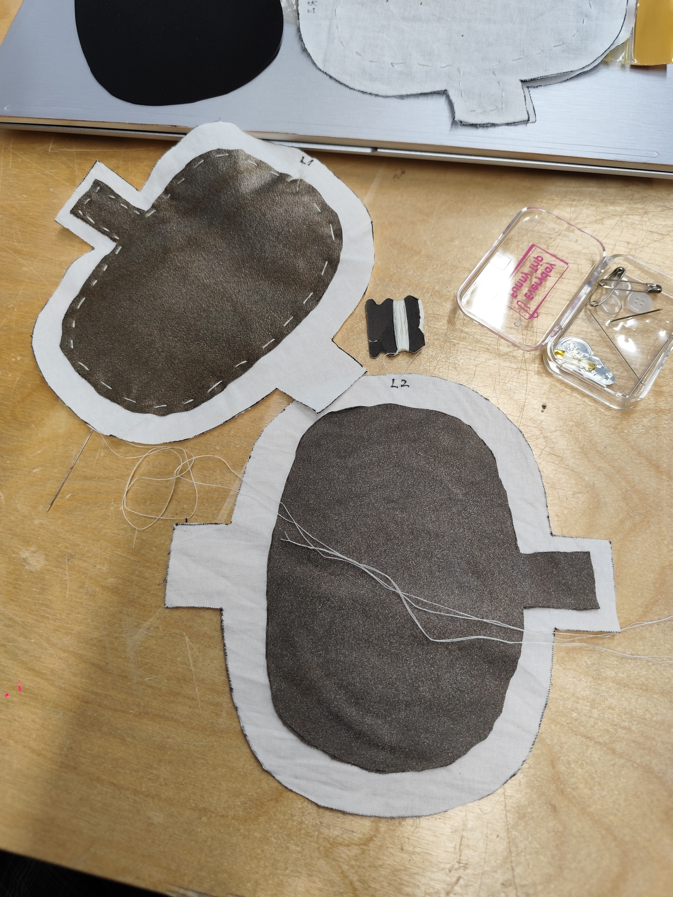
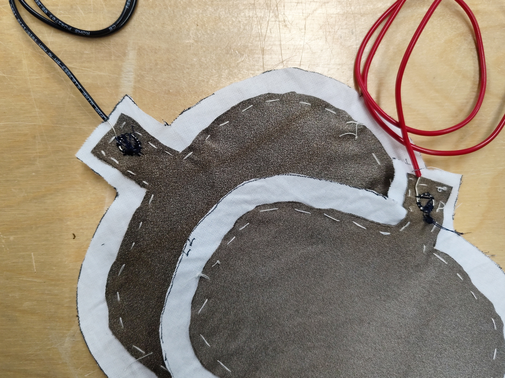
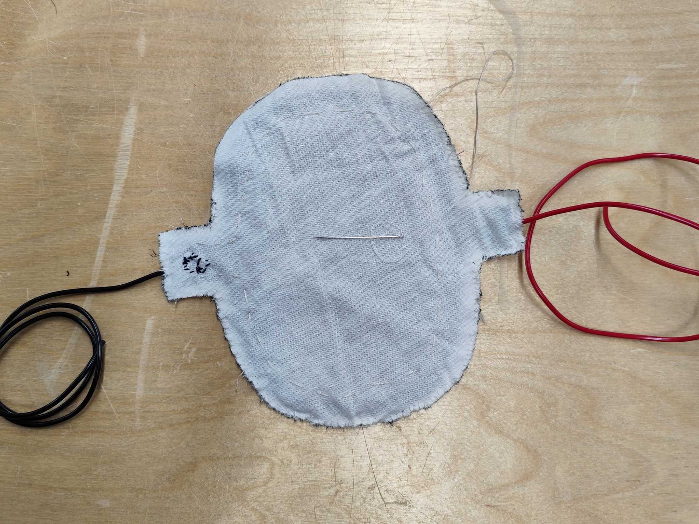
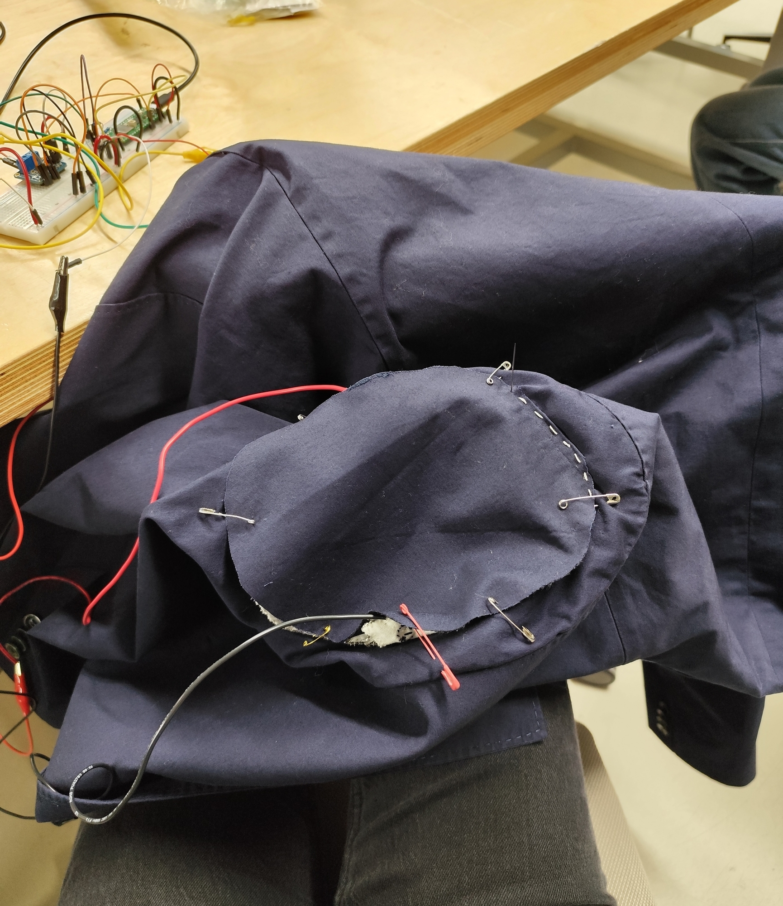
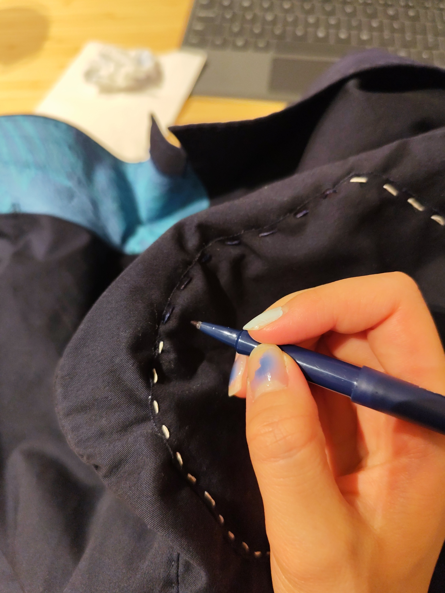

# Final Project Ideas

## 1. Scentient Machine

#### Concept

Scentient Machine is a device that “reads the atmosphere” of a room. It interprets the invisible atmosphere of a space as emotional data.

Using MEMS gas sensors, the system reads the chemical composition of air, including human breath, perfume, humidity, and CO₂ levels, and translates these into emotional states.

ex) When the air feels heavy and warm, it displays: “The air smells tense.”

→ Tuto: [Building an Electronic Nose with MEMS Gas Detection Sensor](https://www.hackster.io/DFRobotOfficial/building-an-electronic-nose-with-mems-gas-detection-sensor-de5269) 

[](https://www.hackster.io/DFRobotOfficial/building-an-electronic-nose-with-mems-gas-detection-sensor-de5269)[](https://www.hackster.io/DFRobotOfficial/building-an-electronic-nose-with-mems-gas-detection-sensor-de5269)

#### Emotion Labels and Training Conditions Examples


→ Edge Impulse model for smell/'feeling of the air'

#### Installation Design

Like the interface of an air purifier or weather application. 

Digital display showing live emotional status (ex. Tense – 82% Confidence)


References

[Adnose, *Adnan Aga*](https://adnanaga.com/Adnose) - predict the smell of any object using AI


[Smeller 2.0, *Wolfgang Georgsdorf -*](https://smeller.net/about/) deliver complex sequences of smells played in place of music notes. 
→ Maybe I can treats scent as a medium and transforms invisible chemical data into a performative art piece


## **2. Apology Jacket**

#### Inspiration

I’m interested in the kind of simple and humorous interactive works that Matti showed us, which echo the spirit of Chindogu, a playful useless invention inventions born from everyday inconveniences.



#### Concept

This project originates from an experience that everyone has: in crowded places, I often bump into people’s shoulders but can’t possibly apologize to everyone.

*Apology Jacket* is a wearable device, embedded in the shoulder of a jacket, that automatically apologizes whenever it detects physical contact. 
→ using AI TTS ?

The project explores the automation of social etiquette and the absurd extension of AI assistance into even the smallest human gestures of politeness. We become more and more reliant on machines and AI, and now even to apologize. *Apology Jacket* exaggerates this dependency by outsourcing an intimate human behavior to an AI that reacts faster and more obediently than we ever could. The result is both comical and unsettling: an endlessly polite jacket, apologizing to the world.

#### How it works

When the wearer bumps into someone, the embedded sensor detects the collision’s intensity. According to the force, the AI system generates and plays an apology with different tone and repetition. From a calm “Sorry” to an anxious stream of “I’m so sorry! Sorry! Sorry!”.


<hr>

\*After reviewing and organizing my ideas, I find the use of an electric nose interesting, but I’m not very satisfied with the concept itself. So for now, I’m considering either simply running the **electric nose experiment** or moving forward with the **Apology Jacket.***

<hr>

# Apology Jacket Working Progress

I decided to choose Apology Jacket because I’m more confident in it (and it received more reactions from my classmates).

**Sensors**

* velostat
* conductive fabric
* small audio player
* amplifier
* pico 2W
* jacket


## STEP 1 — Collision Detection

First Test with Pressure Sensor and Pico 2W

* Light collision = 400–700
* Strong collision = 800–1000

```cpp
int pressureValue;
int thresholdValue = 600;
int thresholdValue2 = 900;

bool hasApologized = false;

void setup() {
  Serial.begin(9600);
}

void loop() {

  // Read pressure sensor (FSR or force sensor)
  pressureValue = analogRead(26);    

  // Collision detected 
  if (pressureValue > thresholdValue) {

    if (!hasApologized) { // only say sorry once per bump

      if (pressureValue < thresholdValue2) {
        Serial.println("Sorry");
      } 
      else if (pressureValue >= thresholdValue2) {
        Serial.println("SORRY SORRY!");
      }

      hasApologized = true;  // prevent repeating
    }
  }

  // RESET when pressure goes back to normal 
  else {
    hasApologized = false;
  }

  // Print readings
  // Serial.print("Pressure: ");
  // Serial.println(pressureValue);

  delay(10);
}
```


## STEP 2 — Add Audio (AI text-to-speech)

* Connecting to a speaker



* Add [Max98306 Stereo Amplifier](https://cdn-learn.adafruit.com/downloads/pdf/stereo-3-7w-class-d-audio-amplifier.pdf) (fix the low-volume problem)



**Add audio**

* Install BackgroundAudio Library 

<https://www.arduinolibraries.info/libraries/background-audio> <https://github.com/earlephilhower/BackgroundAudio> 

* WebradioMP3PlusWebUI example model → plays an MP3 web radio using HTTPS connectivity. Includes a serial and HTTP WebServer interface to allow the user to change URLs, volumes, and see the ICY metadata.

**Text-to-Speech**

* Used **SerialSpeak** example model which uses speech API to talk when I type to Serial Monitor. 

  → I changed to speak words that are inside the code and combined with the pressure sensors.

```cpp
// SerialSpeak - Earle F. Philhower, III <earlephilhower@yahoo.com>
// Released to the public domain January 2025

// Reads from the serial port and plays what's typed over the output
// asynchronously.  Can queue up work while still speaking.
// Demonstrates dictionary and voice usage

#include <BackgroundAudioSpeech.h>

// Choose the voice you want
#include <libespeak-ng/voice/en_029.h>
#include <libespeak-ng/voice/en_gb_scotland.h>
#include <libespeak-ng/voice/en_gb_x_gbclan.h>
#include <libespeak-ng/voice/en_gb_x_gbcwmd.h>
#include <libespeak-ng/voice/en_gb_x_rp.h>
#include <libespeak-ng/voice/en.h>
#include <libespeak-ng/voice/en_shaw.h>
#include <libespeak-ng/voice/en_us.h>
#include <libespeak-ng/voice/en_us_nyc.h>
BackgroundAudioVoice v[] = {
  voice_en_029, // 0
  voice_en_gb_scotland, //1
  voice_en_gb_x_gbclan, //2
  voice_en_gb_x_gbcwmd, //3
  voice_en, //4
  voice_en_shaw, //5
  voice_en_us, //6
  voice_en_us_nyc //7
};

#include <PWMAudio.h>
PWMAudio audio(0);
BackgroundAudioSpeech BMP(audio);

int pressureValue;
int thresholdValue = 600;
int thresholdValue2 = 900;

bool hasApologized = false;

void setup() {
  Serial.begin(115200);

  // We need to set up a voice before any output
  BMP.setVoice(v[4]);
  BMP.begin();

  delay(10);

  BMP.speak("Hello. I am your Apology Jacket.");
  delay(2000);
}

void loop() {
   // Read pressure sensor (FSR or force sensor)
  pressureValue = analogRead(26);    

  // Collision detected 
  if (pressureValue > thresholdValue) {

    if (!hasApologized) { // only say sorry once per bump

      if (pressureValue < thresholdValue2) {
        BMP.speak("Sorry");
      } 
      else if (pressureValue >= thresholdValue2) {
        BMP.speak("Sorry Sorry Sorry");
      }

      hasApologized = true;  // prevent repeating
    }
  }

  // RESET when pressure goes back to normal 
  else {
    hasApologized = false;
  }

  // Print readings
  // Serial.print("Pressure: ");
  // Serial.println(pressureValue);

  delay(10);
}
```

## STEP 3 — AI Apology Generation

* Run ChatGPT with openai API

<https://www.hackster.io/Shilleh/how-to-set-up-chatgpt-on-a-raspberry-pi-pico-w-5977bf> 

<https://www.youtube.com/watch?v=EAwh4ul-K0g>   

```
#include <WiFi.h>
#include <WiFiClientSecure.h>

const char* ssid = "aalto open";
const char* password = "";

const char* apiKey = "my keycode";

// New 2025 API endpoint
const char* host = "api.openai.com";
const int httpsPort = 443;

// Secure client
WiFiClientSecure client;

void setup() {
  Serial.begin(115200);
  delay(1000);

  Serial.println("Connecting to WiFi...");
  WiFi.begin(ssid);

  while (WiFi.status() != WL_CONNECTED) {
    delay(500);
    Serial.print(".");
  }

  Serial.println("\nConnected!");

  // Required for SSL
  client.setInsecure();

  sendPrompt("Give one short, apology sentence to someone who bumped into your shoulder. No introduction, no explanation, no quotes. Output only the sentence.");
}

void loop() {
  // Nothing
}

void sendPrompt(String prompt) {
  Serial.println("\nConnecting to OpenAI...");

  if (!client.connect(host, httpsPort)) {
    Serial.println("Connection failed!");
    return;
  }

  Serial.println("Connected to OpenAI!");

  // JSON for new "responses" endpoint
  String requestBody = "{";
  requestBody += "\"model\": \"gpt-4.1-mini\",";
  requestBody += "\"input\": \"" + prompt + "\"";
  requestBody += "}";

  // Construct HTTP request
  String request = String("POST /v1/responses HTTP/1.1\r\n") + "Host: api.openai.com\r\n" + "Content-Type: application/json\r\n" + "Authorization: Bearer " + String(apiKey) + "\r\n" + "Content-Length: " + requestBody.length() + "\r\n\r\n" + requestBody;

  client.print(request);

  Serial.println("Request sent. Waiting for response...\n");

  String response = "";

  // Wait for the full response
  unsigned long timeout = millis();
  while (millis() - timeout < 5000) {  // wait up to 5 seconds
    while (client.available()) {
      char c = client.read();
      response += c;
      timeout = millis();  // extend timeout while data is still coming
    }
  }

  // Print the whole response for debugging
  Serial.println("===== RAW RESPONSE =====");
  Serial.println(response);
  Serial.println("========================");

  // Extract "text": "...."
  int pos = response.indexOf("\"text\":");
  if (pos != -1) {
    int start = response.indexOf("\"", pos + 7) + 1;
    int end = response.indexOf("\"", start);

    if (start > 0 && end > start) {
      String text = response.substring(start, end);

      Serial.println("\n===== AI MESSAGE =====");
      Serial.println(text);
      Serial.println("======================\n");
    } else {
      Serial.println("ERROR: Could not extract text.");
    }
  } else {
    Serial.println("ERROR: No 'text' field found.");
  }
}
```



Prompt: *Give one short, apology sentence to someone who bumped into your shoulder. No introduction, no explanation, no quotes. Output only the sentence.*

**Problem:** It takes 6 secs to run. (too long)

**Solution:** During this 6 sec → "I’m calculating blablabla"

* Combined the AI generating text code and speaking pressure sensor code
* Add one more sensor for left and right shoulder

```cpp
#include <WiFi.h>
#include <WiFiClientSecure.h>

// -----------Wifi setup
const char* ssid = "aalto open";
const char* password = "";

const char* apiKey = "my keycode";

// New 2025 API endpoint
const char* host = "api.openai.com";
const int httpsPort = 443;

// Secure client
WiFiClientSecure client;

// -----------Speech setup
#include <BackgroundAudioSpeech.h>

// Choose the voice you want
#include <libespeak-ng/voice/en_029.h>
#include <libespeak-ng/voice/en_gb_scotland.h>
#include <libespeak-ng/voice/en_gb_x_gbclan.h>
#include <libespeak-ng/voice/en_gb_x_gbcwmd.h>
#include <libespeak-ng/voice/en_gb_x_rp.h>
#include <libespeak-ng/voice/en.h>
#include <libespeak-ng/voice/en_shaw.h>
#include <libespeak-ng/voice/en_us.h>
#include <libespeak-ng/voice/en_us_nyc.h>
BackgroundAudioVoice v[] = {
  voice_en_029,          // 0
  voice_en_gb_scotland,  //1
  voice_en_gb_x_gbclan,  //2
  voice_en_gb_x_gbcwmd,  //3
  voice_en,              //4
  voice_en_shaw,         //5
  voice_en_us,           //6
  voice_en_us_nyc        //7
};

#include <PWMAudio.h>
PWMAudio audio(0);  // PWM on GP0 --> amplifier imput
BackgroundAudioSpeech BMP(audio);

// ---------Pressure sensor
int pressureValueLeft;   // For the left shoulder
int pressureValueRight;  // For the right shoulder

int threshold1 = 600;
int threshold2 = 900;

// bool hasApologized = false;

bool apologizedLeft = false;
bool apologizedRight = false;


void setup() {
  Serial.begin(115200);
  delay(1000);

  Serial.println("Connecting to WiFi...");
  WiFi.begin(ssid);

  while (WiFi.status() != WL_CONNECTED) {
    delay(500);
    Serial.print(".");
  }

  Serial.println("\nConnected!");

  // We need to set up a voice before any output
  BMP.setVoice(v[4]);
  BMP.begin();
  delay(10);

  BMP.speak("Hello. I am your Apology Jacket.");
  delay(1000);

  // Required for SSL
  client.setInsecure();
}

void loop() {
  // Read pressure sensor (FSR or force sensor)
  //pressureValue = analogRead(26);
  pressureValueLeft = analogRead(26);
  pressureValueRight = analogRead(27);


  // Collision detected
  // left shoulder
  if (pressureValueLeft > threshold1) {
    if (!apologizedLeft) {
      if (pressureValueLeft < threshold2) {
        sendPrompt("Give one short apology sentence for a light shoulder bump. No introduction, no explanation, no quotes. Output only the sentence.");
      } else {
        sendPrompt("Give a stronger apology sentence to someone who bumped into your shoulder very hard. No introduction, no explanation, no quotes. Output only the sentence.");
      }
      apologizedLeft = true;
    }
    // RESET when pressure goes back to normal
  } else {
    apologizedLeft = false;
  }

  // right shoulder
  if (pressureValueRight > threshold1) {
    if (!apologizedRight) {
      if (pressureValueRight < threshold2) {
        sendPrompt("Give one short apology sentence for a light shoulder bump. No introduction, no explanation, no quotes. Output only the sentence.");
      } else {
        sendPrompt("Give a stronger apology sentence to someone who bumped into your shoulder very hard. No introduction, no explanation, no quotes. Output only the sentence.");
      }
      apologizedRight = true;
    }
    // RESET when pressure goes back to normal
  } else {
    apologizedRight = false;
  }

  // Print readings
  // Serial.print("Pressure: ");
  // Serial.println(pressureValue);

  delay(10);
}

void sendPrompt(String prompt) {
  Serial.println("\nConnecting to OpenAI...");

  if (!client.connect(host, httpsPort)) {
    Serial.println("Connection failed!");
    return;
  }

  Serial.println("Connected to OpenAI!");

  // JSON for new "responses" endpoint
  String requestBody = "{";
  requestBody += "\"model\": \"gpt-4.1-mini\",";
  requestBody += "\"input\": \"" + prompt + "\"";
  requestBody += "}";

  // Construct HTTP request
  String request = String("POST /v1/responses HTTP/1.1\r\n") + "Host: api.openai.com\r\n" + "Content-Type: application/json\r\n" + "Authorization: Bearer " + String(apiKey) + "\r\n" + "Content-Length: " + requestBody.length() + "\r\n\r\n" + requestBody;

  client.print(request);

  Serial.println("Request sent. Waiting for response...\n");

  String response = "";

  // Speak thinking message
  BMP.speak("One moment please, I’m thinking about the best way to apologize properly.");

  // Wait for the full response
  unsigned long timeout = millis();
  while (millis() - timeout < 3000) {  // wait up to 3 seconds
    while (client.available()) {
      char c = client.read();
      response += c;
      timeout = millis();  // extend timeout while data is still coming
    }
  }

  // Print the whole response for debugging
  Serial.println("===== RAW RESPONSE =====");
  Serial.println(response);
  Serial.println("========================");

  // Extract "text": "...."
  int pos = response.indexOf("\"text\":");
  if (pos != -1) {
    int start = response.indexOf("\"", pos + 7) + 1;
    int end = response.indexOf("\"", start);

    if (start > 0 && end > start) {
      String text = response.substring(start, end);

      Serial.println("\n===== AI MESSAGE =====");
      Serial.println(text);
      Serial.println("======================\n");

      // Speak the result
      while (!BMP.done()) {
        delay(10);
      }
      //BMP.speak(text);
      BMP.speak(cleanUnicode(text));
      return;

    } else {
      Serial.println("ERROR: Could not extract text.");
    }
  } else {
    Serial.println("ERROR: No 'text' field found.");
  }
}

// Convert Unicode escapes into normal ASCII before speaking
String cleanUnicode(String s) {
  s.replace("\\u2019", "'");    // apostrophe
  s.replace("\\u2018", "'");    // left quote
  s.replace("\\u201C", "\"");   // left double quote
  s.replace("\\u201D", "\"");   // right double quote
  s.replace("\\u2026", "...");  // ellipsis
  s.replace("\\u2014", "-");    // em dash

  // Remove any unknown \uXXXX patterns
  int index;
  while ((index = s.indexOf("\\u")) != -1) {
    s.remove(index, 6);  // remove \uXXXX (6 chars)
  }

  return s;
}
```

[](https://www.hackster.io/giung-kim/how-to-use-openai-api-with-wizfi360-evb-pico-in-arduino-d10d5d)

## STEP 4 —  Making Conductive Fabric Pressure Sensor

Tuto <https://www.instructables.com/Flexible-Fabric-Pressure-Sensor/> 

* velostat
* conductive fabric
* fabric

Testing:



Making my own pressure sensor:









**Problem:** Detect collision even if I move my arm

**Solution:** Detect the difference between current and previous readings, not just the raw value. (sudden fast increase in pressure):

```
int lastPressureValue = 0;

int thresholdValue = 800; 
int thresholdValue2 = 900;     // base threshold
int spikeThreshold = 100;      // how fast the value rises

bool hasApologized = false;

void setup() {
  Serial.begin(9600);
}

void loop() {
  int raw = analogRead(26);
  int delta = raw - lastPressureValue;   // detect sudden spikes
 
  // TRUE collision = pressure + fast spike
  if (raw > thresholdValue && delta > spikeThreshold) {

    if (!hasApologized) {
      //Serial.println("REAL COLLISION DETECTED!");
      if (raw < thresholdValue2) Serial.println("Sorry");
      else Serial.println("SORRY SORRY!");
      hasApologized = true;
    }

  } else if (raw < thresholdValue - 50) {
    // Reset only when pressure fully drops
    hasApologized = false;
  }

  // Print readings
  // Serial.print("Pressure: ");
  // Serial.println(lastPressureValue);

  lastPressureValue = raw;
  delay(10);
}
```


## STEP 5 — Integration Into Jacket

* Sew the pressure sensors on the shoulder





* Make my own breadboard 
* Wiring inside fabric 
* Battery → power bank
