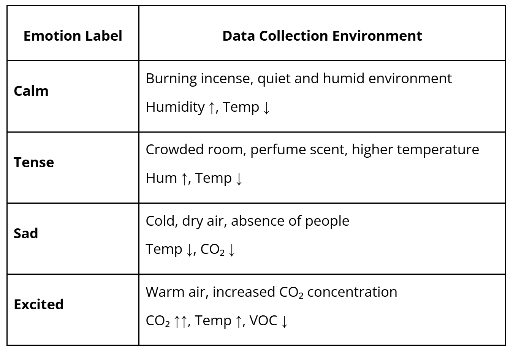
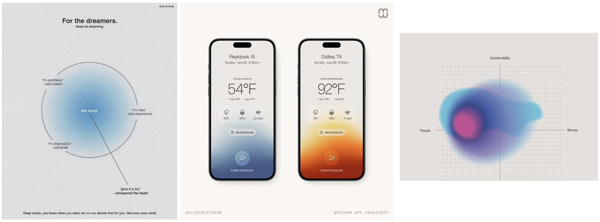

# Final Project Ideas

## 1. Scentient Machine

**Concept**

Scentient Machine is a device that “reads the atmosphere” of a room. It interprets the invisible atmosphere of a space as emotional data.

Using MEMS gas sensors, the system reads the chemical composition of air, including human breath, perfume, humidity, and CO₂ levels, and translates these into emotional states.

ex) When the air feels heavy and warm, it displays: “The air smells tense.”

**Reference**

→ [Building an Electronic Nose with MEMS Gas Detection Sensor](https://www.hackster.io/DFRobotOfficial/building-an-electronic-nose-with-mems-gas-detection-sensor-de5269) 

**Emotion Labels and Training Conditions Examples**

→ Edge Impulse model for smell/'feeling of the air'

**Installation Design**

Like the interface of an air purifier or weather application. 

Digital display showing live emotional status (ex. Tense – 82% Confidence)

## **2. Apology Machine**

**Inspiration**

I’m interested in this kind of simple and humoristic interaction work based on everyday life experiences. (Chindogu)

My little piece of privacy 



**Concept**

This project originates from an experience that everyone has: in crowded places, I often bump into people’s shoulders but can’t possibly apologize to everyone.

*Apology Machine* is a wearable device, embedded in the shoulder of a jacket, that automatically apologizes whenever it detects physical contact. 
→ using AI TTS ?

The project explores the automation of social etiquette and the absurd extension of AI assistance into even the smallest human gestures of politeness. We become more and more reliant on machines and AI, and now even to apologize. *Apology Machine* exaggerates this dependency by outsourcing an intimate human behavior to an AI that reacts faster and more obediently than we ever could. The result is both comical and unsettling: an endlessly polite jacket, apologizing to the world.

**How it works**

When the wearer bumps into someone, the embedded sensor detects the collision’s intensity. According to the force, the AI system generates and plays an apology with different tone and repetition. From a calm “Sorry” to an anxious stream of “I’m so sorry! Sorry! Sorry!”.

\*After reviewing and organizing my ideas, I find the use of an electric nose interesting, but I’m not very satisfied with the concept itself. So for now, I’m considering either simply running the **electric nose experiment** or moving forward with the **Apology Machine.***
