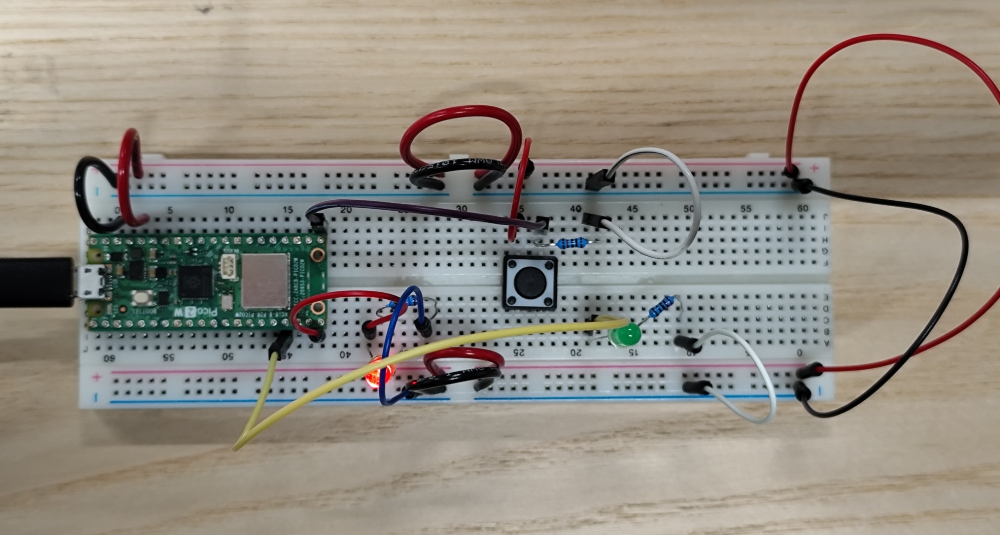

## Instruction

Create a circuit and Arduino code that does the following

#### Circuit [](https://learn.newmedia.dog/courses/physical-computing/week-01/#circuit)

* Connect two LEDs to your Arduino using a breadboard
* Connect one switch to your Arduino using a breadboard

#### Code [](https://learn.newmedia.dog/courses/physical-computing/week-01/#code)

1. Read a momentary switch being pressed
2. When the program starts, both LEDs are off
3. When the switch is pressed once, the first LED turns on
4. When the switch is pressed the second time, the second LED turns on (the first one should also still be on)
5. When the switch is pressed the third time, both LEDs turn off
6. Repeat this same cycle of LEDs turning on and off in sequence (off, one LED, two LEDs, off…)

## **Pictures of my circuit**





This circuit part was simple to make, because I had to add just one LED to another GP (in my case, GP 13).

## **My Code**

**Version 1** (with small issue)

```cpp
int button;
int i=0;

void setup() {
  pinMode(15,OUTPUT); // LED n°1
  pinMode(13,OUTPUT); // LED n°2
  pinMode(16,INPUT); // Button
  Serial.begin(9600); // Sending speed from Pico
}

void loop() {
  button = digitalRead(16);
  Serial.println(button);

  if(button == 1){
    i++; // if button is pressed add 1 to i

    switch(i){
      case 1: digitalWrite(15,HIGH); break; // Turn on LED n°1 when button is pressed once
      case 2: digitalWrite(13,HIGH); break; // Turn on LED n°2 when button is pressed the second time
      case 3: i = 0; break;                 // Return i to 0 when button is pressed the third time
    }
  }

  if(i == 0){ // When i is 0 turn off all 
    digitalWrite(15,LOW); // Turn off LED n°1
    digitalWrite(13,LOW); // Turn off LED n°2
  }

  delay(100); 
}
  
```

The coding part was easy, so I wrote it quickly. But at first, I set the delay to 10, and that made the button’s info (0 and 1) update too fast. Because of that, pressing the button once produced too many 1. As a result, unless I pressed and released the button extremely quickly, both LEDs stayed on all the time. I didn’t realize it was a delay issue at first, but once I figured it out and changed the delay to 100, it worked fine. 

**However, if I keep holding the button, I can see the stages changing continuously**. So to prevent this, I add one line to my code to detect only when the button state change.

**Version 2** (solved)

```cpp
int button;
int previousButton = 0;
int i=0;

void setup() {
  // put your setup code here, to run once:
  pinMode(15,OUTPUT); // LED n°1
  pinMode(13,OUTPUT); // LED n°2
  pinMode(16,INPUT); // Button
  Serial.begin(9600); // Sending speed from Pico
}

void loop() {
  // put your main code here, to run repeatedly:
  button = digitalRead(16);
  Serial.println(button);

  if(button != previousButton){ // Detect only when the button state changes (prevents multiple counts while holding)
    if(button == 1){
      i++; 
    }
  }
  previousButton = button;

  switch(i){
    case 1: digitalWrite(15,HIGH); break; // Turn on LED n°1 when button is pressed once
    case 2: digitalWrite(13,HIGH); break; // Turn on LED n°2 when button is pressed the second time
    case 3: i = 0; break;                 // Turn off all when button is pressed the third time
  }

  if(i == 0){
    digitalWrite(15,LOW); // Turn off LED n°1
    digitalWrite(13,LOW); // Turn off LED n°2
  }

  delay(10);
}
  
```
