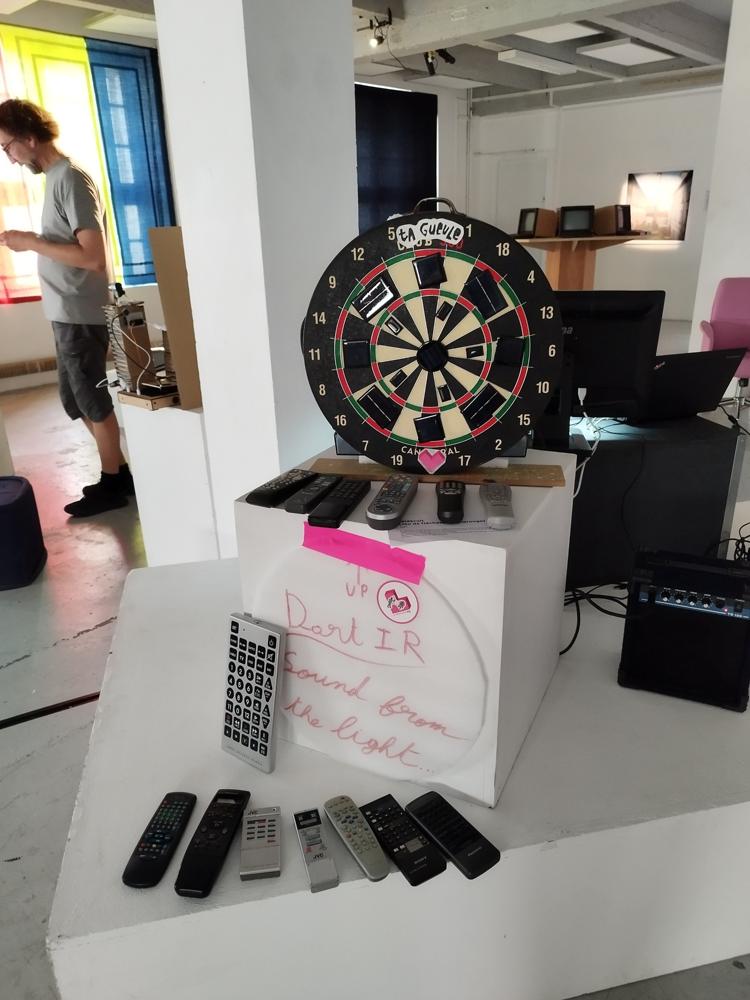
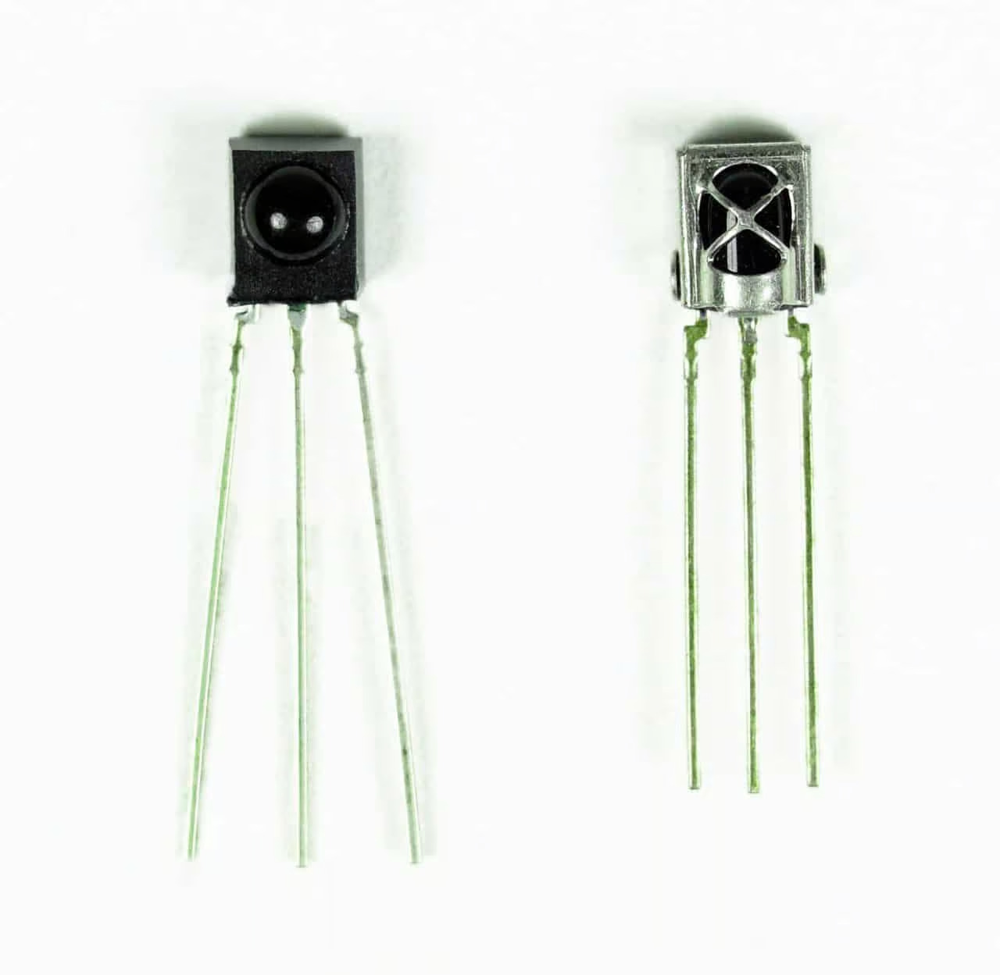

# 1. Find an interesting existing Alt+Ctrl Interface 

> *Explore the archive from GDC, Shake That Button and beyond. Find one interesting project/controller and write a short description of the project. Include a link to it and even embed a video to your site if it is available. Why did you choose this? What caught your attention?*

## Candlelight Superfight

##### Description of the project: 

Candlelight Superfight is a two-player competitive candle lighting video game. Each player has 4 candles and must have them lit/out depending on the instructions on screen. Sabotage of the other player’s candles is of course encouraged. The game ends after 30 seconds, and the player with the higher score wins.

Created by : Yann Seznec

Stuff used:

* candles
* light sensors



#### My thought:

I chose *Candlelight Superfight* because the use of candles immediately caught my attention. It’s not a normal or common game controller. The project cleverly blends the physical and digital worlds, turning a simple and ancient object into an interactive input device. I found it very simple yet unique, using candlelight both as a game tool and as the game itself. Its playful use of real-world, fragile materials, candles, as controllers is fascinating. I never imagined that candles could become part of a game, but it works surprisingly well. The contrast between the calm glow of candlelight and the frantic, competitive gameplay creates a uniquely absurd and memorable experience. What makes it even more interesting is how it uses real, everyday objects with their smell, warmth, and behavior, instead of a flat 2D screen. It’s a perfect example of how alternative controllers can transform the mood and meaning of play through tactile, performative interaction.

# 2. Come up with a concept for your own Alt+Ctrl Interface 

> * *Explore at least one sensor in more detail. You can do this with the actual sensor or just do some research on what is available in general.*
>
>   * *If you have access to the sensor, figure out how to read the values from it with your Arduino. Print out the data from the sensor to the Serial Monitor or Serial Plotter.*
>   * *If you are not able to actually use it, find out what type of data you can get out of it. Is it on/off signal, continuous number, some more complex data?*
> * *Think of different interactions and/or gestures that could be detected with the sensor you picked. What kind of objects could the sensor be attached to?*
> * *Choose an existing video game that could be controlled using the interaction/interface enabled by this sensor OR come up with a completely new game or game mechanic.*
> * *You don’t need to make it work yet. Just come up with the idea/concept for your alternative controller.*
> * *Write about your idea on your site.*
> * *You can draw sketches or other ways to illustrate your idea.*
> * *You can also make a prototype if you are able to, but I am not requiring it. It’s enough to just describe the concept.*
> * *These can be silly, experimental, ridiculous, absurd…*

#### Inspiration:

This is an artwork that I saw in Orléans, France. Many remote controls were placed around a space, and when you pointed and pressed them toward a dartboard, each button triggered a different sound. Each remote and each section of the dartboard produced unique tones, creating an unpredictable and playful sonic experience. I was fascinated by how something as ordinary as a TV remote could be transformed into a musical instrument and interactive performance tool.

## Sensor Exploration: Infrared (IR) Receiver

#### About the Sensor:

<https://www.circuitbasics.com/arduino-ir-remote-receiver-tutorial/>

Infrared (IR) sensor is a device commonly found in remote-controlled electronics such as TVs and air conditioners. It detects invisible infrared light signals emitted by IR transmitters like remote controls. Each button on a remote sends a short unique encoded pulse pattern, which corresponds to a specific hexadecimal code (e.g., 0xFFA25D).

The IR receiver converts these light pulses into binary electrical signals that a microcontroller can interpret.

#### Type of Output:

Digital signal: alternating HIGH / LOW pulses representing binary code.

#### Interactions and/or gestures that could be detected with the IR Receiver:

* Trigger different responses depending on where it’s pointed
* Each button press can correspond to a specific command or event (sound, visual effect, etc)
* Detects rhythm or speed of pressing enabling rhythmic or musical interaction
* Holding down a button can activate continuous or long-duration actions
* When multiple remotes are used simultaneously, create collaborative outcomes
* Instead of printing the key values to the serial monitor, display the information on an LCD screen 

#### The sensor can be attached to: 

* Lamps 
* TV
* Air conditioner
* Audio and video equipment
* Other home furniture
* Sculptures
* Instruments
* Installation surfaces
* Wall
* Wearable pieces

#### Controlled by:

* Remote control
* Phone (IR blaster)

### My Idea:

Inspired by my lazy self who never wants to get out of bed to turn off the light. I always wish I could do it without moving. It also comes from the frustration of trying to find the perfect angle to make a TV remote work.

**Idea 1:** 

Single players must find the right remote control, aim and press the correct button toward multiple IR sensors hidden around the room. Each sensor responds unexpectedly depending on which button is pressed, and only one will actually switch the light off.

For example, one sensor might turn on the TV, another might start the coffee maker, another might switch the lights into disco mode, or even play loud music from the speaker.

**Idea 2:** 

In the versus mode, the room is filled with multiple lights and remotes. Two players compete: one tries to turn the lights on, while the other tries to turn them off. Both must find and use the correct remotes as fast as possible. The final state of the room, lights on or off, determines the winner. (Similar in spirit to “Candlelight Superfight.”)
