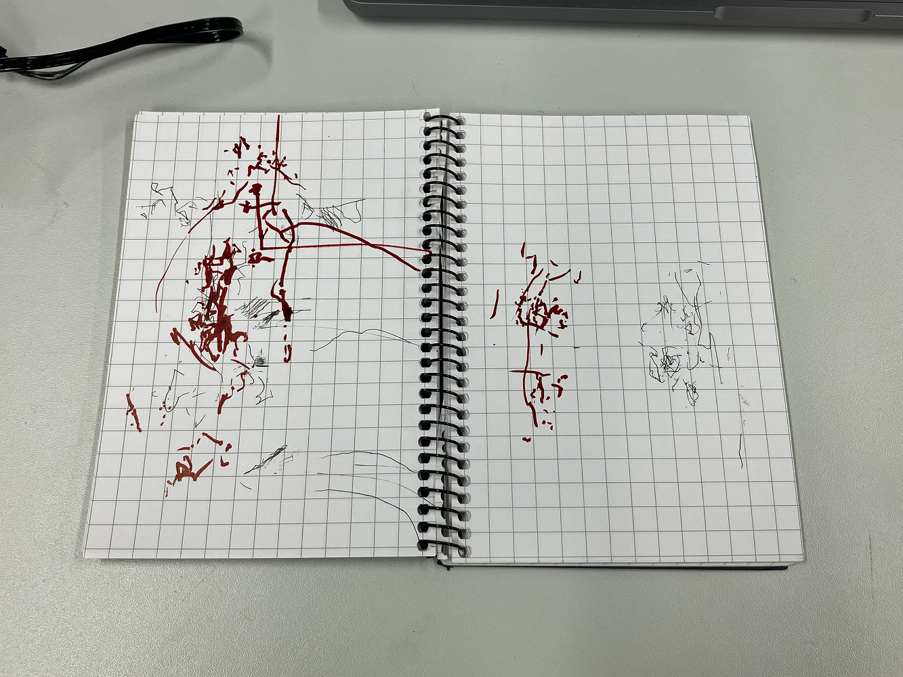
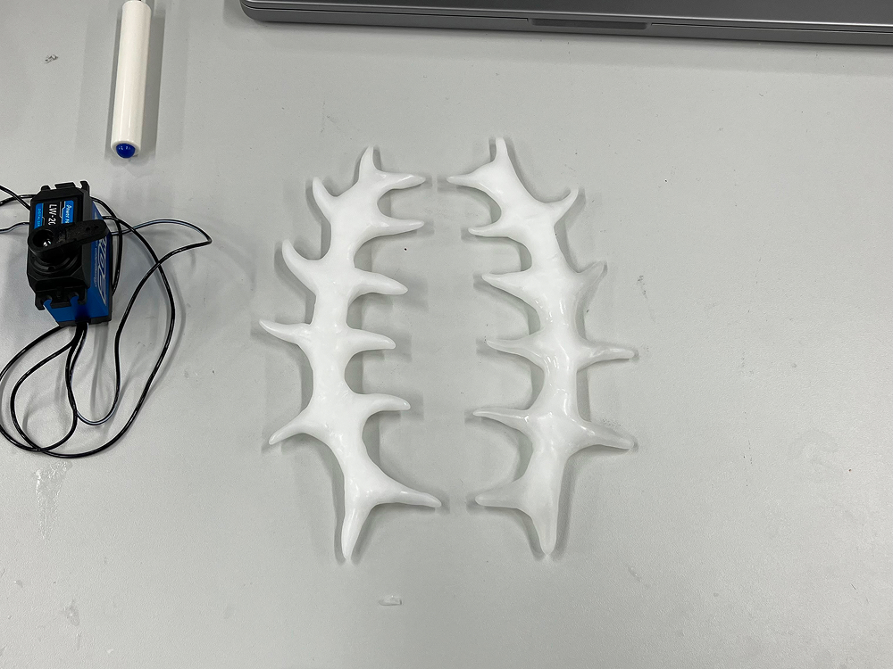
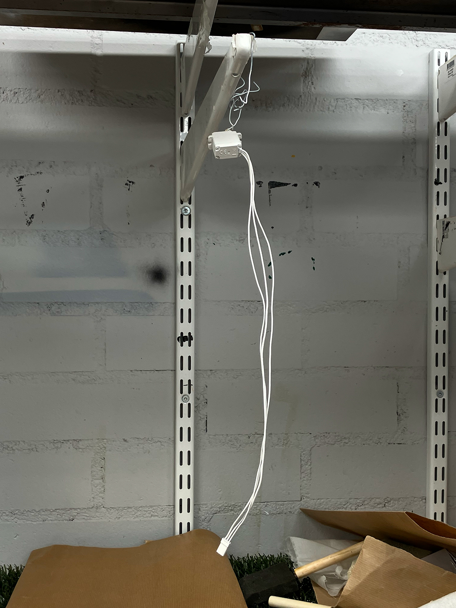
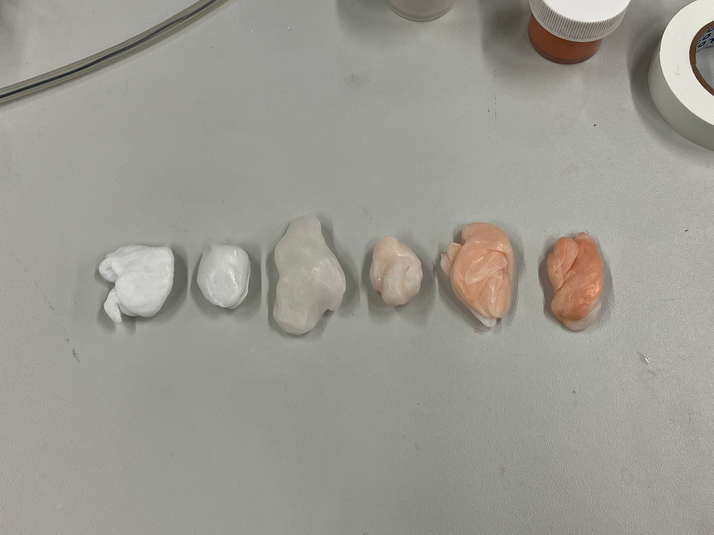
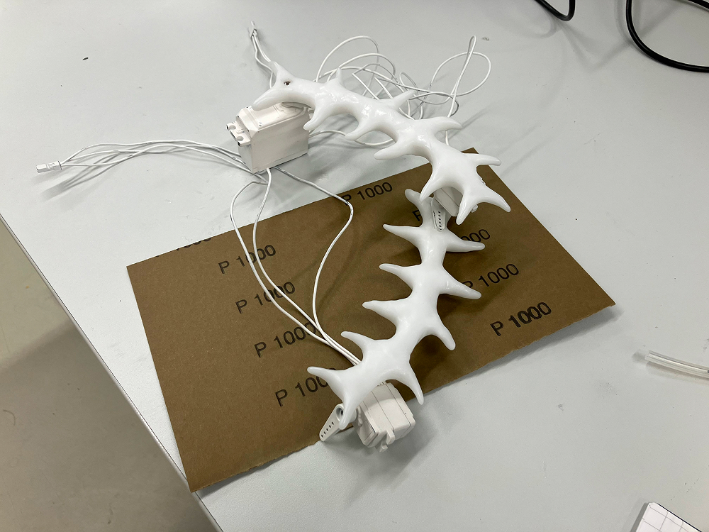
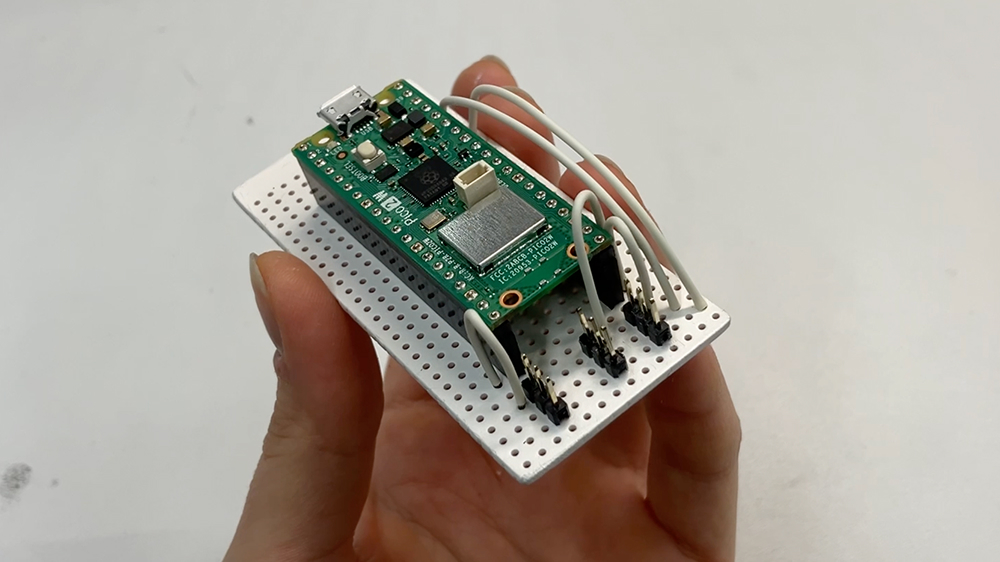
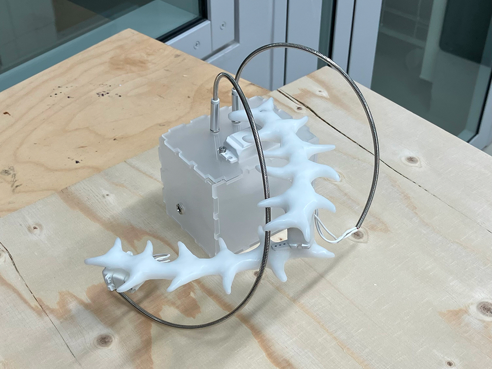
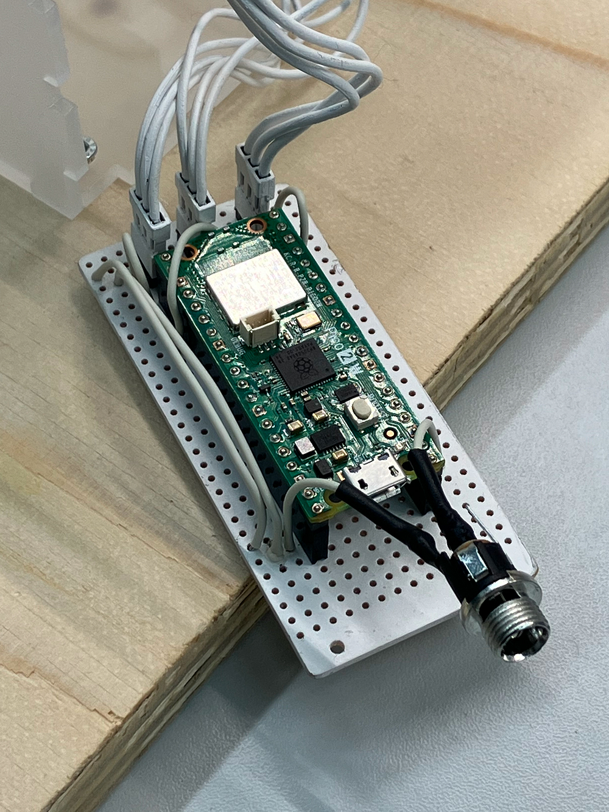
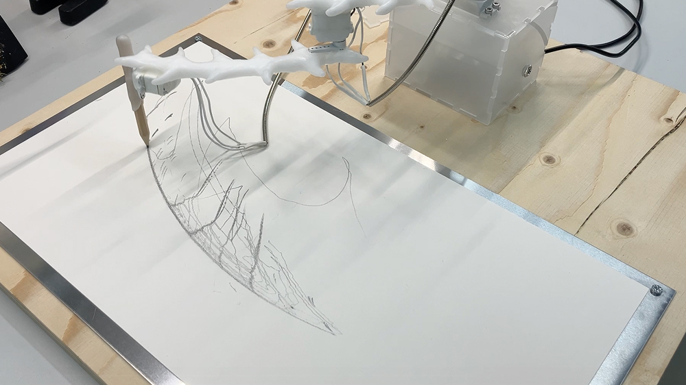
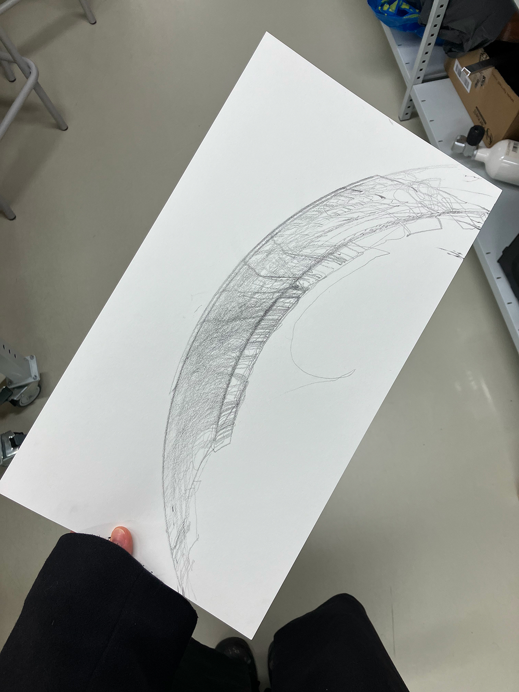

*initial traces from the first bracciograph arm constructed with the materials I found from the workshop*

*once I got the code roughly working, I started to craft the arms out of moldable plastic pellets*

*I painted a lot of the parts with white spray paint and wet sanded them for a smooth finish*

*testing pigments*

*planning the attachment of the motors to the arms*

I built my own breadboard for more compact wire management

*creating an acrylic box to contain the breadboard and to add height to the shoulder motor. also planned to use an aux cable to customise the look of the motor wires*

*aux cables are cut, rewired and soldered to both ends of the elbow and wrist motors. I also added heat shrink tubing to cover the wires*

*added a charger port for the pico*

*initial writing tests with the finalised components*

playing with different approaches to the code before selecting the final outcome for the writing
