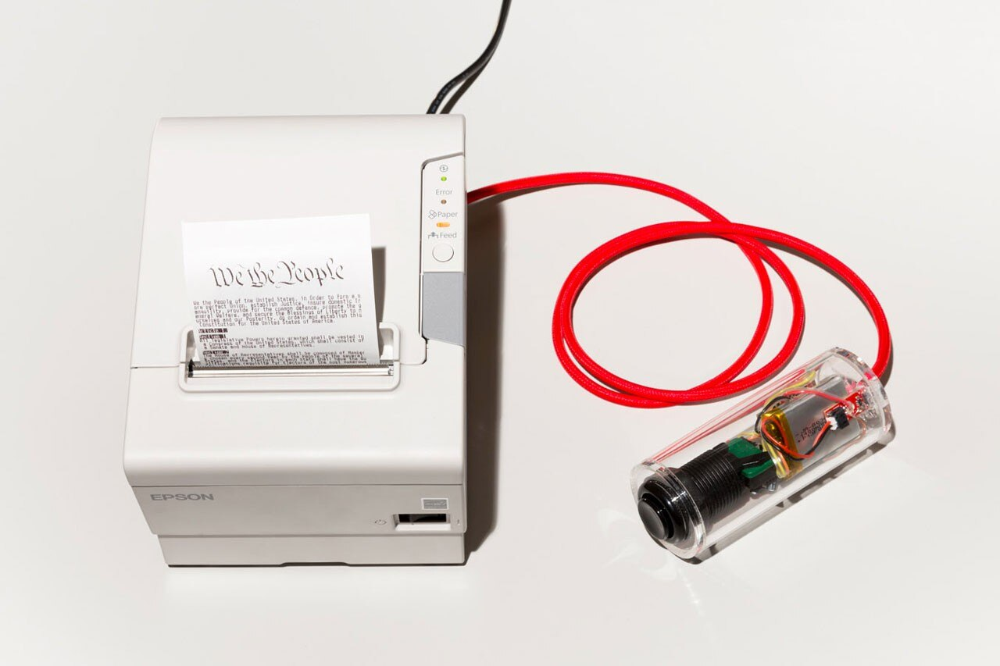
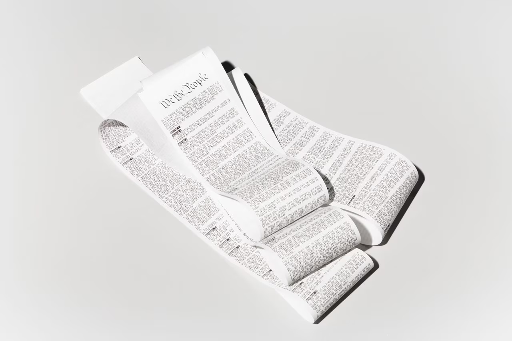
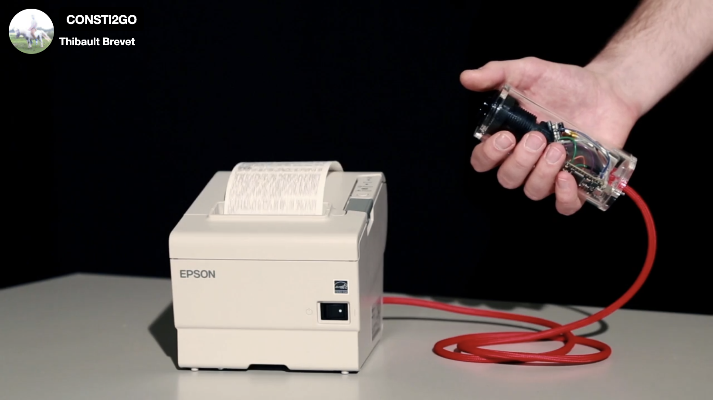
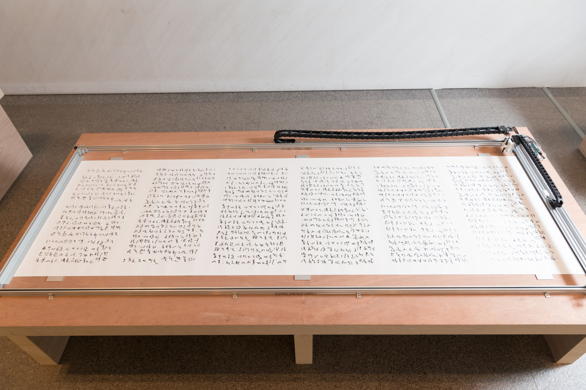
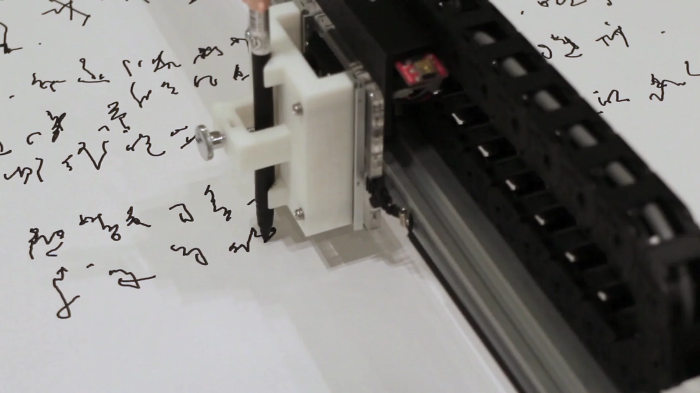
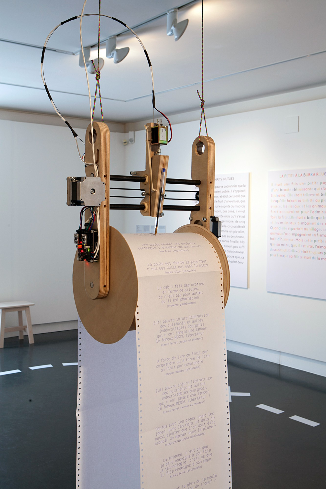
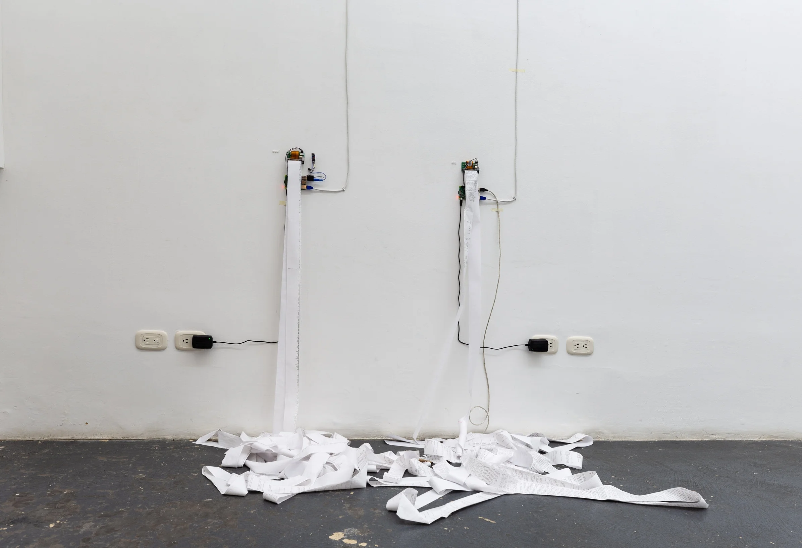
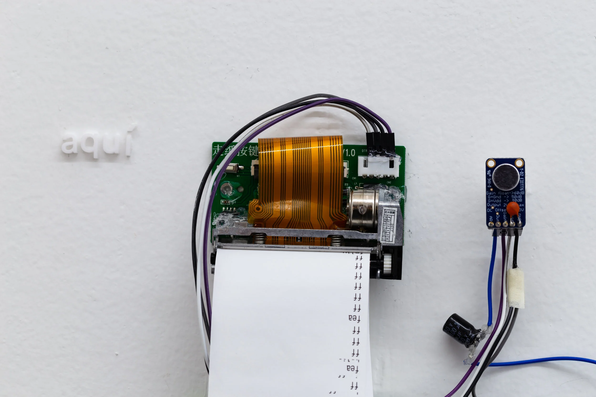

#### Introduction

*Imagine a future society, where technology has advanced to a point where writing is no longer necessary. Writing itself has become a novel artefact of the past, and the only texts being produced in the world remain illegible, mechanical scribblings made by machines.*

#### Background

In my project, I take a speculative stance on the notion of the post-literate society, (originally proposed by theorist Marshall McLuhan in 1962), through the practice of asemic writing (letter-like marks that cannot be read for their semantic content).

In its core, the project will comprise of a writing tool, a surface, and a motor. In my mind, I envisage for the movement of writing to function as an endless loop, which could take effect through e.g. a long scroll of paper, or a memory-foam like surface that bounces back to a flat form. I have prepared two potential design routes with varying levels of technical complexity:

#### Route 1: Thermal printer

A receipt printer that prints continuous unintelligible text.

Components

1. Mini thermal printer
2. Microcontroller
3. 5-9 V AC/DC power adapter (for power supply)
4. USB cable
5. Breadboard, jumper wires, resistors, capacitors (for prototyping)

#### Route 2: Engraving plotter

A pen-plotter-like engraving tool, that traces writing on a malleable, soft material. The ‘engraving’ would repeat the same line in a loop, as the letters bounce back from the writing surface.

Components

1. Printer chassis (upcycled or DIY)
2. Stepper motors
3. Microcontroller
4. Power supply (to be confirmed)
5. Stylus (e.g. bookbinding bone)
6. Drawing surface (e.g. memory foam, silicone)

#### References

Thibault Brevet: Consti2go 


*Consti2go is a portable device that allows, on the press of a button, to print copies of the US Constitution.*

So Kanno: Asemic Languages

*Publicized at the international art festival “Aichi Triennale 2016”, the project was implemented by collecting handwritten artist statement or description of work of an extremely international group of 10 participating artists. By learning handwriting with one writer in each language, artificial intelligence collected information on the shapes of each character system, as well the idiosyncrasies of each writer, of a AI, to possess a plotter.*

AATB: Petit Central

*Petit Central is the small brother of Grand Central, a large-scale on/offline installation. It is a custom-designed mechanical pen-plotter is connected to a website where visitors, local and remote, can leave anonymous messages. The apparatus will immediately start printing any messages received, tracing a collective physical artefact out of the intangible data stream.*

Viviana Troya: All Your Diction


*Three thermal printers that transcribe what people say in real time, both locally (here), remotely (there -outside the exhibition space) and in AI predicted future (nor here nor there — future conversations created by a neural network).*
