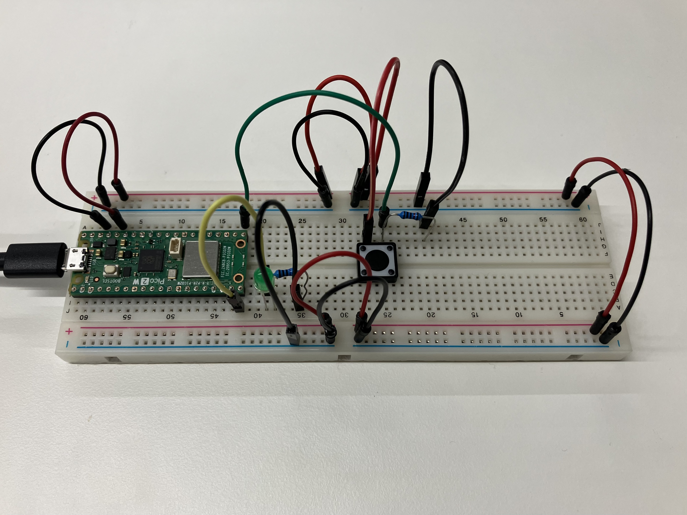
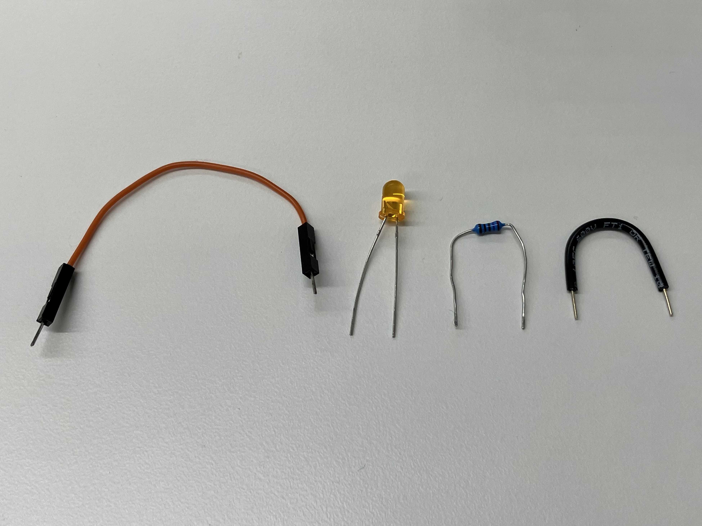
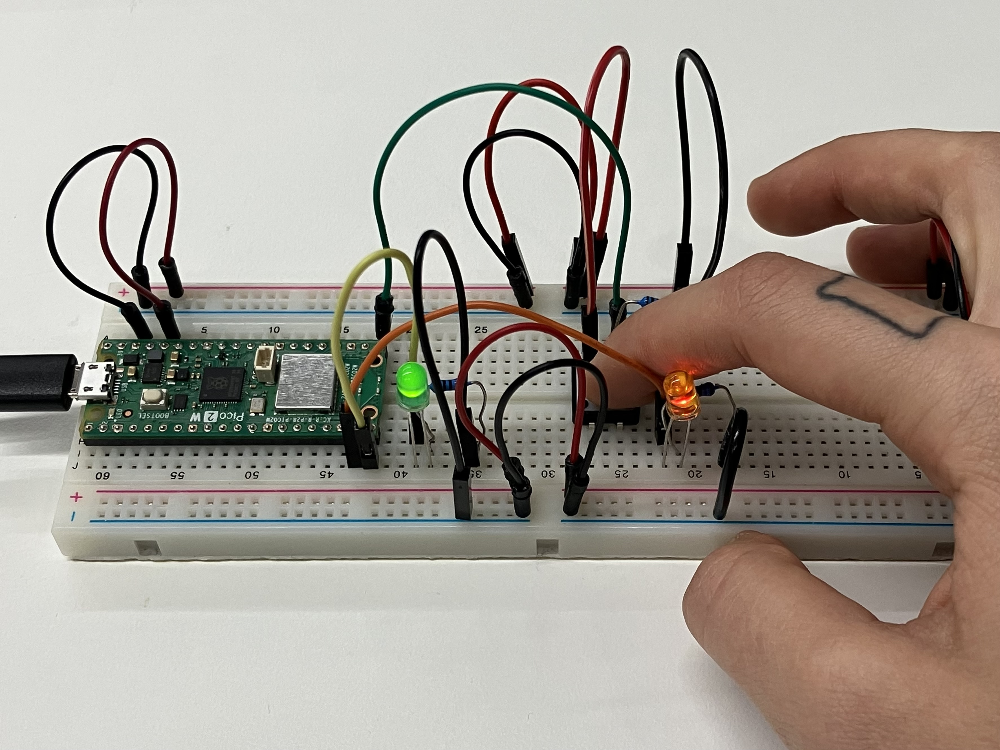
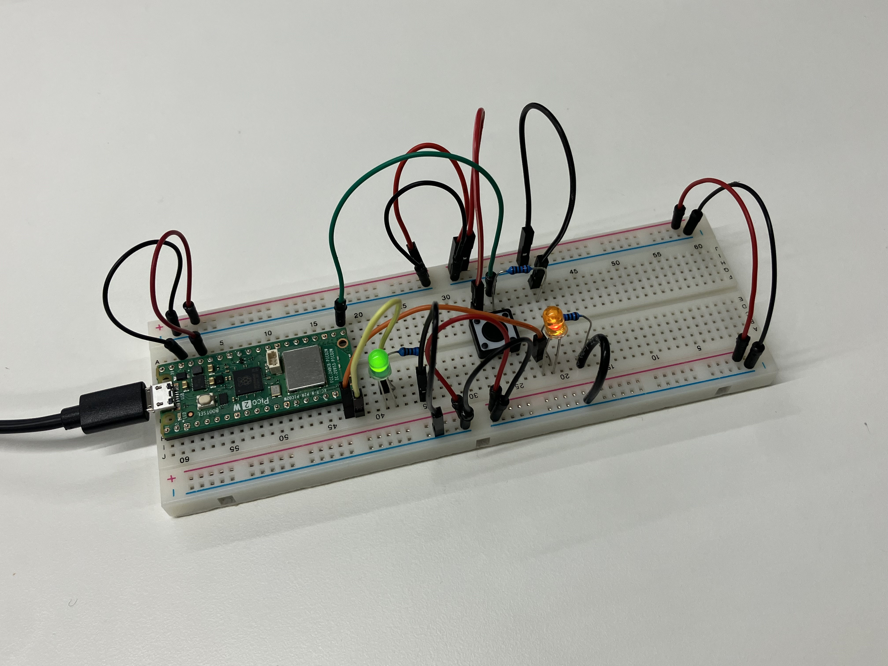
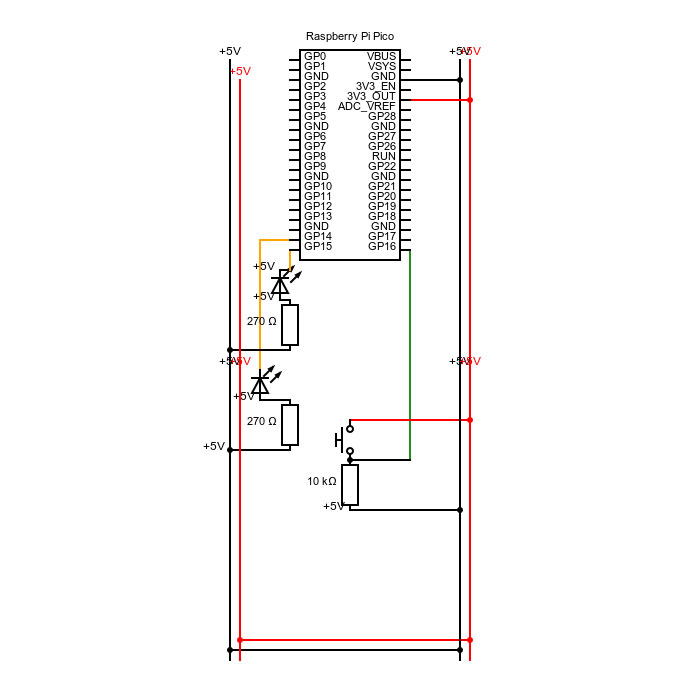

#### Assignment

*Circuit*

* *Connect two LEDs to your Arduino using a breadboard*
* *Connect one switch to your Arduino using a breadboard*

*Code*

* *Read a momentary switch being pressed*
* *When the program starts, both LEDs are off*
* *When the switch is pressed once, the first LED turns on*
* *When the switch is pressed the second time, the second LED turns on (the first one should also still be on)*
* *When the switch is pressed the third time, both LEDs turn off*
* *Repeat this same cycle of LEDs turning on and off in sequence (off, one LED, two LEDs, off…)*

#### Process

I started off using the circuit we built during the first week as my base, and drew it as a technical drawing to understand the structure better.






\
Considering the intention was just to add one more LED, I researched the structure in which the first LED was connected to the board. 



```
int button;

void setup() {
  //put your setup code here, to run once:
  //selecting GP14 as an output
  pinMode(14, OUTPUT);
  //selecting GP15 as an output
  pinMode(15, OUTPUT);
  //selecting GP16 as an input
  pinMode(16, INPUT);
  //turn on the light
  digitalWrite(15, HIGH);
  //open communication with port
  Serial.begin(9600);
}

void loop() {
  //put your main code here, to run repeatedly:
  button = digitalRead(16);
  Serial.println(button);
  if(button==1){
    analogWrite(15, 255);
    analogWrite(14, 0);
  if else(button==1){
    analogWrite(15, 255);
    analogWrite(14, 255);
  }else{
    analogWrite(15, 0);
    analogWrite(14, 0);
    }
  }
}
```

I got both LEDs to work while pressing the button via an if-else structure, but knew I should introduce more variables in my code in order to get it to work the way I imagined. 



After researching the Arduino Reference, I still could not figure out how to continue, but was sure my circuit was connected right. As my last resort, I looked up at the second solution, which seemed more logical based on my approach, and adjusted it line-by-line to match my circuit. I did not copy the circuit set-up, since I wanted to test my original approach, which I suspected would work correctly with the new code.

```
int ledPins[] = {14, 15};
int ledAmount = 2;
int btnPin = 16;
int btnState = 0;
boolean isBtnPressed = false;
int counter = 0;

void setup() {
  //put your setup code here, to run once:
  for(int i=0; i<ledAmount; i++){
    pinMode(ledPins[i], OUTPUT);
    digitalWrite(ledPins[i], LOW);
  }
  pinMode(btnPin, INPUT);
  Serial.begin(9600);
}

void loop() {
  //put your main code here, to run repeatedly:
  btnState = digitalRead(btnPin);

  if (btnState == HIGH && isBtnPressed == false){
    counter++;
    isBtnPressed = true;
    if(counter>ledAmount){
      counter = 0;
    }

  Serial.println(counter);
  }else if(btnState == LOW){
    isBtnPressed = false;
  }

  for (int i=0; i<ledAmount; i++){
    if(counter >= i+1){
      digitalWrite(ledPins[i], HIGH);
    }else{
      digitalWrite(ledPins[i], LOW);
    } 
  } 
  delay(15); 
}
```



The constellation now works! To summarise what I had learned, I redrew my technical drawing to reflect the changes I had made.


