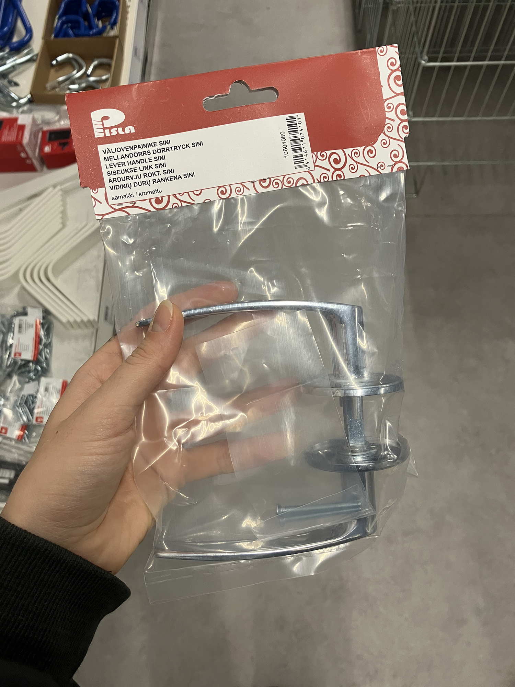
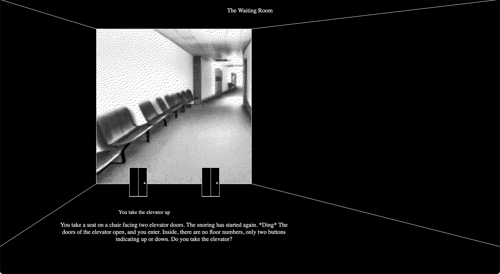
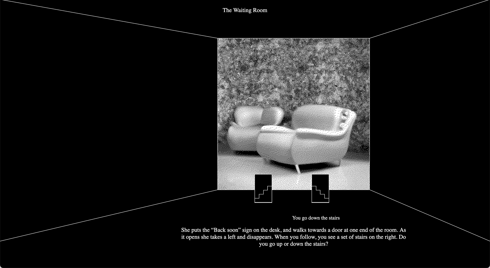
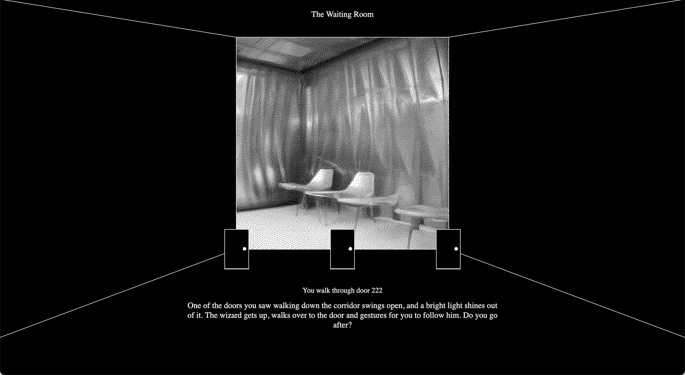
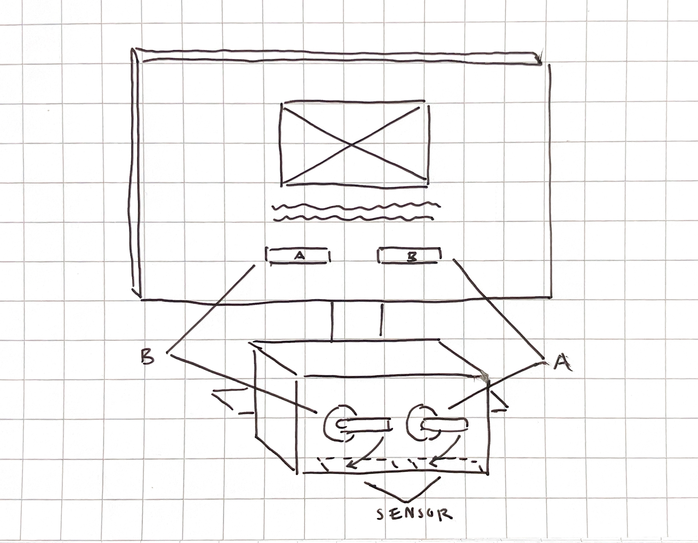

#### Assignment 1

*Find one interesting project/controller and write a short description of the project. Include a link to it and even embed a video to your site if it is available. Why did you choose this? What caught your attention?*

TIC TAC TOE THING (TTTT) by Shuang Cai

https://www.youtube.com/watch?v=qRp8oorWgjg&t=51s

This project is a futuristic take on a classic (archaic, even) game of tic tac toe with new tactics. In this game, two players complete against eachother by toggling switches to trigger LEDs, aiming to win by connecting three lights in a row. In Cai’s version, a new rule is introduced, as a player can also spend their turn by undoing the previous move of their opponent (made possible by the switch). 

As much as the beauty of this game may lie on the simplicity of its idea, I think half of the enjoyment is also due to its refined design and choice of materials. Adorned by a sleek metal cover, rounded casing and pastel-hued LEDs, the retro-futurist design of the object evokes a feeling of a lost future artefact.

Henceforth, I think Cai’s project is particularly succesful from the point of view of its narrative, which is why I was drawn to study it further. It engages a storyworld through the gameplay and the visual aesthetics of the controller itself, intelligently interpreting material cues and cultural affordances, which is something I may also wish to explore in my final project during this course.

#### Assignment 2

*Come up with a concept for your own Alt+Ctrl Interface*

* *Explore at least one sensor in more detail. You can do this with the actual sensor or just do some research on what is available in general.*
* *If you have access to the sensor, figure out how to read the values from it with your Arduino. Print out the data from the sensor to the Serial Monitor or Serial Plotter.*
* *If you are not able to actually use it, find out what type of data you can get out of it. Is it on/off signal, continuous number, some more complex data?*
* *Think of different interactions and/or gestures that could be detected with the sensor you picked. What kind of objects could the sensor be attached to?*
* *Choose an existing video game that could be controlled using the interaction/interface enabled by this sensor OR come up with a completely new game or game mechanic.*
* *You don’t need to make it work yet. Just come up with the idea/concept for your alternative controller.*
* *Write about your idea on your site.*
* *You can draw sketches or other ways to illustrate your idea.*
* *You can also make a prototype if you are able to, but I am not requiring it. It’s enough to just describe the concept.*
* *These can be silly, experimental, ridiculous, absurd…*

I begun my research at the hardware store, where I came across a set of door handles. I had been thinking of choose-your-own adventure games, where players are introduced upon a few (often text-based) choices that will later determine the course of the story for the playable protagonist. 

For this exercise, I chose to focus on The Waiting Room (chapter I) by Mina Amiri Kalvøy. Playable as a desktop game with a mouse, the game presents its player with options across its narrative arc of a protagonist stuck in a reality shifting loop. The game can be accessed in full here: https://minakalvoey.com/wr/ 

The handle seemed like an apt tool for navigating such a realm–one of doors, stairways and elevators that traverse the player through their customised story.

In order to make this gameplay functional, one of the following sensors could be used:

1. Proximity, Light, RGB, and Gesture Sensor (APDS9960)\
2. Distance (VL53L1X)

Following the sketch above, a container could be placed in front of the desktop screen, with two (or three, depending on amount of choice required), door handles installed on the front of it. The  sensor(s) would then be installed on the inside of the box (illustrated in dashed lines), so as not to be visible to the viewer. Each time a handle would be turned down, the sensor would thus return a higher (or lower) value, resulting in a change in data that can be used to trigger an action in the game. By linking handle A to choice A, and handle B to choice B, the handles would then become the primary mode of navigation in the story.

The integration of this controller would not only result in a more direct interaction with the game by lessening the time the user would need to spend with a mouse, but it could also present the player with a more immersive game experience. Mechanical resistance could also be added to the door handle (as most common door handles have a feeling of heaviness to them), to foster the sense of uncertainty in standing behind an unfamiliar door: *are you sure you want to go there?*
