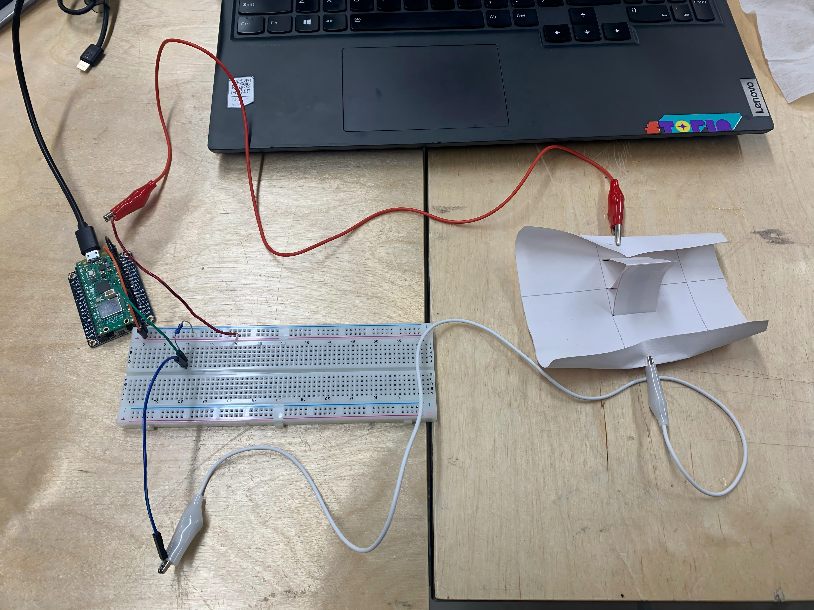
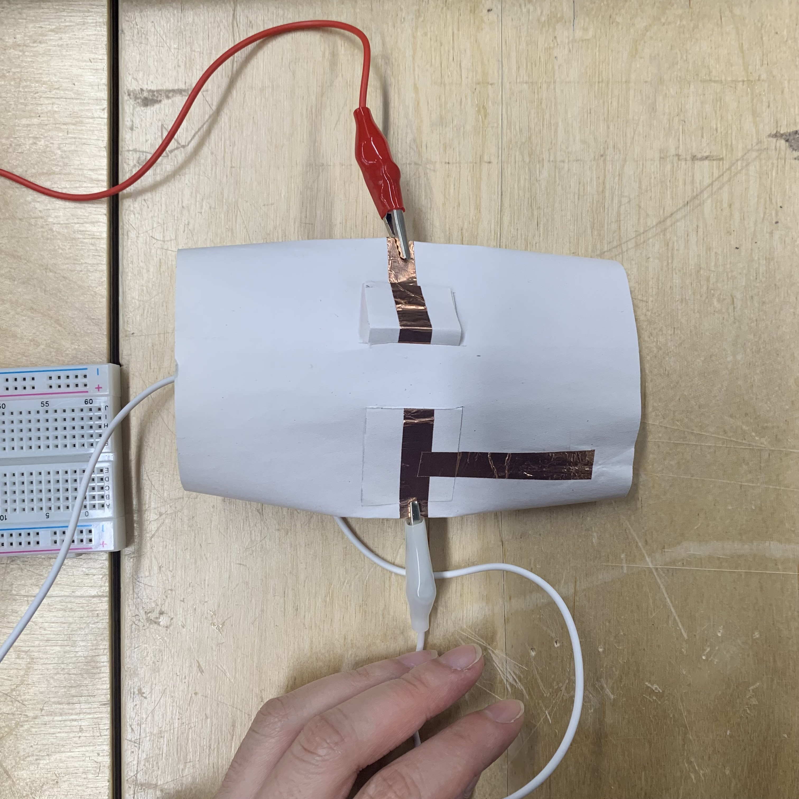

# Initial Minimum Viable Test

## Blow Structure Test


\
At first the circuit counldn't give the correct HIGH/LOW signal as I expected. From Matti I know there is two problems:

> 1. **The glue on the back of the conductive tape is not conductive**, so you can't make it discontinuous;
> 2. Matti suggest for testing I should use bread board to connect the components to prevent the unstable serial transformation.




## Arduino & Processing Connection

This is my initial Arduino code:

```
int i;

void setup() {
  // put your setup code here, to run once:
  Serial.begin(9600);
  pinMode(21,INPUT);
}

void loop() {
  // put your main code here, to run repeatedly:
  i = digitalRead(21);
  Serial.println(i);
}
```

and here is the Processing code:

```
import processing.serial.*;
Serial myPort;  // Create object from Serial class
int val;     // Data received from the serial port

void setup()
{
  // On Windows machines, this generally opens COM1.
  // Open whatever port is the one you're using.
  String portName = Serial.list()[2]; //change the 0 to a 1 or 2 etc. to match your port
  myPort = new Serial(this, portName, 9600);
}

void draw()
{
  println(val);
}
```

But the problem is the signal look fine in the arduino serial monitor, but in processing I can't print the signal. It only shows 0. With Matti's help I know that there are several problems behind:

> 1. The speed arduino sending the signals is faster than the processing refeshing(60FPS), so I need to add a `delay(30)`in arduino. This is the explaination of Gemini: set the Arduino delay to 30ms (approx. 33Hz) to maintain a safe 1:2 ratio with Processing's 60Hz read rate, ensuring the buffer clears faster than it fills to prevent data backlog.
> 2. The code `println(val)` is not actually getting the serial data so that I need to use `str = myPort.readStringUntil('\n');`. But this only gets the `String` type of data(pure text) but I need `int` or `float`, so Matti says I need use this `val = float(str);` to force the data become a float. **But at first we want to try `int()`, but there is some unknown error, but float works fine.**
>    The code I got that can actually work is this:

```
import processing.serial.*;
Serial myPort;  // Create object from Serial class
float val;     // Data received from the serial port
String str;

void setup()
{
  // On Windows machines, this generally opens COM1.
  // Open whatever port is the one you're using.
  println(Serial.list());
  
  String portName = Serial.list()[0];
  myPort = new Serial(this, portName, 9600);
  
  //myPort.bufferUntil('\n');
}

void draw()
{
  background(255);
  if ( myPort.available() > 0) {  // If data is available,
    str = myPort.readStringUntil('\n');  // read it and store it in str
    //
    //println(str);
    if(str != null){
      //String[] splitData = split(str, ","); // I'll need this for more int
      val = float(str); // change the text we get into real number we can do calculation
     // y = float(splitData[1]);
     // z = float(splitData[2]);
    }
  }
  
  println(val);
  text(val,20,20);
}
```

Here is the final prototype that works with simple visual in processing:

<div style="position:relative;padding-bottom:56.25%;height:0;overflow:hidden;">
  <iframe
    src="https://www.youtube.com/embed/Lz-LvIUfI_E"
    style="position:absolute;top:0;left:0;width:100%;height:100%;"
    frameborder="0"
    allow="accelerometer; autoplay; clipboard-write; encrypted-media; gyroscope; picture-in-picture"
    allowfullscreen>
  </iframe>
</div>

## Ball-Slide Sensor Structure Test


\
The first version works if I use conductive tap to be the bridge of every pair of interrupts, but I failed to reach my goal of using the ball as trigger. Here is the initial version that failed:

<div style="position:relative;padding-bottom:56.25%;height:0;overflow:hidden;">
  <iframe
    src="https://www.youtube.com/embed/oxbjrm6M4dY"
    style="position:absolute;top:0;left:0;width:100%;height:100%;"
    frameborder="0"
    allow="accelerometer; autoplay; clipboard-write; encrypted-media; gyroscope; picture-in-picture"
    allowfullscreen>
  </iframe>
</div>

There are several reasons I concluded from this:

> 1. The width of the conductive tap areas now is 5mm, is should be bigger for the ball to touch and stay;
> 2. The diameter of ball I use now is 6mm, I should use bigger ball to increase the conductive area(so I got myself some 1.2mm large ones);
> 3. Also for increasing the conductive region, instead to the current flat structure, I should use a “U valley” shape as the ball-rolling zone.



The second prototype version can give me a signal when I pivoted the box up side down! But to make this stable, I must **squeeze this box a little bit** to provide more contact area between the ball and the surface, which means that I should design a structure that bends to fit the ball shape.

<div style="position:relative;padding-bottom:56.25%;height:0;overflow:hidden;">
  <iframe
    src="https://www.youtube.com/embed/8D2EjkFu-sE"
    style="position:absolute;top:0;left:0;width:100%;height:100%;"
    frameborder="0"
    allow="accelerometer; autoplay; clipboard-write; encrypted-media; gyroscope; picture-in-picture"
    allowfullscreen>
  </iframe>
</div>

## Paper Folding Sensor Structure Test

When I was introducing this idea to everyone in our class, it is really interesting to find that people all played this before, so I guess this interaction must be a fun experience as a connection of their childhood memories and familiar gestures.
The final prototype works like this:

<div style="position:relative;padding-bottom:56.25%;height:0;overflow:hidden;">
  <iframe
    src="https://www.youtube.com/embed/S-RRjogM4I4"
    style="position:absolute;top:0;left:0;width:100%;height:100%;"
    frameborder="0"
    allow="accelerometer; autoplay; clipboard-write; encrypted-media; gyroscope; picture-in-picture"
    allowfullscreen>
  </iframe>
</div>
Although in concern of time, I don’t have enough effort to use this sensor as a trigger of something, but I think in the future I can do some with this. Also, I have summarized some after prototyping:

> 1. The electric wires should use the soft ones with more flexibility;
> 2. The plus and minus side soldering should be carefully avoided touching when pressing two side together.

# Coding Part
## Arduino Code
### Ball OSC_codeToProcessing
```
#include <WiFi.h>
#include <ArduinoOSCWiFi.h>

// WiFi stuff
const char* ssid = "mainframe";
const char* pwd = "12345678";

// OSC setting
// computer ip address
const char* host = "192.168.50.231"; 
const int recv_port = 12345;    // Arduino recieve com
const int publish_port = 54321; // Arduino send com

float ballA,ballB,ballC,ballD,ballE;

void setup() {
  // put your setup code here, to run once:
  Serial.begin(9600);

  // WiFi ------------------>
  // WiFi stuff (no timeout setting for WiFi)
    WiFi.mode(WIFI_STA);

    // Connect to the WiFi network
    WiFi.begin(ssid,pwd);
    while (WiFi.status() != WL_CONNECTED) {
        Serial.print(".");
        delay(500);
    }

    Serial.print("WiFi connected, IP = ");
    Serial.println(WiFi.localIP()); // print arduino's own IP

    // subscribe to receive osc messages that control the robot
    OscWiFi.subscribe(recv_port, "/control",
        [](const OscMessage& m) {
            Serial.print(m.remoteIP());
            Serial.print(" ");
            Serial.print(m.remotePort());
            Serial.print(" ");
            Serial.print(m.size());
            Serial.print(" ");
            Serial.print(m.address());
            Serial.print(" ");
            Serial.print("Value: ");
            float val = m.arg<float>(0);
            Serial.println(val);
        });

  //ball pin
  pinMode(D0,INPUT_PULLUP);
  pinMode(D1,INPUT_PULLUP);
  pinMode(D2,INPUT_PULLUP);
  pinMode(D3,INPUT_PULLUP);
  pinMode(D4,INPUT_PULLUP);
}

void loop() {
  // update the OSC sending and receiving
  OscWiFi.update();

  // put your main code here, to run repeatedly:
  //ball serial define
  ballA=digitalRead(D0);
  ballB=digitalRead(D1);
  ballC=digitalRead(D2);
  ballD=digitalRead(D3);
  ballE=digitalRead(D4);

  OscWiFi.send(host, publish_port, "/sensors", 
      ballA,    // index 1
      ballB,    // index 2
      ballC,    // index 3
      ballD,    // index 4
      ballE     // index 5
  );

  Serial.print("A: ");
  Serial.print(ballA);
  Serial.print("B: ");
  Serial.print(ballB);
  Serial.print("C: ");
  Serial.print(ballC);
  Serial.print("D: ");
  Serial.print(ballD);
  Serial.print("E: ");
  Serial.println(ballE);

  delay(30);
}
```

### BLOW_OSC_codeToProcessing
```
#include <WiFi.h>
#include <ArduinoOSCWiFi.h>

// WiFi stuff
const char* ssid = "mainframe";
const char* pwd = "12345678";

// OSC setting
// computer ip address
const char* host = "192.168.50.231"; 
const int recv_port = 12345;    // Arduino recieve com
const int publish_port = 54321; // Arduino send com

float blow;

void setup() {
  // put your setup code here, to run once:
  Serial.begin(9600);

  // WiFi ------------------>
  // WiFi stuff (no timeout setting for WiFi)
    WiFi.mode(WIFI_STA);

    // Connect to the WiFi network
    WiFi.begin(ssid,pwd);
    while (WiFi.status() != WL_CONNECTED) {
        Serial.print(".");
        delay(500);
    }

    Serial.print("WiFi connected, IP = ");
    Serial.println(WiFi.localIP()); // print arduino's own IP

    // subscribe to receive osc messages that control the robot
    OscWiFi.subscribe(recv_port, "/control",
        [](const OscMessage& m) {
            Serial.print(m.remoteIP());
            Serial.print(" ");
            Serial.print(m.remotePort());
            Serial.print(" ");
            Serial.print(m.size());
            Serial.print(" ");
            Serial.print(m.address());
            Serial.print(" ");
            Serial.print("Value: ");
            float val = m.arg<float>(0);
            Serial.println(val);
        });

  //blow pin
  pinMode(D10,INPUT_PULLUP);
}

void loop() {
  // update the OSC sending and receiving
  OscWiFi.update();

  // put your main code here, to run repeatedly:
  //blow serial define
  blow=digitalRead(D10);

  OscWiFi.send(host, publish_port, "/sensors_2", 
      blow
  );
  
  // 1. Blow
  Serial.print("ValBlow: ");
  Serial.println(blow);

  delay(30);
}
```

